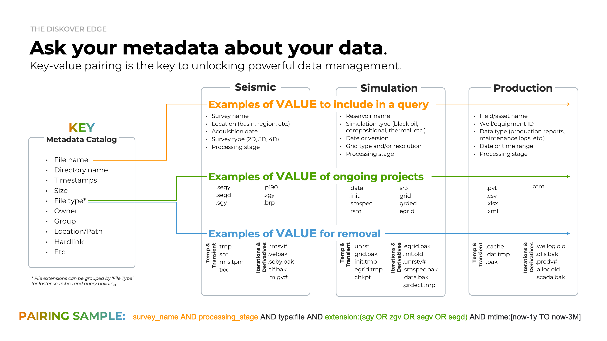

## Manual Queries

### Overview

The examples in this chapter may not be specific to your industry, but the logic of searching is universal. Understanding these concepts will help you apply them effectively in any context. The list of possible search queries and syntax is extensive; therefore, this chapter will cover only the basics of manual searches.  

✏️ Be sure to read the messages in the green and blue information bars in the user interface—they provide helpful guidance! 

#### Many Ways to Search

There are multiple ways to search with Diskover and achieve the same results. You can use the [built-in tools](#builtin_search_tools), manual queries, or a combination of both, depending on your personal preferences and comfort level. 

#### Golden Rules of Searching

Whether you're building simple or complex queries:  

1. **Expand your results**, using [wildcards](#wildcards) for example, and make sure you are not missing any files or directories in your results—[naming convention](#naming_convention) being one of the biggest problems when it comes to searching.
1. **Only add one criterion at a time** and validate your results between each addition. 
1. **Readjust your query** as needed.

#### Search Rules Based on Elasticsearch

Since Diskover uses Elasticsearch to store the harvested metadata and as its search engine, all search syntax in Diskover follows Elasticsearch's rules and algorithms. This chapter will cover many of these rules, but for more details and examples, please [visit the Elasticsearch website](https://www.elastic.co/guide/en/elasticsearch/reference/current/query-dsl-query-string-query.html).

#### Naming Conventions

Many organizations struggle with inconsistent naming conventions, including misspellings. Here are a few examples:

| PROJECT NAME | PROJECT NAME | VERSION | EPISODE |
| --- | --- | --- | --- |
| **North Sea Simulation**<ul><li>northseasimulation</li><li>north_sea_simulation</li><li>NorthSeaSimulation</li><li>NORTH sea sim</li><li>NSea-simulation</li></ul> | **Four Your Eyes Only**<ul><li>ForYourEyesOnly</li><li>foryoureyesonly</li><li>4YourEyesOnly</li><li>for_your_eyes_only</li><li>for your eyes only</li></ul> | **Version 8** <ul><li>v08</li><li>v8</li><li>v_08</li><li>ver8</li><li>ver_008</li></ul> | **Episode 5** <ul><li>ep5</li><li>eps5</li><li>e05</li><li>ep_05</li><li>ep-005</li></ul> | 

To ensure comprehensive results, consider using broader or more flexible search terms. Diskover provides tools to refine or expand your search, allowing you to pinpoint the exact data you need or cast a wider net when necessary.  

### Understanding the Basics and Logic

#### [🍿 Watch Quick Tips | Understanding the Basics of Manual Queries](https://vimeo.com/770024733)

#### Case Sensitivity

Search queries are generally case-insensitive, meaning you can use uppercase or lowercase letters in the search bar without affecting the results. However, there are a few exceptions where queries are case-sensitive:  

- When [searching on time](#search_time).
- When searching on [field names](#search_field_names).

#### Isolated Characters

When you enter a word, number, or a combination of both in the search bar, Diskover searches for those **isolated characters**. To identify isolated characters, Diskover uses **isolators** such as **spaces, underscores, hyphens, periods, other punctuation marks, and uppercase letters (also known as 🐫 CamelCase)**.  

Of course, there are ways to find characters that are not isolated by using [wildcards](#wildcards), which is explained in the next section.

##### Isolated Characters | Examples with Letters

🔎 If you launch a query with the word **albert**:

| FILE NAME | ✅ WHY FILE WOULD BE FOUND | 🚫 WHY FILE WOULD _NOT_ BE FOUND |
| --- | --- | --- |
| `project_albert_overview.pdf` | **albert** is isolated by underscores |  |
| `AlbertSimulationTest_log_v001.txt` | **albert** is isolated by CamelCase |  |
| `albertSIMULATION_test_log_v003.log` | **albert** is isolated by CamelCase | |
| `projectalbert.pdf` |  | **albert** is only isolated on one side with the . |
| `projectalbertoverview.pptx` | | project**albert**overview is read as one word |
| `ProjectALBERTOverview.pptx` | | reads **ALBERTO** |

##### Isolated Characters | Examples with Numbers

🔎 If you launch a query with the number **2025**:

| FILE NAME | ✅ WHY FILE WOULD BE FOUND | 🚫 WHY FILE WOULD _NOT_ BE FOUND |
| --- | --- | --- |
| `project-albert-2025-draft.pdf` | **2025** is isolated by hyphens |  |
| `mapping log 2025 final.log` | **2025** is isolated by spaces |  |
| `projectalbert2025.pdf`  |  | **2025** is only isolated on one side with the . |
| `MappingLog2025Final.log` |  | CamelCase doesn't work with numbers |
| `QA_testing_20250220.pptx` |  | **2025** is only isolated on one side with the _ |

### Wildcards Overview

#### [🍿 Watch Quick Tips | Manual Search Tool: Wildcards](https://vimeo.com/772196768)

This guide covers 3 major wildcards—they are useful to:

- Expand your results and make sure you are not missing files.
- Go around naming convention issues.
- Search on a specific number of variables.
- Find possible misspellings.

### * Wildcard

#### [🍿 Watch Quick Tips | Manual Search Tool: Wildcards](https://vimeo.com/772196768)

The `*` asterisk wildcard **replaces zero or more characters** and is the most commonly used wildcard. It’s a powerful tool for overcoming [naming convention](#naming_convention) inconsistencies.  

✏️ Using the `*` wildcard in a search may slow down performance, especially when placed at the beginning of a query, as it requires scanning a much larger dataset.  

#### Search Examples Using the *

| 🔎 SEARCH QUERY | ✅ POSSIBLE RESULTS|
| --- | --- |
| `*albert*` | SIMULATIONLOG**ALBERT**.txt project**albert**overview.pptx **albert**xb12p.pdf |
| `R*1005` | **R**-**1005** **R1005** **R**es_**1005** **R**eservoir**1005** |
| `*2025*` | MappingLog**2025**Final.log simulation_**2025**0220.txt |
| `s*1` | **S1** **s**eason **1** **s**0**1** **s**_**1**   ✏️This search query would also find **season 11**, for example, but it’s often better to start with a broader search and then refine your results once you have a better understanding of the data. |

✏️ If you prefer not typing the `*` and ALWAYS want to use it by default, you can set [**Use predictive search**](#predictive_search) in your settings. Throughout this user guide, we assume that predictive search has not been activated.

### ? Wildcard

#### [🍿 Watch Quick Tips | Manual Search Tool: Wildcards](https://vimeo.com/772196768)

The `?` question mark wildcard **replaces a single character** and can be used multiple times to match a specific number of characters.  

| 🔎 SEARCH QUERY | ✅ POSSIBLE RESULTS|
| --- | --- |
| `scene?` | **scene**s **scene**1 |
| `e?2` | **e**p**2** **e**0**2** **e**2**2** |
| `shot??1` | **shot**00**1** **shot**25**1** |
| `project????` | **Project**0021__log.txt **project**logs.log **project**or01.log |
| `r??05` | **r**es**05** **r**10**05** **R**S7**05** |

✏️ Technically, the `*` wildcard could be used instead of multiple `?` characters, but it may return results outside your intended character range since `*` replaces zero or more characters. In cases where precision is needed, the `?` wildcard is often the better choice.  

### ~ Wildcard

#### [🍿 Watch Quick Tips | Manual Search Tool: Wildcards](https://vimeo.com/772196768)

The `~` tilda, aka fuzziness wildcard, is used to find similar words and catches about 80% of all human misspellings.

By default, when used alone, the `~` wildcard allows up to 2 character changes. However, **best practice is to use `~1`** to limit changes to 1, which is usually sufficient to catch about 80% of human misspellings.  

⚠️ Note that using the `~` wildcard in a query can consume a significant amount of memory and may lead to poor performance, potentially resulting in a "timed out" error.  

| 🔎 SEARCH QUERY | ✅ POSSIBLE RESULTS|
| --- | --- |
| `life~1` | live, line, wife, like, rife, lift... |
| `life~` | results from `life~1` + knife, lived, hide, fire, link, loft, love... |
| `jungle~1` | jungle, juggle, jingly, jingle, jingles... |
| `jungle~` | results from `jungle~1` + june, judge, single, bundle, uncle... |

🔆 The query uses the [Damerau-Levenshtein distance](https://en.wikipedia.org/wiki/Damerau-Levenshtein_distance) to find all terms with a maximum of two changes, where a change is the insertion, deletion or substitution of a single character or transposition of two adjacent characters.

### Mixing Wildcards

⚠️ Mixing wildcards can be tricky. Below are a few examples, but remember that additional rules apply when combining wildcards, such as the order in which they are used.  

| 🔎 Mixing wildcards in the same QUERY | 🔎 Mixing wildcards in the same CRITERIA |
| --- | --- |
| You can mix any wildcards in the same query, ex:  `jungle~1 and e*2` `*albert* not v1?` |  You can mix the * and ? but NOT the ~, ex:  What you **can** do: `*albert* 2023????` What you **can't** do: `*albert~1` |

### Operators

Operators are used to join multiple criteria in a query. There are 3 operators: **AND**, **NOT**, **OR**, and they are not case sensitive. 

| AND | NOT | OR | MIX'EM |
| --- | --- | --- | --- |
| 🔎 `albert AND v*1`  ✅ would find **albert** isolated anywhere in the path/file name **and versions ending with 1**.  ✏️ Note that **AND** is assumed if no operators are typed in between two criteria, so the same results would be obtained with `albert v*1` | 🔎 `albert NOT v*1`  ✅ would find **albert** isolated anywhere in the path/file name but would **exclude versions ending with 1**. | 🔎 `albert (v*1 OR v*2)`  ✅ would find **albert** isolated anywhere in the path/file name **and versions ending with 1 or 2**.  ✏️ You need to group the criteria around the **OR** operator to ensure the query is processed correctly—think of it as building formulas in Excel where it requires you to group conditions to interpret your logic accurately. | 🔎 `*test* AND *log* (r*1 OR r*2) NOT 2023`  ✅ would find path/file name with both **test** and **log** isolated or not, with **releases ending with 1 or 2**, but would **exclude anything with 2023 isolated**. |

### Field Names aka Key-Value Pair

Searching with field names can be effective when you need precise results, especially if you're searching within a specific or hidden field. You can think of this like searching within a specific column in a massive Excel spreadsheet—rather than scanning the entire dataset, you're narrowing your focus to just the relevant information.

Often referred to as **key-value pair**, think of this as a structured way to store and retrieve data, where a **key acts as an identifier**, and the **value holds the associated variable data**. In Diskover, key-value pairs are used for various use cases like search queries, custom reporting, and workflows.

🔎 The query needs to be typed in this exact format **fieldname:_value_**

| **fieldname:** | **_value_** |
| --- | --- |
| <ul><li>Corresponds to the field indexed by Elasticsearch.</li><li>Needs to be typed lowercase.</li></ul>| <ul><li>The _variable_ you are searching.</li><li>Needs to be typed right after the **:** without any spaces.</li><li>Are mostly case sensitive.</li><li>You can use [wildcards](#wildcards).</li></ul> |

### Field Names for Basic Metadata

These fields are harvested during indexing, without the need for any plugins.

### Field Names for Extra Metadata

Additional metadata fields can be harvested using Diskover plugins, extending the depth of searchable information beyond the default fields. These plugins enable you to extract specialized metadata tailored to your workflows, providing enhanced visibility and search capabilities. 

<a class="email-link" href= "mailto:support@diskoverdata.com?subject=Extra Metadata fields request">Contact us</a> for a comprehensive list of metadata fields for the plugins in your instance, and how to use them.

#### Examples of Searches with Field Names

You can find examples throughout this chapter, but here are a few more:

| 🔎 QUERY | ✅ RESULT |
| --- | --- |
| `name.text:*jungle* AND (size:>=5242880 AND size:<=10485760)` | Files and directories with **jungle** that are **between 5MB and 10MB**. |
| `*jungle* AND (ctime:[now-1h TO now] OR mtime:[now-1h TO now])` | Files or directories with **jungle** and that have been **modified or changed in the last hour**. |
| `*jungle* AND nlink:2` | Files with **jungle** that have **2 hard links**. |
| `*albert* AND tags:delete AND extension:mov` | All **.mov** files tagged **delete** containing **albert** in its name. |
| `tags:(manual_delete AND approve_delete)` | Files and directories with both tags attached to them - please refer to [complex queries](#complex_queries) regarding the use of the parentheses for grouping. |

You can find more examples with field names when it comes to [searching on time](#search_time) and [searching on size](#search_size) sections.

### Queries with Data Size

Diskover shows file size (size) and allocated size (size_du) in bytes. We recommend using the [filters](#filters), as well as [quick search](#quick_search) when searching on size, but these fields can also be searched manually. Make sure you are using the proper [syntax for mathematical symbols](#math_symbols) when searching with numbers.

🔆 Use a free *byte converter* available online when unsure how to translate size from MB, GB, etc. to bytes.

Here are some examples when searching on size:

| 🔎 QUERY | ✅ RESULT |
| --- | --- |
| `size:>1048576` | Files and directories larger than 1 MB |
| `size:>10485760 AND type:file` | Files larger than 10 MB |
| `size:>5242880 AND (tags:delete OR tags:approve_delete)` | Files and directories larger than 5 MB tagged delete or approve_delete |
| `size:>=5242880 AND size:<=10485760` | Files or directories equal or larger than 5 MB but equal or smaller than 10 MB |
| `extension:mov AND size:>32212254720` | .mov files larger than 30 GB |

### Queries with Time

Although it is strongly advised to use [filters](#filters) or [quick search](#quick_search) to query time, below are a few examples on how to do so with a manual query.

#### Definitions

| FIELD NAME | DEFINITION |
| :---: | --- |
| **atime** | **last accessed** → the file may have been opened by you, or may have been accessed by some other program or a remote machine. Anytime a file has been accessed, its access time changes. |
| **ctime** | **last changed** → the modification can be in terms of its content or in terms of its attributes—whenever anything about a file changes (except its access time), its ctime changes. |
| **mtime** | **last modified** → indicates the time the contents of the file have been changed—mind you, only the contents, not the attributes—for instance:<ul><li>If you open a file and change some (or all) of its content, its mtime gets updated.</li><li>If you change a file's attribute (like read-write permissions, metadata), its mtime doesn't change, but ctime will.</li></ul> |

#### Formatting

Format to use when searching for date and time - ⚠️ searching on time is case-sensitive.

| VARIABLE | FORMAT |
| :---: | --- |
| **date** | <ul><li>**d** = day</li><li>**M** = month</li><li>**y** = year</li></ul> |
| **time** | <ul><li>**h** = hour</li><li>**m** = minute</li><li>**s** = second</li></ul> |
| **brackets** | These [two types of brackets `[ ]` or `{ }`](#parentheses_brackets) can be used to contain a range of time, they can even be mixed `[ }` |

#### Examples to Find Recent Files

Here are a few examples for finding **files with recent activity**.

| 🔎 QUERY | ✅ RESULT |
| --- | --- |
| `ctime:[now-30m TO now] OR mtime:[now-30m TO now]` | Files that have been modified or changed within the last 30 minutes. |
| `ctime:[now-1h TO now] OR mtime:[now-1h TO now]` | Files that have been modified or changed in the last hour. |
| `ctime:[now-1d TO now]  OR mtime:[now-1d TO now]` | Files that have been modified or changed in the past day. |

#### Examples to Find Old Files

Here are a few examples for finding **old data**.

| 🔎 QUERY | ✅ RESULT |
| --- | --- |
| `mtime:[now-5y TO now-3M]` | Files that haven't been modified in over 3 months but less than 5 years. |
| `mtime:[\* TO now-1y] AND atime:[\* TO now-1y]` | Files that haven't been modified or accessed in over 1 year (**\*** in this case is used to represent "any time in the past"). |

### Complex Queries | Syntax and Grouping

#### Syntax for Mathematical Symbols in Queries

You can only use **:** with letters, but you can use any other with numbers.

| SYNTAX | EQUATION |
| --- | --- |
| **:** | equal to |
| **:>** | greater than |
| **:>=** | equal to or greater than |
| **:<** | lesser than |
| **:<=** | equal to or lesser than |
| **:<>** | is not equal to |

#### When to use Parentheses and Brackets

At times, you will need to group criteria so Diskover can correctly interpret your queries. Think of this like grouping conditions when building formulas in Excel to ensure the logic is applied as intended. This section covers simple to complex groupings using different types of brackets.

| GROUPING TYPE | WHEN TO USE |
| --- | --- |
| **(parentheses)** | **For grouping conditions in logical queries**, ex: (jpg OR png). |
| **[square brackets]** | **Inclusive** ranges for **time**, **dates**, **numeric** or **string fields**, ex: [min TO max] |
| **{curly brackets}** | **Exclusive** ranges for **time**, **dates**, **numeric** or **string fields**, ex: {min TO max} |
| **mix [square and curly }** | `size:[104857600 TO 1073741824}` → Finds files **between 100MB and 1GB**, **including** 100MB (`104,857,600` bytes) but **excluding** 1GB (`1,073,741,824` bytes) `mtime:{now-30d TO now]` → Finds items with a modified time in the last 30 days, **excluding** the exact timestamp of 30 days ago but **including** "now. |

#### Examples with Single Grouping

Here are a few examples using the file name structure **thejunglebook_s01_ep05_en.mov**:

| 🔎 QUERY | ✅ RESULT |
| --- | --- |
| `*jungle* AND (s*1 OR s*2)` |  All files/paths related to season 1 and season 2 for The Jungle Book series. |
| `*jungle* AND e*5 AND (en OR it)` | All Italian (assuming **it** was respected in the naming convention) and English (**en**) translations of episode 5 for The Jungle Book series. |
| `*jungle* AND s*1 (AND extension:(mov OR mp4))` | All files of season 1 with .mov and .mp4 extension, a less precise query could be `*jungle\* AND s*1 AND (mov OR mp4)` |
| `(new york city)` | Files/paths with those 3 words in them, assuming that all the words are isolated of course—the [AND operator](#operators) is assumed |

#### Examples with Multiple Groupings

Here are a few examples:

| FILE NAME EXAMPLE | 🔎 QUERY | ✅ RESULT |
| --- | --- | --- |
| **thejunglebook_s01_ep05_en.mov** | `*jungle\* AND (s*1 OR s*2) (NOT (en OR it))` | All files for season 1 and season 2 of the Jungle Book series, but excluding English and Italian translations. |
| Let's say that you have the following files:<ul><li> **quick brown fox**</li><li>**quick fox**</li><li>**brown fox**</li><li>**fox news** | `((quick AND fox) OR (brown AND fox) OR fox) AND NOT news` | The following conditions would be meet:<ul><li>**fox** must be present.</li><li>**news** must be excluded.</li><li>**quick** and **brown** are optional — their presence increases the relevance. |

