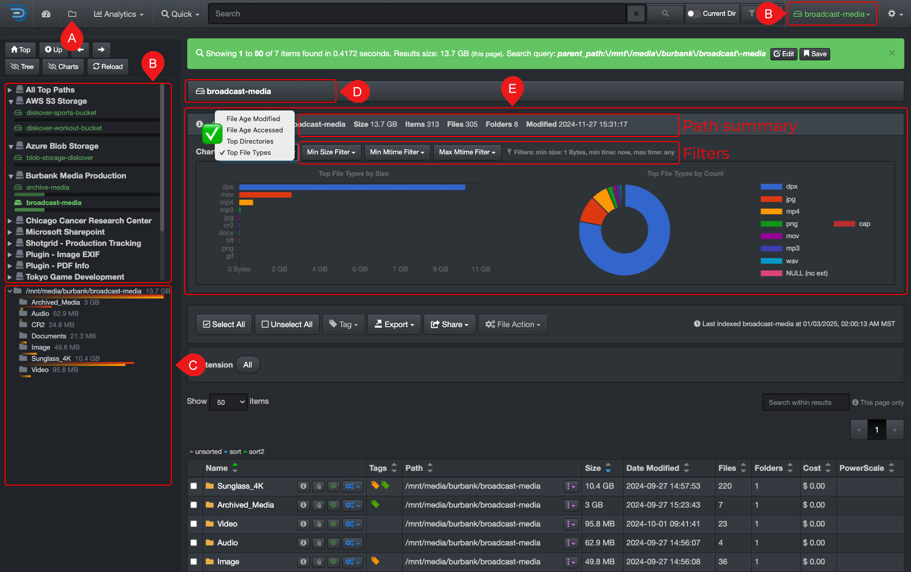
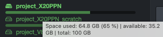
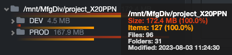

### Search Page

✏️ _[Click here for a complete overview of the user interface](#ui_overview)_

| REFERENCE | DESCRIPTION |
| :---: | --- |
| A | Use the 📁 icon to navigate back to this page when you visit other pages. |
| B |  [**Volumes**](#volume):<ul><li>You can select a volume from the left pane or the drop-down list at the top right.</li><li>Your instance may have **top paths**, as per this example, where some volumes may be grouped by geo locations, data centers, etc.</li><li>If you hover a volume name, you will see the date and time that volume was last indexed: </li><li>If you hover a fill bar, you will see the space used, free, and total for each volume: </li></ul> |
| C |  [**Directories**](#directory):<ul><li>The directories are in relation to the selected [**volume**](#volume) above.</li><li>Hover a directory in the left pane for a snapshot of additional information: </li><li>There are several ways to drill down a file tree, here are the main ones:<ul><li>You can drill down the directories from the left pane.</li><li>From the [results pane](#results_pane).</li><li>From the [path bar](#path_bar), you can click any directory to quickly navigate to that specific directory.</li><li>Some people like to drill down using the [file tree analytic](#filetree).</li></ul><li>Note that the left pane will only display directories that contain data.</li><li>⚠️ Empty directories will only appear in the [results pane](#results_pane).</li></ul> |
| D | **Path bar**: extremely useful, it shows the [path](#path) you're drilling down - you cannot type in it, but you can click on any directory to navigate directly to it. |
| E |  **Charts**: statistics about the [path](#path) your're drilling down or up - ⚠️ the charts won't update while searching:<ul><li> Click to hide/unhide the charts to free up some space from seeing your results and also note that having the charts open will slow down loading results.</li><li>**Path summary**: gives you a summary of the current path.</li><li>**Filters**: you can apply basic filters to the charts.</li><li>✅ Analytics selection drop-down list.</li><li>The graphics are clickable and will open the specific results associated with them.</li><ul> |

