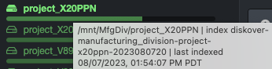

### Search Page

✏️ [Click here for a complete overview of the user interface](#ui_overview)

| REFERENCE | DESCRIPTION |
| :---: | --- |
| A | Use the 📁 icon to navigate back to this page if you visit other pages |
| B |  [**Volumes**](#volume):<ul><li>You can select a volume from the left pane or the drop-down list at the top right</li><li>Your instance may have **top paths**, as per this example, where some volumes may be grouped by geo locations, data centers, etc.</li><li>If you hover a volume name, you will see the date and time that volume was last indexed </li><li>If you hover a fill bar, you will see the space used, free, and total for each volume </li></ul> |
| C |  [**Directories**](#directory):<ul><li>The directories are in relation to the selected [**volume**](#volume) above</li><li>There are several ways to drill down a file tree, here are the main ones:<ul><li>You can drill down the directories from the left pane</li><li>From the [results pane](#results_pane)</li><li>From the [path bar](#path_bar),  you can click any directory to quickly navigate to that specific directory</li><li>Some people like to drill down using the [file tree analytic](#filetree)</li></ul><li>Hover a directory in the left pane for a snapshot of additional information</li><li>Note that the left pane will only show directories with data in them</li><li>⚠️ Empty directories will only appear in the [results pane](#results_pane)</li></ul> |
| D |  **Charts**: 

### Search Page Charts

B) **Charts hide/unhide**: By default, the file search page displays colorful charts at the top of the page giving useful statistics about a selected [path](#path). If you want to hide the charts as they take away space from seeing the results below them, click the **Charts** icon.

