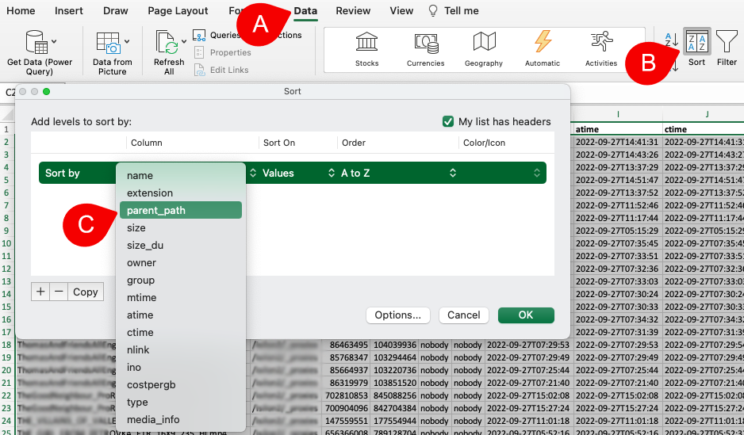
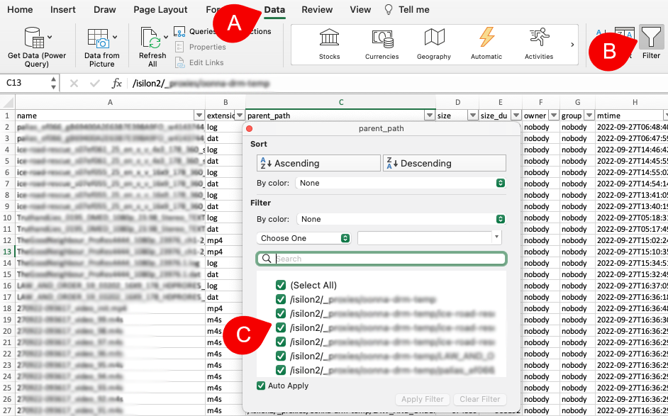

___
### Recursive/Non-Recursive Path Search and Data Manipulation in Excel

&nbsp;&nbsp;&nbsp;&nbsp;

From the [search page](#file_search), you can isolate in one click and then export all the directories and/or files that are [recursive or non-recursive](#recursive) under a path.

A) From the [results pane](#result_pane_columns), identify the path that you wish to search.

B) Click the icon that can be found in the **Path** column - follow these [instructions to unhide the **Path** column](#hideunhide-fields-in-search-results) if that specific column is not visible in your [results pane](#result_pane_columns).
  
C) Select **search path (non-recursive)** to include ONLY the directories and files included in the selected path.
  
D) Select **search path (recursive)** to include ALL the sub-directories and files included under the selected path.

#### Export Directories and/or Files to Excel

Please refer to the instructions in the **[export](#export)** section of this guide regarding files and directories export to a **csv** format.

#### Multiple Path/Directory Levels Manipulation in Excel

When exporting data in a **csv** format, you will get all the metadata associated with a file and/or directory, displayed within multiple columns. This will allow you to use Excel **sort** and/or **filters** to easily pinpoint the specific data you are looking for.

##### Excel > Data > Sort

Once you export the desired data to a **csv** format, open that file with Excel.

A) From the Excel application menu, select **Data**.

B) Click on the **Sort** icon.

C) Select **parent_path** to sort by path/directories:
  - You can add multiple levels of column sort by clicking on the **+** sign.
  - The same **Data > Sort** selection can be achieved from the Excel drop-down top menu.
  - Please refer to **Excel > Help** menu for further instructions.

##### Excel > Data > Filter - When Exporting Files from Diskover

Once you [export](#export) the desired **files** from Diskover to a **csv** format, open that file with Excel.

A) From the Excel application menu, select **Data**.

B) Click on the **Filter** icon.

C) Click on the **down-arrow** in the **parent_path** column which will open a window with multiple options:
  - Select the path(s) which you want to isolate in your results and click on **Apply Filter**.
  - The same **Data > Filter** selection can be achieved from the Excel drop-down top menu.
  - Please refer to **Excel > Help** menu for further instructions.

##### Excel > Data > Filter - When Exporting Directories from Diskover

The same instructions as above apply when you [export](#export) **directories** from Diskover, but the results will include a few more columns, giving you more filtering options.

A) From the Excel application menu, select **Data**.

B) Click on the **Filter** icon.

C) Instead of clicking on the **down-arrow** in the **parent_path** column, click the down-arrow from the **dir_depth** column, which will open a window with multiple options:
  - Select the depth of sub-directory(ies) you want to isolate in your results and click on **Apply Filter**.
  - The same **Data > Filter** selection can be achieved from the Excel drop-down top menu.
  - Please refer to **Excel > Help** menu for further instructions.

>🔆 &nbsp;In Excel, you can use both **sort** and **filters** to isolate and display the results you want to achieve.
