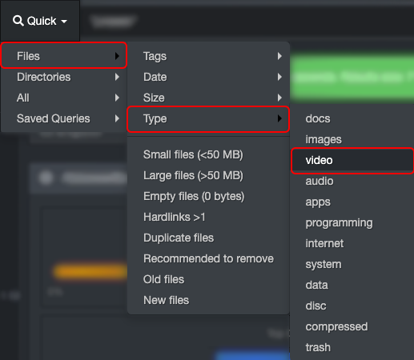

### Quick Search

Quick searches will search all your volumes and their directories. The choices are intuitive and based on pre-established smart groups of criteria. The drop-down list, and its sub-menus, offer several options. 

Select any criteria and the results will automatically open in the search page. Here is an example of possibilities:

You can always validate the criteria used for a quick search query in the green bar, this one is based on the example above:

#### Combine Quick Searches with Other Tools

Quick searches can be used on their own or combined with other searches, here are a few examples:

<ul><li>Combine Quick Search with [filters](#filters):<ul><li>Start by selecting/saving [filters](#filters).</li><li>Run a quick search.</li><li>Validate the combined criteria in the green bar.</li></ul></ul>

- They can be combined with [manual queries](#search_syntax):
  - Start by launching a quick search.
  - Copy the criteria from the green bar as per the example/image above.
  - Type a manual query in the search bar then paste the copied quick search criteria.
