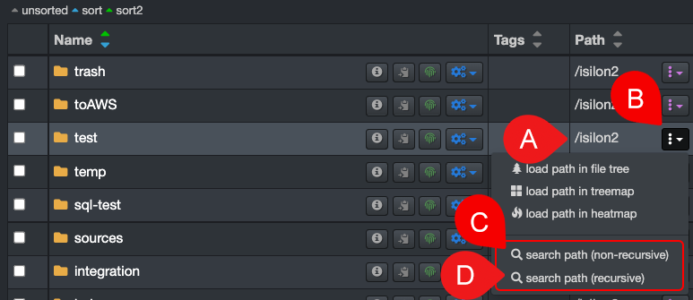

### Recursive and Non-Recursive Searches

#### [🍿 Watch Quick Tips | Recursive Search, Export, and Excel Manipulation](https://vimeo.com/762454710)

From the [search page](#search_page), you can list all the directories and files under a specified path, either [recursively or non-recursively](#recursive).  

✏️ [Learn how to manipulate the search results in Excel](#excel) for advanced sorting and filtering.

| REFERENCE | DESCRIPTION |
| :---: | --- |
| A | From the [results pane](#results_pane), identify the path that you wish to search [recursively or non-recursively](#recursive). |
| B | Click the  button that can be found in the **Path** column - if you don't have that column in your results pane, follow these [instructions to unhide the **Path** column](#hide_columns). |
| C | Select **search path (non-recursive)** to include only the directories and files within the selected path - the results will open in a new browser tab. |
| D | Select **search path (recursive)** to include ALL the sub-directories and files within the selected path - the results will open in a new browser tab. |

