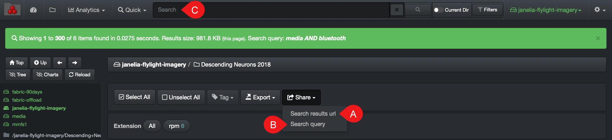

## Share Search Queries/Results

From the search page, you can share your browser’s URL address or your search query criteria.

A) **Search results url**: To copy/share the browser’s URL address of your current view/results.

B) **Search query**: To copy/share the search query you typed in C) the search bar.
