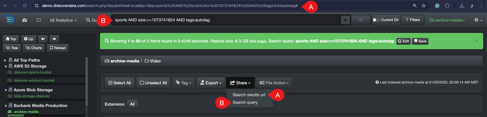

### Share 

The share options are built for efficiency and can be used in multiple ways. 

| REFERENCE | DESCRIPTION |
| :---: | --- |
| A | **Search results url**: to copy your browser’s URL with your current view and results, making it easy to share with a co-worker with access to Diskover - they can simply click the link to see the exact same results. |
| B | **Search query**: to copy the search query criteria. |
