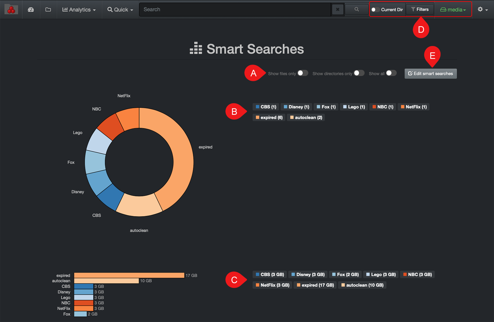
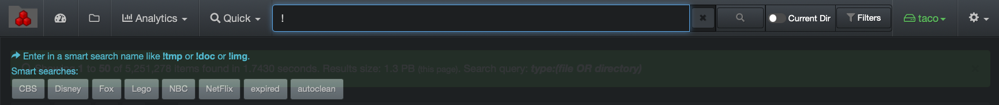

## Smart Searches

Smart searches were designed for repeatable reports; they are basically saved searches or shortcuts. The goal is to avoid having to recreate complex queries when you know you will need the same report on a regular basis. These reports are global and accessible by everyone in your organization.

The smart searches  tool comes with pre-defined searches, but those queries can be customized by someone with and admin account.

Access via the  **Analytics**  drop-down list:

All saved reports can be found in this view offering a quick graphical snapshot:

A) Apply selection for results to include files and/or directories.

B) Reports with results in number format – click on a report to open in the search page.

C) Reports with results in size format – click on a report to open in the search page.

D) Smart searches are global and selecting any of these options will not affect the results. If you want to narrow the results to one or more specific storage volumes, select the desired volume(s) in the [indices](#indices)  page and navigate back to this report.

E) You can view the queries used for the report, but an admin account is required to edit them. If you have a search query that you’d like to add to the list and do not have an admin account, copy the full path/query and share it with your System Administrator.

You can launch a smart search report at any time directly from the search bar by typing  **!**  and all the available reports will appear under the search bar.

