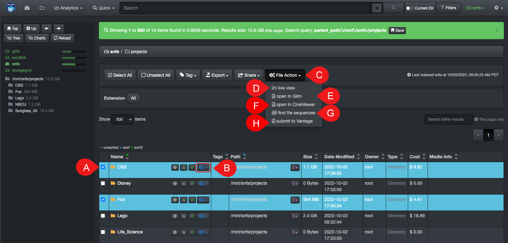
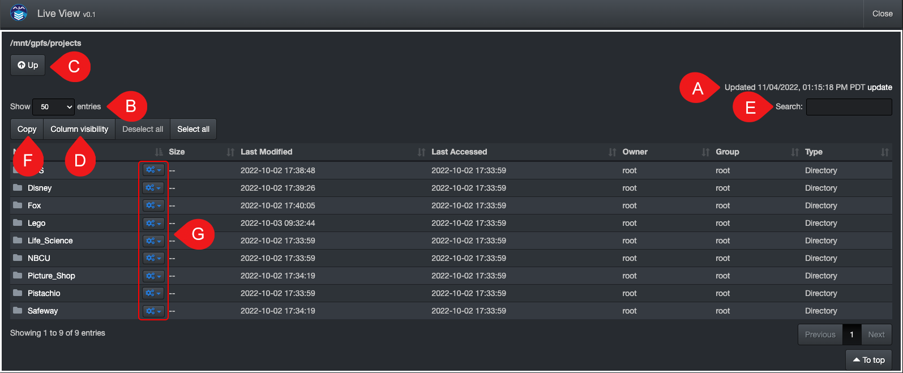

___
## File Actions
___

&nbsp;&nbsp;&nbsp;

The options within file actions push the boundaries around read-only files while still safeguarding your source assets. While some plugins are designed for seamless integration with third-party platforms, reducing time and complexity for users along with many other benefits, Diskover also embraces clients deploying their own plugins to automate their specific in-house workflows. 

The [plugins/features needs to be enabled](#https://docs.diskoverdata.com/diskover_configuration_and_administration_guide/#diskover-web-plugins-file-actions) by your System Administrator.

### File Action Overview

Here is a sample of file actions offered with the Media Edition.

A) You need to select files and/or directories before using C) **File Action** button.

B) If you want to apply a **File Action** to a single item, you can use the inline gear icon to do so.

C) Click **File Action** once you've A) selected items.

D) **live view** > Gives you a live view into the director(ies).

E) **open in Glim** > To preview media files using [Telestream GLIM](https://diskoverdata.com/products/products-aja-media-edition/#glim) - you need to have a [GLIM account](https://www.telestream.net/glim/overview.htm) to use this feature and be logged in.

F) **open in CineViewer** > To preview media files using [CineViewer Player](https://diskoverdata.com/products/products-aja-media-edition/#cineviewer).

G) **find file sequences** > To find all [files in a sequence](https://docs.diskoverdata.com/diskover_user_guide_companion_aja_media_edition/#find-file-sequences).

H) **submit to Vantage** > To submit files for transcoding via [Telestream Vantage](https://diskoverdata.com/products/products-aja-media-edition/#vantage), directly from the Diskover user interface - you need to have a [Vantage account](http://www.telestream.net/vantage/overview.htm) to use this feature and be logged in.

### File Action > Live View

&nbsp;&nbsp;&nbsp;

#### [🍿 Watch Quick Tips | Indexing and Live View](https://vimeo.com/767272643)

This feauture allows you to view the content of a live directory(ies), lists the content so you can search and pro-actively copy paths. This feature only works for on-premise storage at the moment and is not avaiable for cloud storage.

The typical use case is when you are not finding a file/directory in the indexed volumes within Diskover, you can access live directories and see if the files you are waiting to be onboarded will be available during the next indexing, as well as pro-actively copy paths.

- Select one or multiple directories in the results pane.
- Click the **File Action** icon.
- Select **live view**.

>🔆 &nbsp;If you want to **live view** a single directory, you don't have to select it first; you can use the **gears icon** in the results pane in line with the directory name. 

The **live view** directory will open in a new tab:

A) Time stamp of when you clicked **live view** in the search page - this time stamp will update if you refresh your browser tab, which will also refresh the data.

B) You can opt to view between 10 to 1,000 line items per page.

C) You can go **Up** one volume at a time - you can also drill down in the results pane.

D) You can hide and unhide columns in the results pane via the **Column visibility** button.

E) You can **Search** for specific words and/or numbers and only the line items containing that value will remain visible - once you remove the characters from that field, the previous line items will come back.

F) You can **Copy** paths:
  - If you want to copy all the paths in the results pane, you don't even have to select anything, just click the **Copy** button.
  - If you want to copy a block of paths, select the first line item, hold the SHIFT key, and click on the last line item.
  - If you want to copy random lines, hold the CTRL button for Windows or COMMAND for Mac, and select the desired lines.

G) You can launch file actions from the live view.

### Industry Specific File Actions

#### File Action > Open in GLIM

### [🍿 Watch Demo Video | Telestream GLIM](https://vimeo.com/665037937)

Allows users to safely preview media files by launching GLIM seamlessly from Diskover.

Please refer to the [User Guide Companion for the AJA Diskover Media Edition](https://docs.diskoverdata.com/diskover_user_guide_companion_aja_media_edition/#preview-media-files-with-telestream-glim) for details.

#### File Action > Submit to Vantage

#### [🍿 Watch Demo Video | Telestream Vantage](https://vimeo.com/669672933)

Allows users to safely send transcoding jobs to Telestream Vantage seamlessly from Diskover.

Please refer to the [User Guide Companion for the AJA Diskover Media Edition](https://docs.diskoverdata.com/diskover_user_guide_companion_aja_media_edition/#vantage-submit-transcoding-jobs-direclty-from-diskover) for details.

#### File Action > Open in CineViewer

#### [🍿 Watch Demo Video | CineViewer Player](https://vimeo.com/765285042)

Allows users to safely preview media files by launching the CineViewer Player seamlessly from Diskover.

Please refer to the [User Guide Companion for the AJA Diskover Media Edition](https://docs.diskoverdata.com/diskover_user_guide_companion_aja_media_edition/#cineviewer-player) for details.

#### File Action > Find File Sequences

&nbsp;

Allows users to find all files in a sequence in one click.

Please refer to the [User Guide Companion for the AJA Diskover Media Edition](https://docs.diskoverdata.com/diskover_user_guide_companion_aja_media_edition/#find-all-files-in-a-sequence) for details.
