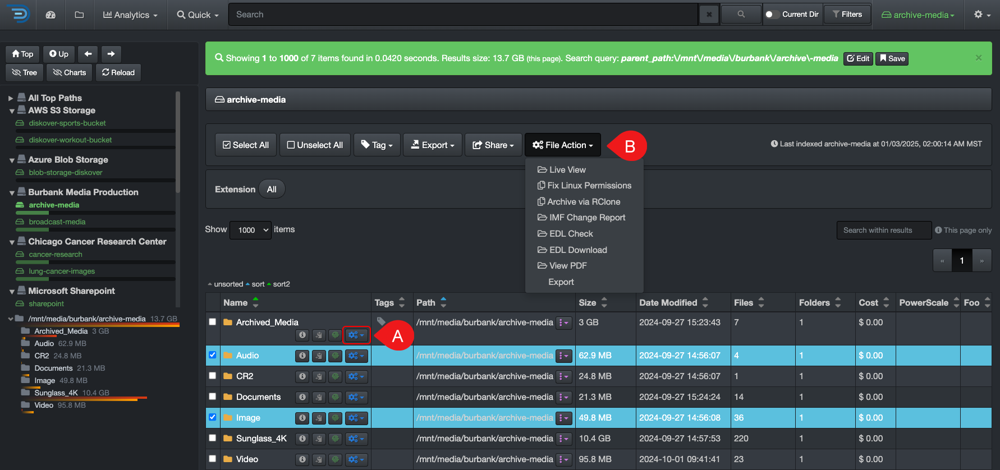
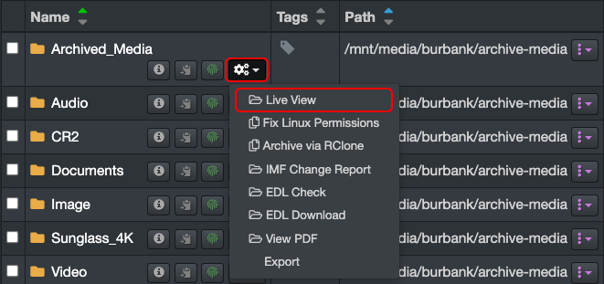
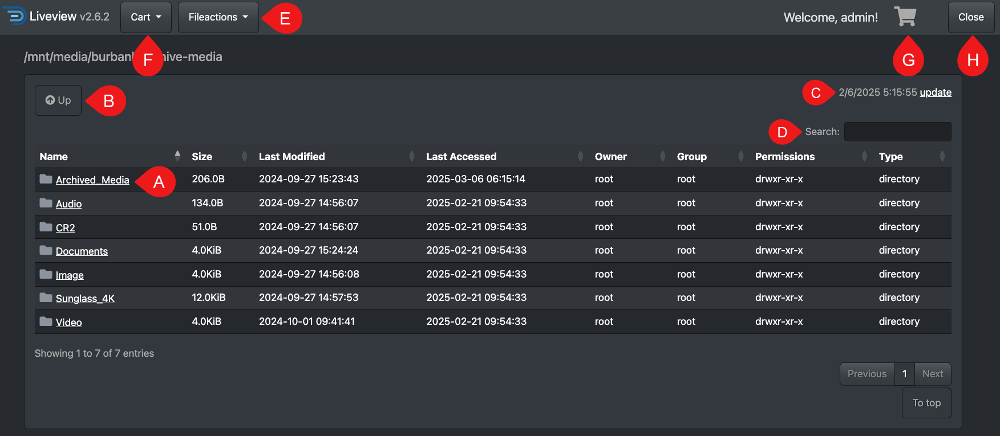
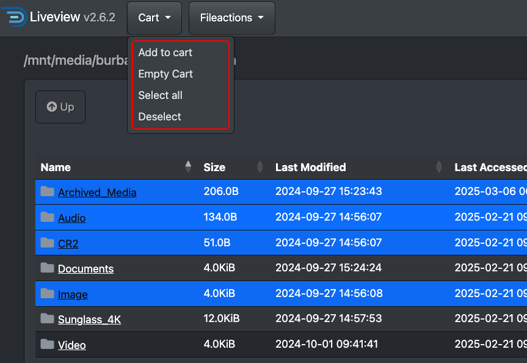
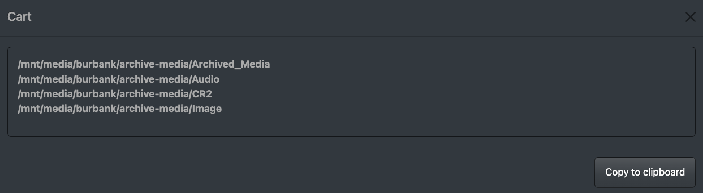

## File Actions

&nbsp;&nbsp;&nbsp;&nbsp;&nbsp;&nbsp;&nbsp;&nbsp;&nbsp;&nbsp;&nbsp;&nbsp;

The options within file actions push the boundaries around read-only files while still safeguarding your source assets. Authorized users, following role-based access controls, can initiate File Actions directly from the Diskover interface, supporting a wide range of use cases. Whether it’s taking targeted actions on data or seamlessly integrating with third-party platforms, Diskover’s open-source architecture empowers users to develop custom File Action Plugins, enabling the automation of unique in-house workflows with ease and flexibility.

### File Actions Overview

| REFERENCE | DESCRIPTION |
| :---: | --- |
| A | **Launch File Action for a single item**: You can launch a File Action on a single item by using the button in line with that item. |
| B | **Launch File Action for multiple items**: Start by [selecting](#item_selection) the items, then select the File Action. |

### Live View

#### [🍿 Watch Quick Tips | Indexing and Live View](https://vimeo.com/767272643)

This feature gives authorized users a real-time view of a live directory, allowing them to access the latest filesystem content between indexing intervals.

| STEP | DESCRIPTION |
| :---: | --- |
| 1 | Select any directory inside the volume you want to launch **Live View** as you will be able to navigate up and down once in Live View mode. |
| 2 | Select  |
| 3 | Select **Live View** - the live view directory will open in a new tab. |

| REFERENCE | DESCRIPTION |
| :---: | --- |
| A | **Drill down** by clicking on a directory. |
| B | **Drill up**. |
| C | **Timestamp** of when you launched Live View in the search page, click **update** to refresh the information if your tab is idle for a while. If the time doesn't match your local time, make sure your [time zone setting](#time) is selected. |
| D | **Search** with keywords - this will only search the current page of results and will hide the other line items, but they will return as soon as you clear the search bar. |
| E | You can launch other **File Actions** once in Live View, but you must [select](#item_selection) the items first. |
| F | The use case for the **Cart** is to copy paths:<ul><li>[Select the items](#item_selection) first.</li><li>Open the **Cart** options and select **Add to cart**.</li></ul> |
| G | Open the **Cart** and select **Copy to clipboard**  |
| H | You can **close** Live View with this button or simply close the browser tab. |

### File Actions for Media

For details, please refer to the [User Guide Companion for the AJA Diskover Media Solutions](https://docs.diskoverdata.com/diskover_user_guide_companion_aja_media_edition/).

### File Actions for Life Science

For details, please refer to the [User Guide Companion for Life Science Solutions](https://docs.diskoverdata.com/diskover_user_guide_companion_life_science_edition/).
