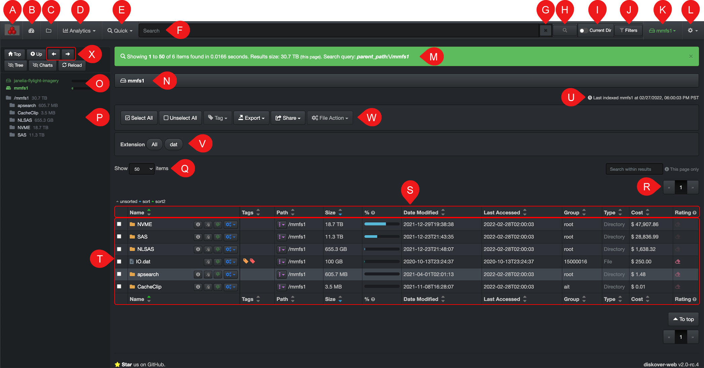
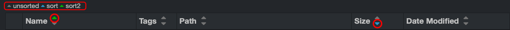
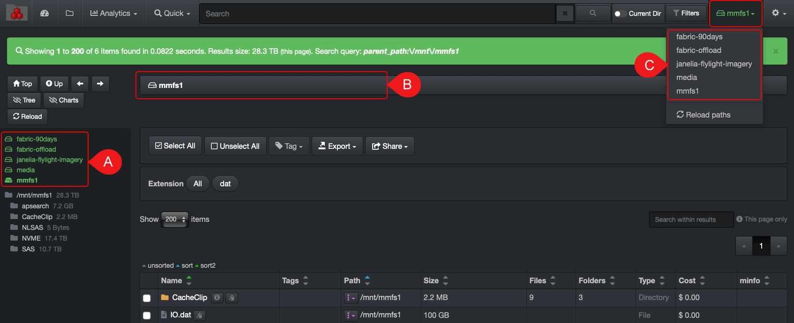
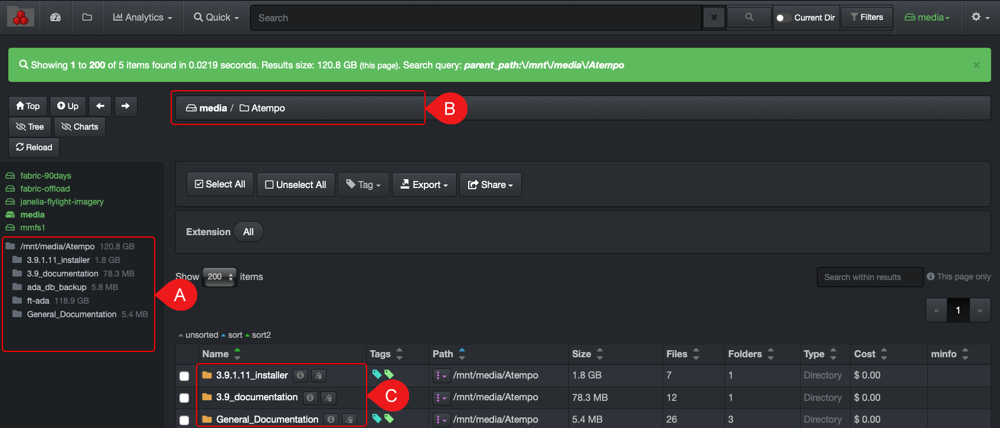

___
## User Interface Overview
___

### Web Browser

Diskover should look and act the same on any browser. The only thing to keep in mind is if, for example, you apply some modifications in your [settings](#settings) in Google Chrome, they will not transfer to Safari because the [settings](#settings) are tied to the cookies  of a browser. In this example, you would need to apply the same [settings](#settings) in Safari.

___
### Login

A) Open a  **Web browser**  of your choice and type the  **URL address**  that was supplied to you by the System Administrator of your facility.
B) Enter the  **Username**  and  **Password**. Your System Administrator configures the login mechanism.
C) Click on  **Login**.

___
### User Interface Overview

This section offers an overview of the user interface. All icons, drop-down lists and tools will be further explained in the next chapters.

A) **Company logo**: No functions.

B) **[Dashboard](#dashboard)**: Offers a visual summary of a selected storage volume.

C) [**File search page**](#file_search): The file search tool with which most users will interact.

D) **Analytics**: Built-in data analytic reports.

E) [**Quick search**](#quick_search): To quickly search on a single pre-established criterion.

F) **Search bar**: To type and paste [search queries](#search_syntax).

G) **Clear**: To clear the search bar.

H) **Launch a search**: Same function as a  **Return**  key.

I)  **Current Dir**: Toggle right to narrow your searches/results to a selected storage volume and/or directory.

J) [**Search Filters**](#filters): Built-in filters to refine your searches.

K) [**Storage volumes**](#storage_volume): Drop-down list for selection of available storage volumes.

L) [**Settings**](#settings): To personalize your interface via the settings, access to indices, help and logout.

M) **Green Info bar**: This bar displays the following details:

>- How many items were found during a query or just by drilling-down, ex:  _Showing 1 to 100 of 270 items found in 0.0201 seconds._
>- Size resulting from a search or drill-down, ex: _Results size: 664.3 GB (this page)_
>- Shows the storage volume/directory you are pointing to, ex:  _parent_path:/mnt/media_
>- Shows search query either you are typing a manual query or using a built-in search tool ([Filters](#filters), [Quick Search](#quick_search), etc.), ex:  _Search query: mov and tags:archive_
>- This bar can be cleared by clicking the  **X**  at the far right.

N) **Path bar**: Shows the path you’re working in (storage volume, directory, sub-directory, etc.), you cannot type in it, but you can click on any storage volume or directory and navigate that way.

O) [**Storage volumes**](#storage_volume): To view and select available storage volumes:
>- If you hover over a volumes, you will see the last indexed date and time for that specific volume.
>- If you hover over the fill bars on the right of the volumes, you will see the space used, free, and total for each volume.

P) [**Directories**](#directory): To view and select available directories inside the selected storage volume.

Q) **Items per page**: To modify the number of items per page to display – choices between 10 to 1,000.

R) **Pages of results**: The number of pages of results is directly related to the number of Q) items per page.

S) **Headers and Columns**: Columns can be added or removed in [Settings](#settings) > [Hide fields in search results](#hide_columns). Also, you can sort any columns:
>- By using the arrows as specified in the legend.
>- Choice of primary and secondary sort.
>- Ascending or descending.
>- To assign a **primary sort** > just click on the column's arrow you desire, ascending or descending, and the green arrow will change to that column.
>- To assign a **secondary sort** > start by clicking on the blue arrow to remove the current secondary sort, and then click on the column you want to apply the secondary sort to, ascending or descending.
>
>Start by clearing the [sorted columns by default](#default_columns_sort) by clicking on the colored arrows and then select the columns and orders you want.
>

T) **Search results pane**: Section where you can either see the full content of a storage volume, a directory, or search results following a query.

> 🔆 &nbsp;You can adjust the width of the columns in T) search results  pane by sliding the thin vertical line in between the columns.

U) **Storage volume last indexed**: Gives the date and time of the last scan of the selected storage volume.

> 🔆 &nbsp;Hovering  your mouse over a [storage volume](#storage_volume) or a [directory](#directory) in the left pane will show more data about that specific directory (path, size, number of items, etc.).

 

V) **Extension**: Will show all the file extensions found in the path you are pointing to or search query you ran.

W) Features will be explained later in this guide, but you can click on the links below to go directly to that section:
>- [Select All and Unselect All](#line_selection)
>- [Tag](#tags)
>- [Export](#export)
>- [Share](#share)
>- [File Action](#file_action)

X) **Navigation arrows**: You can navigate back and forth withing the user interface using these arrows and/or the browser's arrows; the results will be the same.

___
### How to Select a Storage Volume

A) Via the  **left pane** (at the top in green).

B) Via the  **path navigation bar**.

C) Via the  **drop-down list**  at the top right corner.

___
### How to Select a Directory

A) Via the  **left pane**  below the storage volumes – click on a directory to drill down the file tree.

B) Via the  **path navigation bar**.

C) Within the  **search results pane**.
