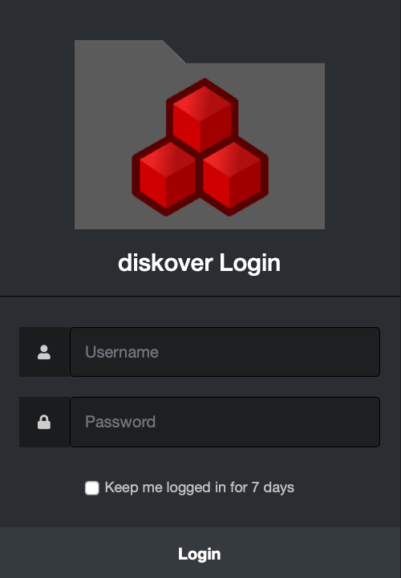
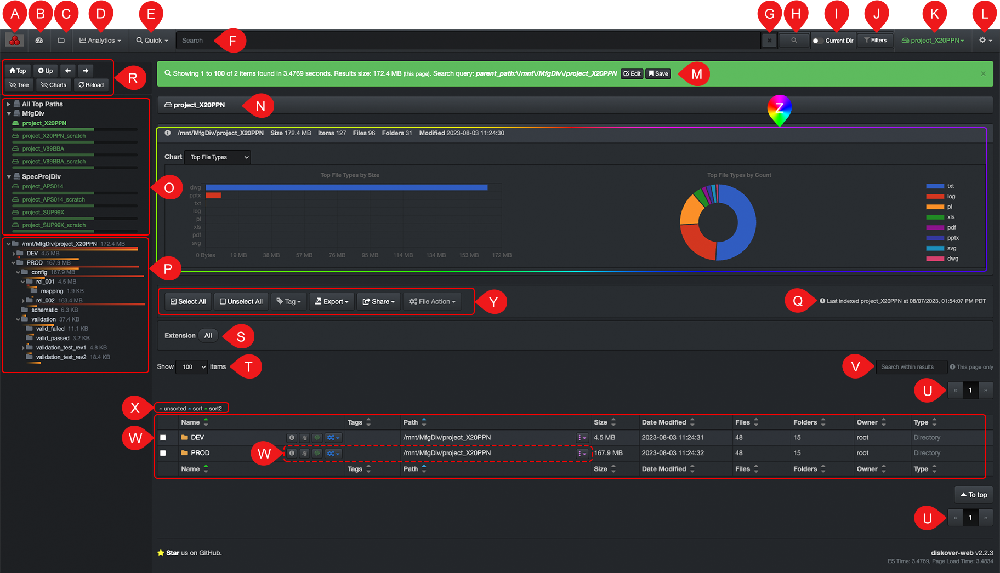
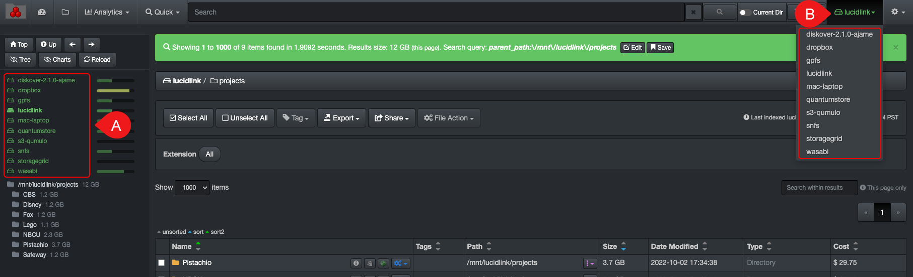
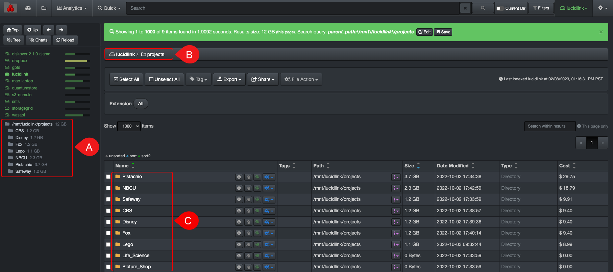

___
## User Interface Overview
___

#### [🍿 Watch Quick Tips | User Interface Overview](https://vimeo.com/787050664)

___
### Login

A) Open a  **Web browser**  of your choice and type the  **URL address**  that was supplied to you by the System Administrator of your facility.

B) Enter your  **Username**  and  **Password** which were also supplied to you by the System Administrator.

C) Click  **Login**.

>🔆 &nbsp;Diskover should look and act the same on any web browser. The only thing to keep in mind is if you apply some modifications in your [settings](#settings) using Google Chrome, they will not transfer if you switch to Safari, for example, because the [settings](#settings) are tied to the cookies of a browser. In this example, you would need to apply the same [settings](#settings) in Safari. Learn more about how [cookies](#clear_cookies) and [cache](#clear_cache) affect the Diskover user interface.

___
### User Interface Overview

By default and upon login, you will land on the file search page as shown below, which is the most used page. This section offers an overview of this main user interface. All other icons, drop-down lists, and tools will be further explained in the subsequent chapters.

A) **Software logo**: No functions.

B) **[Dashboard](#dashboard)**: Analytical snapshot of a [volume](#storage_volume).

C) 📍 [**File search page**](#file_search): Use the folder icon to navigate back to this file search page.

D) [**Analytics**](#analytics): To select one of the several built-in analytics.

E) [**Quick search**](#quick_search): To quickly search all volumes using pre-established criteria/queries.

F) **Search bar**: To type and/or paste [search queries](#search_syntax) or a [path](#search_path).

G) **Clear**: To clear the search bar.

H) **Launch a search**: Same function as using your  **Return**  key to launch a query.

I) **Current Dir**: Toggle on/right to narrow your searches/results to a selected [path](#path), it will remain active until you manually toggle off.

J) [**Filters**](#filters): Built-in filters to refine your results either when drilling down or searching.

K) [**Volumes**](#storage_volume): Drop-down list to select a specific volume - volumes can also be selected via O) the left pane.

L) **Gear Icon**: 
  - **Settings**: To modify the [settings](#settings) of the Diskover interface.
  - **Indices**: To select specific [indices](#indices).
  - **Task Panel**: For system administrators.
  - **Help**: Direct link to access our complete documentation catalog [docs.diskoverdata.com](https://docs.diskoverdata.com/)
  - **Reload Indices**: To refresh your [indices](#indices) and Z) charts.
  - **Logout**: To log out of Diskover.

M) **Green bar**: This bar displays the following details:

  - How many items were found during a search query or drilling down, ex:  _Showing 1 to 1000 of 9 items found_
  - Size of data listed on the current page, resulting from a search or drill down, ex: _Results size: 12 GB (this page)_
  - Shows the [path](#path) you are pointing to, ex: _parent_path:\/mnt\/lucidlink\/projects_
  - Shows search criteria either you are typing a manual query or using a [built-in search tool](#builtin_search_tools), ex:  _Search query: mov and tags:archive_
  - This bar can be cleared by clicking the  **X**  at the far right.

N) **Path bar**: Shows the [path](#path) you’re in, you cannot type in it, but you can click on any directory to navigate directly to it.

O) [**Volumes**](#storage_volume): To view and select available volumes from the left pane:
  - If you hover over the fill bars on the right of the volumes, you will see the space used, free, and total for each volume.
  - If you hover over a volume, you will see the last indexed date and time for that specific volume.

  

P) [**Directories**](#directory): To view and/or drill down the directories inside the selected volume in green above, you can also drill down from the [results pane](#results_pane).
  - Hovering your mouse over a directory in the left pane will give you a snapshot of its attributes.
  - Note that the left pane will only show directories with data in them, all directories either with data or empty will show in the W) results pane.

  

Q) **Last indexed**: Gives the date and time of the last scan of the selected volume.

R) **Other ways to navigate**:
  - **Top**: Will bring you back to the top/root of the active [volume](#storage_volume).
  - **Up**: To drill up one [directory](#directory) at a time.
  - **Back and forth arrows**: To navigate back and forth between visited pages, you can also use the browser's arrows, the results will be the same.
  - **Hide Tree**: Will hide the left pane allowing for more space to investigate W) your results.
  - **Charts**: To hide/unhide the charts that are located by default above W) the results pane.
  - **Reload**: To reload the data in the current page.

S) **Extension**: Will show all the file extensions detected in your results, either from drilling down or resulting from a search query, any extension can be clicked to isolate these specific items.

T) **Items per page**: To modify the number of items per page to display in W) the results pane – 10 minimum and 1,000 maximum.

U) **Pages of results**: The number of pages of results is directly related to the number of T) items per page.

V) **Search within results**: Built-in search tool to [search within the results on the current page](#search_within_results), acts like CTRL or CMD F but is much more powerful.

W) **Results pane**: To see the results when you drill down or from a search query, see the [file search chapter](#file_search) for more details:
  - You can see more or less columns > **gear icon** > [**Settings**](#settings) > [**Hide fields in search results**](#hide_columns).
  - You can change the width of the columns by holding/moving the line in between two columns.
  - You can [sort](#sort) the data.
  - Contains several clickable icons which are explain in details in subsequent chapters.

X) These features will be explained later in this guide, but you can click on the links below to go directly to a section:
  - [Select All and Unselect All](#line_selection) line items in your results pane.
  - Apply a manual [Tag](#tags).
  - [Export](#export) your results.
  - [Share](#share) your results.
  - [File Action](#file_action).

___
### How to Select a Volume

A) Via the **left pane**.

B) Via the **drop-down list** in the top menu.

___
### How to Select a Directory

A) Via the **left pane**  below the volumes, click on any directory to drill down the file tree.

B) Via the **path bar**, click any directory to navigate directly to it.

C) You can drill down via the  **results pane**.
