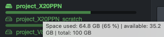
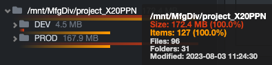

## User Interface Overview

#### [🍿 Watch Basics & Beyond | Interface Overview](https://vimeo.com/1078066161)

### Login

| STEP | DESCRIPTION |
| :---: | --- |
| 1 | Open a  **Web browser**  of your choice and type the  **URL address**  that was given to you to access Diskover. |
| 2 | Enter your  **Username**  and  **Password**, which were also given to you, probably by your System Administrator. |
| 3 | Click  **Login**. |

✏️ _Diskover should look and act the same on any web browser. The only thing to keep in mind is if you apply some modifications in your [settings](#settings) using Google Chrome, for example, they will not transfer if you switch to Safari because the [settings](#settings) are tied to your browser's cookies._

### User Interface Overview

By default, upon login, you will land on the file search page shown below or the [dashboard](#dashboard) page, depending on how your System Administrator configured your instance. The search page is the most used tool, and this section offers an overview. The subsequent chapters will further explain all other icons, drop-down lists, and features.

🔆 _Hovering almost anything(buttons, charts, volumes, etc.) in Diskover will give you additional information._

| REFERENCE | DESCRIPTION|
| :---: | --- |
| A | Software logo - it has no function. |
| B | <ul><li>[**Dashboard**](#dashboard): gives a snapshot of an entire [volume](#volume).</li><li>[**Analytics**](#analytics): drop-down list offering multiple tools and reports.</li></ul> |
| C | Use the 📁 icon to navigate back to this page called the **search page**. |
| D | Integrated search tools:<ul><li>[**Quick search**](#quick_search): to quickly search all volumes using pre-established criteria.</li><li>[**Filters**](#filters): to refine your results either when drilling down or searching.</li><li>[**Search within results**](#search_within_results): acts like CTRL or CMD F on steroids.</li></ul> |
| E | **Search bar**:<ul><li>You can type or paste [search queries](#manual_queries).</li><li>Use the **x** to clear the search bar.</li><li>Click **Enter** or **Return** to launch a search or use the 🔍 next to the **x**.</li></ul> |
| F | [**Current Dir**](#current_dir): toggle **ON** to limit your searches to a selected [path](#path), note that it will remain active until you manually toggle **OFF**. |
| G | [**Volume**](#volume) selection: <ul><li>You can select a volume from the left pane or the drop-down list at the top right.</li><li>Your instance may have **top paths**, as per this example, where some volumes may be grouped by geo locations, data centers, etc.</li><li>If you hover a volume name, you will see the date and time that volume was last indexed: </li><li>If you hover a fill bar, you will see the space used, free, and total for each volume: </li></ul> |
| H | **⚙ drop-down list**:<ul><li>**Settings**: to modify your personal interface [settings](#settings).</li><li>**System Configuration**: you will only see this option if you are a System Administrator.</li><li>**Indices**: to select specific [indices](#indices).</li><li>**Task Panel**: you will only see this option if you are a System Administrator.</li><li>**Help**: contains direct link to access our complete online documentation [docs.diskoverdata.com](https://docs.diskoverdata.com/)</li><li>**Reload Indices**: to refresh your [indices](#indices) search page charts.</li><li>**Logout**: to log out of the Diskover application.</li></ul> |
| I | **Optional navigation buttons**:<ul><li>**Top**: will bring you back to the top/root of the active [volume](#volume).</li><li>**Up**: to drill up one [directory](#directory) at a time.</li><li>**Back and forth arrows**: to navigate back and forth between visited pages, you can also use the browser's arrows and the results will be the same.</li><li>**Hide Tree**: to hide/unhide the left pane allowing for more space to view the search results.</li><li>**Hide Charts**: to hide/unhide the [charts](#search_page_charts) on the search page.</li><li>**Reload**: to refresh the left pane and the [charts](#search_page_charts).</li></ul> |
| J |  **Green bar**:<ul><li>**Items per page**: number of items found during a search or when drilling down, ex:  _**Showing 1 to 100 of 259 items found**_ </li><li>**Size of data**: listed on the current page ONLY so be careful if you have several pages of results, ex: _**Results size: 12 GB (this page)**_ </li><li>**Path**: will show the [path](#path) when drilling down, ex: _**parent_path:\/mnt\/lucidlink\/projects**_ </li><li>**Search criteria**: shows the criteria used after launching a search, either you are typing a manual query or using a [built-in search tool](#builtin_search_tools), ex: _**Search query: bigfoot AND tags:missing**_ </li><li>**Close the green bar**: you can close this green bar by clicking the  **X** on the far right, but it’ll pop back up after your next action. Trust us, you’ll want it—so don’t fight it! | **Save queries**: you can [save personal queries](#save_query) that will only be visible to you [click here to learn everything about personal queries](#save_query).</li></ul> |
| K |  **Path bar**: shows the [path](#path) you're drilling down - you cannot type in it, but you can click on any directory to navigate directly to it. |
| L | [**Search Page Charts**](#search_page_charts): offer useful statistics about a selected path - [click here to learn more about these charts](#search_page_charts). |
| M | [**Directories**](#directory):<ul><li>The directories are in relation to the selected [volume](#volume) above.</li><li>You can drill down the directories from the left pane or the [results pane](#results_pane).</li><li>Hover a directory in the left pane for a snapshot of additional information: </li><li>Note that the left pane will only display directories that contain data.</li><li>Empty directories will only appear in the results pane.</li></ul> |
| N | **Select All or Unselect All**: the results in the [results pane](#results_pane), either they are from drilling down or a search. |
| O | **Extension bar**: will show all the file extensions detected in your results, either from drilling down or a search - you can click any extension to list only these files in the [results pane](#results_pane). |
| P | [**Tags**](#tags): to manually tag one or several items - [click here to learn more about tagging](#tags). |
| Q | [**Export**](#export): to export in JSON or CSV format, or simply copy paths, of all or selected items - [click here to learn more about exporting](#export). |
| R | [**Share**](#share): to share the results URL or query with a co-worker using Diskover - [click here to learn more about sharing](#share). |
| S | [**File Action**](#file_action): allow authorized users to take different actions on files - [click here to learn more about file actions](#file_action). |
| T |  **Items per page**:<ul><li>Allows the user to modify the number of items per page to display in the [results pane](#results_pane):</li><li>Choices are between 10 and 1,000.</li><li>The limit on the number of items per page is set for faster data loading and improved speed.</li><li>**Pages of results**: the number of pages of results is directly related to the number of items per page.</li></ul> |
| U | [**Sort**](#sort): legend for sorting the data in the results pane - [click here to learn more about sorting](#sort). |
| V | **Results pane**: to see the results when you drill down or from a search:<ul><li>Go to your [Settings](#hide_columns) to see more or less columns.</li><li>You can change the width of the columns by holding and dragging the line between two columns.</li><li>All icons will be explained in the [results pane overview](#results_pane) section.</li></ul> |

