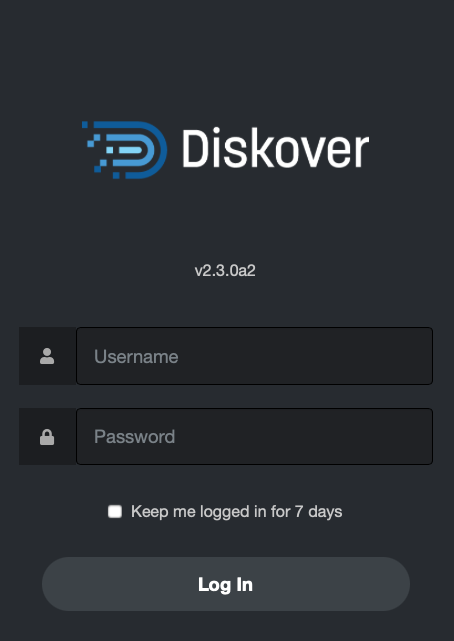
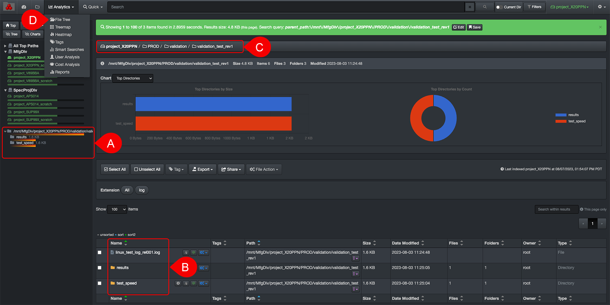

## User Interface Overview

#### [🍿 Watch Quick Tips | User Interface Overview](https://vimeo.com/787050664)

### Login

| STEP | DESCRIPTION |
| :---: | --- |
| 1 | Open a  **Web browser**  of your choice and type the  **URL address**  that was given to you to access Diskover. |
| 2 | Enter your  **Username**  and  **Password**, which were also given to you, probably by your System Administrator. |
| 3 | Click  **Login**. |

✏️ _Diskover should look and act the same on any web browser. The only thing to keep in mind is if you apply some modifications in your [settings](#settings) using Google Chrome, for example, they will not transfer if you switch to Safari because the [settings](#settings) are tied to your browser's cookies._

### User Interface Overview

By default, upon login, you will land on the file search page shown below or the [dashboard](#dashboard) page, depending on how your System Administrator configured your instance. The search page is the most used tool, and this section offers an overview. The subsequent chapters will further explain all other icons, drop-down lists, and features.

🔆 _Hovering almost anything(buttons, charts, volumes, etc.) in Diskover will give you additional information._

⭐️ _Indicates the most used features._

| FEATURE | DESCRIPTION|
| :---: | --- |
| A | Software logo, has no function |
| B | <ul><li>[**Dashboard**](#dashboard): gives a snapshot of an entire [volume](#volume)</li><li>[**Analytics**](#analytics) drop-down list: choice of multiple analytics and reports</li></ul> |
| C | 📍 Use the **folder icon** to navigate back to this page called the **search page** |
| D ⭐️ | Integrated search tools:<ul><li>[**Quick search**](#quick_search): to quickly search all volumes using pre-established criteria</li><li>[**Filters**](#filters): to refine your results either when drilling down or searching</li><li>[**Search within results**](#search_within_results): acts like CTRL or CMD F on steroids</li></ul> |
| E ⭐️ | **Search bar**:<ul><li>You can type or paste [search queries](#manual_queries)</li><li>Use the **x** to clear the search bar</li><li>Click **Enter** or **Return** to launch a search or use the 🔍 next to the **x**</li></ul> |
| F | Toggle [**Current Dir**](#current_dir) ON to limit your searches to a selected [path](#path) - will remain active until you manually toggle OFF |
| G | You can select a [**volume**](#volume) from either the left pane or the drop-down list at the top right. Important notes<ul><li>Your instance may have **top paths**, as per this example, where some volumes may be grouped by geo locations, data centers, etc.</li><li>If you hover a volume name, you will see the date and time that volume was last indexed </li><li>If you hover a fill bar, you will see the space used, free, and total for each volume </li></ul> |
| H | **⚙ drop-down list**:<ul><li>**Settings**: to modify your personal interface [settings](#settings)</li><li>**System Configuration**: you will only see this option if you are a System Administrator</li><li>**Indices**: to select specific [indices](#indices)</li><li>**Task Panel**: you will only see this option if you are a System Administrator</li><li>**Help**: contains direct link to access our complete online documentation [docs.diskoverdata.com](https://docs.diskoverdata.com/)</li><li>**Reload Indices**: to refresh your [indices](#indices) search page charts</li><li>**Logout**: to log out of the Diskover application</li></ul> |
| I | **Optional navigation buttons**:<ul><li>**Top**: will bring you back to the top/root of the active [volume](#volume)</li><li>**Up**: to drill up one [directory](#directory) at a time</li><li>**Back and forth arrows**: to navigate back and forth between visited pages, you can also use the browser's arrows and the results will be the same</li><li>**Hide Tree**: to hide/unhide the left pane allowing for more space to view the search results</li><li>**Hide Charts**: to hide/unhide the [charts](#search_page_charts) on the search page</li><li>**Reload**: to refresh the left pane and the [charts](#search_page_charts)</li></ul> |
| J | **Green bar**:<ul><li>**Items per page**: number of items found during a search or when drilling down, ex:  _Showing 1 to 100 of **259 items found**_ </li><li>**Size of data**: listed on the current page ONLY so be carefully if you have several pages of results, ex: _Results size: **12 GB (this page)**_ </li><li>**Path**: will show the [path](#path) when drilling down, ex: _parent_path:\/mnt\/lucidlink\/projects_ </li><li>**Search criteria**: shows the criteria used after launching a search, either you are typing a manual query or using a [built-in search tool](#builtin_search_tools), ex: _Search query: bigfoot AND tags:missing_ </li><li>**Close green bar**: you can close this green bar by clicking the  **X**  at the far right, but it will reappear following your next action, and you really want and need it, so don't fight it! | **Save queries**: you can [save personal queries](#save_query) that will only be visible to you [learn everything about personal queries here](#save_query) |
| K |

N) **Path bar**: Shows the [path](#path) you're drilling down, you cannot type in it, but you can click on any directory to navigate directly to it.

O) [**Volumes**](#storage_volume): To view and select available volumes from the left pane:
  

P) [**Directories**](#directory): To view or drill down the directories inside the O) selected volume:
  - Hovering your mouse over a directory in the left pane will give you a snapshot of additional information.
  - Note that the left pane will only show directories with data in them. You can find all directories, empty or containing data, in the W) results pane.

    

Q) **Last indexed**: Gives the date and time of the last scan of the selected volume.

R) 

S) **Extension bar**: Will show all the file extensions detected in your results, either from drilling down or resulting from a search. Click any extension to list these specific items.

T) **Items per page**: To modify the number of items per page to display in W) the results pane – 10 minimum and 1,000 maximum - the reason to limit the number of items per page is speed, so data loads faster.

U) **Pages of results**: The number of pages of results is directly related to the number of T) items per page.

V) 

W) **Results pane**: To see the results when you drill down or from a [search](#file_search):
  - You can see more or less columns > gear icon > [Settings](#settings) > [Hide fields in search results](#hide_columns).
  - You can change the width of the columns by holding/dragging the line between two columns.
  - Contains several clickable icons which are explained in later in this guide, but briefly:
    - Grey **i** button: Will open the [attributes/metadata](#attributes) window for a [directory](#directory).
    - Grey **clipboard** button: To copy a [path](#path).
    - Blue **gears** button: To launch a [file action](#file_action)
    - Pinkish **dots** button - quick load: To launch a path in an [analytic](#analytics) format or to search [non-recursively or recursively](#recursive)

X) [**Sort**](#sort): You can sort the data in the W) results pane.

Y) **Action buttons**: These features are explained later in this guide or click a link below:
  - To [select all and unselect all](#line_selection) line items in your results pane.
  - To apply a manual [tag](#tags).
  - To [export](#export) your results, copy paths, or copy file names.
  - To [share](#share) your results URL with a co-worker or to copy a search query.
  - To launch a [file action](#file_action).

Z) [**Charts**](#file_search_charts): Quick analytics of the selected path with different options in the drop-down list at the left top corner.

___
### How to Select a Volume

A) From the **left pane**, click on an arrow first to open a top path, if applicable, as you may not have any top paths in your instance.

B) From the **drop-down list** in the top menu.

___
### How to Select a Directory

There are several ways to drill down a file tree, here are the main ones:

A) From the **left pane**  below the volumes.

B) From the  **results pane**.

C) From the **path bar**, click any directory to navigate back to that specific directory.

D) Some people like to drill down using the [file tree analytic](#filetree).

>🔆 &nbsp;Note that the directories in A) the left pane and B) the results pane may differ as the left pane only shows directories with data in them. Empty directories will only be listed in the results pane.
