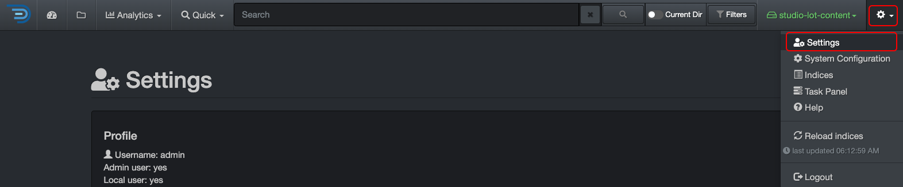
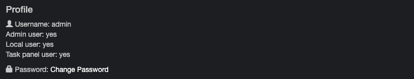
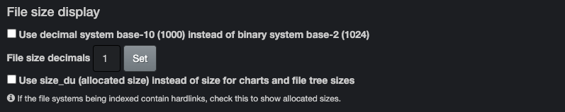
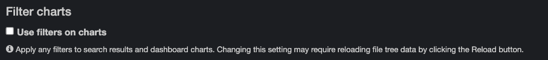
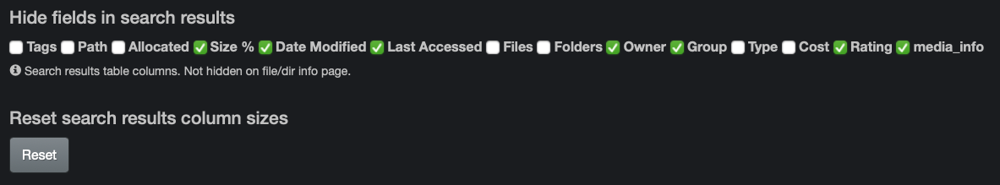
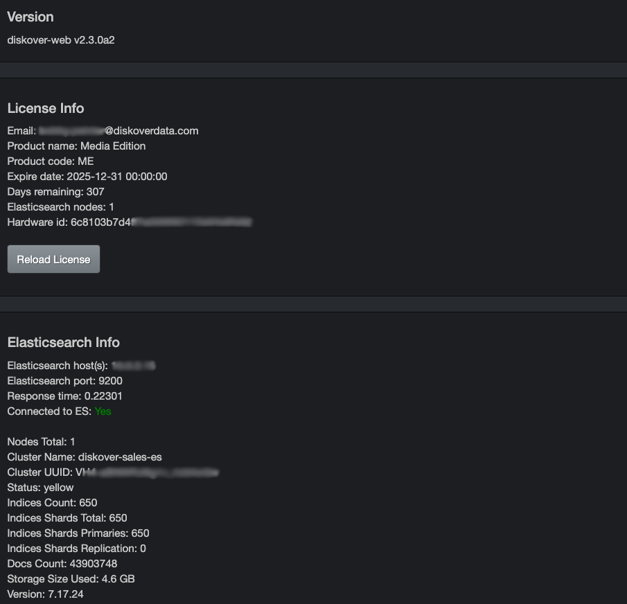

## Settings

### Settings Overview

You can access the settings via the ⚙️ icon at the top right corner of the interface.

⚠️ **IMPORTANT!**

- Settings are personal to your browser, even if you share an account. Your customizations are stored as cookies. [Clearing the cookies](#clear_cookies) will reset your settings to Diskover’s defaults.
- If you switch browsers, such as from Chrome to Firefox, you’ll need to reselect your settings, as they are stored as cookies specific to each browser.
- Your cookies may also be cleared after a software update, requiring you to reselect your settings.
- To learn more about how your [cookies](#clear_cookies) and [cache](#clear_cache) affect the Diskover user interface.
- **GOOD NEWS!** There are very few settings to select, so reselecting when needed is an easy task.

### Profile

- Shows your **Username**
- Determines your [role/access](#role_access):
    - **Admin user** = admin
    - **Local user** = non-technical user
    - **Task panel user** = sys admin/technical user
- Click **Change Password** as needed, and you will be prompted to enter your current password and type a new one.

### Time Display

- You can choose to change the time to your **local time zone** instead of **UTC** (Coordinated Universal Time).
- We recommend selecting **Show times in local timezone** to avoid confusion, especially with indexing times.
- This change will also affect the [storage time of your indices](#indices), file creation dates, modifications, etc.
- Your selection will be saved automatically.

### File Size Display

- By default, Diskover shows the file size using the **binary system**. Click **Use decimal system base-10...** if you prefer the **decimal system**. Your selection will be saved automatically.
- By default, Diskover’s file size decimal is set to **1**. Change it to your preference and click **Set** to save.
- Select **Use size_du (allocated size) instead...** if you want to use the real allocated disk size instead of the actual file size. Your selection will be saved automatically.

### Search File Tree

- By default, the [file tree analytic](#filetree) is sorted alphanumerically.
- Click the box to sort the [file tree analytic](#filetree) by size instead.
- Your selection will be saved automatically.

### Filter Charts

- By default, [filters](#filters) do not affect the [charts](#search_page_charts) on the file search page or the [dashboard](#dashboard).
- Check the **Use filters on charts** box to apply the filters to the [charts](#search_page_charts) and the [dashboard](#dashboard).
- Your selection(s) will be saved automatically.

### Use Predictive Search

- Check this box if you want your searches to **always** expand with the [\* wild card](#asterisk_wildcard) without needing to type the **\*** in the search bar.
- ⚠️ **Important**: Using this setting may return many additional or unwanted results.
- Your selection(s) will be saved automatically.
- The [wild cards](#wildcards) are explained further in the [manual queries](#manual_queries) chapter.

### Default Search Sort

- By default, the columns on the file search page are sorted by **path name** and then by **file or directory name**.
- Check this box to display unsorted search results instead.
- Your selection(s) will be saved automatically.
- Learn how to [assign primary and secondary sort](#sort) in the [results pane](#results_pane).

### Hide/Unhide Fields in Search Results

- ⬜️ Unchecked boxes mean the columns are **visible** in your [results pane](#results_pane).
- ✅ Checked boxes mean the columns are **hidden** in your [results pane](#results_pane).
- Your selection(s) will be saved automatically.
- The [base metadata](#base_metadata) fields are the same for everyone, but you may have extra options depending on your organization’s indexing of [extra metadata](#extra_metadata).
- Click the **Reset** button to restore the default column widths if you’ve modified them.

### Path Translations for Copying Paths

- Depending on 1) how your System Administrator configured Diskover, 2) your operating system, and 3) who you need to share paths with, you may need to select the proper option to copy paths correctly for your instance.
- For example, in a Windows environment, you may have the option to change a forward slash `/` to two backslashes `\\`, translating a path from `/isilon1/data/dm/tools/staging_files.xls` to `\\isilon1\data\dm\tools\staging_files.xls`.
- If you select any **path translations**, click **Set** to save.
- Please contact your System Administrator for more details.

### Clear Diskover Cache

- A **cache** stores website content locally in the browser to improve performance by reducing load times.
- There are occasional instances where clearing the cache is necessary, but it should be a last resort:
    - Sometimes, the cache can cause issues by storing outdated content, which may prevent the browser-based software from working properly.
    - If you receive a pop-up message in the Diskover interface asking you to clear the cache.

### Clear Diskover Cookies

- **Cookies** are used by the browser to store user preferences, such as the personal settings described in this chapter, and are stored both on the server and in the browser.
- Clearing the cookies will remove any customized settings you’ve selected, as discussed in this chapter.
- There are a few instances where you may need to clear the cookies:
    - After a software update or upgrade to remove cookies from the previous version, which may affect the behavior of the new version.
    - If you receive a pop-up message in the Diskover interface asking you to clear the cookies.

### About Diskover

- These sections are for informational purposes only and provide details about your Diskover instance.

### Send Anonymous Usage Data

- Upon your first login and after a software update, you will be prompted to agree or decline, allowing Diskover to automatically receive anonymous data to help improve the software based on behavioral results.
- No personal information is collected.
- Uncheck the box if you wish to opt out of sending anonymous data.
- Your selection will be saved automatically.

