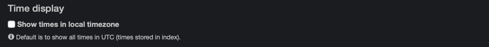
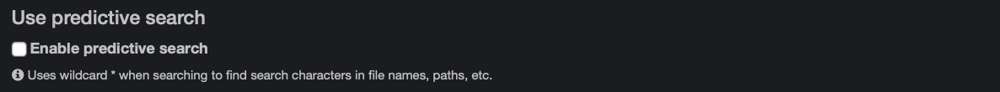

___
## Settings
___

You can access the settings  via the gear icon at the top right corner of the interface.

**IMPORTANT!**

- Changing the settings are personal to your own web browser, even if you share a login account with others. Your customizations are stored as cookies. When you [clear the cookies](#clear_cookies) from the settings, your customized settings will also be cleared and reset to Diskover’s default values. 
- If you switch browsers, for example from Chrome to Safari, you will have to reselect your settings as they will not follow, again due to the settings being stored as cookies to a specific browser.
- Your cookies might also be cleared and need to be reselected after a software update.
- Click the following links to learn more about how [cookies](#clear_cookies) and [cache](#clear_cache) affect the Diskover user interface.

___
### Profile

On top of giving you some informative details about your account, you can also change your password. If you click **Change Password**, you will be prompted to enter your current password and type a new one.

___
### Time Display

You can opt to change the time for your  **local time zone**  instead of  **UTC**  (Coordinated Universal Time).  We strongly recommend you select/click the **Show times in local timezone** so there will be no confusions when you look at the indexing time for example. Your selection will be saved automatically.

This change will affect the [storage time of your indices](#indices), file date creation, modification, etc.

___
### File Size Display

By default, Diskover shows the file size using the  **binary system**. Click the box if you prefer using the  **decimal system**  and your selection will be saved automatically.

Also by default, Diskover’s file size decimals is set to  **1**. You can change that value to your own preference and click on  **Set**  to save.

Select **Use size_du** if you want to use the real allocated disk size instead of the usual file size.

___
### Filter Charts

Clicking this box and selecting any [filters](#filters) will apply the criteria to:

- The charts at the top of the file search page, you can validate the query/criteria in the [green bar](#green_info_bar).
- The [dashboard](#dashboard) results/analytics.

___
### Use Predictive Search

Check this box if you want your searches to _always_ be expanded with the [**\* wild card**](#asterisk_wildcard) without having to type the **\*** in the search bar. The [wild cards](#wildcards) are further explained in the [Syntax Rules for Manual Queries chapter](#search_syntax).

___
### Default Search Sort

By default, the columns in the file search page will be [sorted by path and then by name](#sort). Select this box if you want to show unsorted search results instead.

___
### Hide/Unhide Fields in Search Results

Only click the boxes (showing as a green check mark below) for the fields/columns you _DO NOT_ wish to see in your [search results](#results_pane). Your selection(s) will be saved automatically.

The available fields are initially configured by your System Administrator. Other fields might be available for viewing and could be added to your selection.

Click the  **Reset**  button if you have modified the columns width and wish to reset them to the default width.

___
### Path Translations for Copying Paths

Depending on how your System Administrator configured Diskover, your operating system, and with whom you need to share paths, you may need to adjust this parameter to easily copy paths. This will basically change all forward slash / to backslash \\ and add some when needed for Windows.

For example, to translate from `/isilon1/data/dm/tools/staging_files.xls` to `\\isilon1\data\dm\tools\staging_files.xls`

___
### Clear Diskover Cache

A cache is used to store website content for performance purposes and is stored in the browser only. There are a few instances in which you will need to clear the cache, but it should be used as a last resort:

-  Sometimes the cache might prevent a browser-based software from working properly overtime and the cache needs to be cleared.
-  If you get a pop-up message on the Diskover interface asking you to clear the cache.

___
### Clear Diskover Cookies

Cookies  are used by the browser to store user’s preferences, like the personal settings described in this chapter, and are stored in both server and browser. There are a few instances in which you may need to clear the cookies:
- After a software update/upgrade to clear the cookies from the previous version that might affect the behavior of the new version.
- If you get a pop-up message on the Diskover interface asking you to clear the cookies.

Clearing the cookies  will also remove the customized settings discussed in this chapter and that you might have previously selected.

___
### About Diskover

This segment is informative only and provides details about your Diskover software.

___
### Send Anonymous Usage Data

Upon your first login and/or after a software update, you will be prompted to agree, or not, for Diskover to automatically receive anonymous data so we can compile the behavioral results and improve the software. No personal information is collected.

If you wish to opt out of sending anonymous data, uncheck this box.

