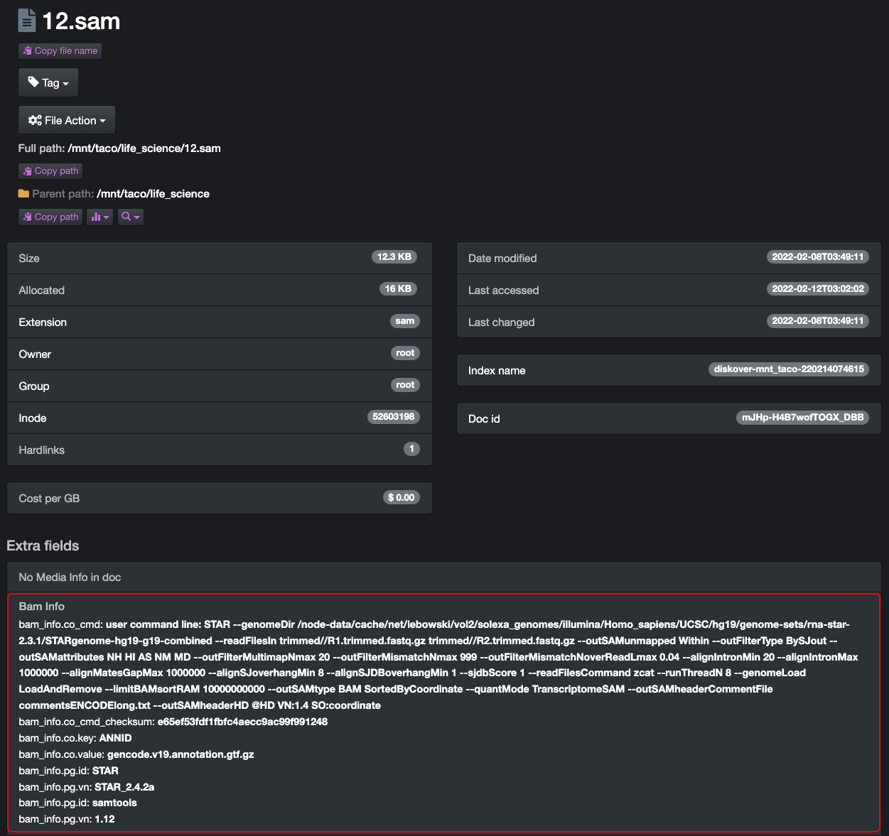

___
## BAM harvest Plugin
___

The first feature on the menu for the Life Science Edition is the BAM Plugin, allowing for the curation of genome sequence file transformation.

The BAM harvest plugin is designed to provide BAM and SAM metadata attributes about a file without granting the Diskover user any read/write file system access for data integrity measures. The BAM plugin enables additional metadata for the SAM and BAM file formats to be harvested at time of index, and those extra fields are therefore searchable within Diskover.

The additional metadata being searchable means that it is also reportable for analysis, therefore actionable, allowing for potential upstream file management, manually or via automated scheduled tasks. If a file at the source doesn’t include any BAM attributes, it goes without saying that no details will be harvested and/or be available within Diskover.

The BAM plugin regroups all the BAM file attributes under the **bam_info** field.

___
### Hide/Unhide BAM Info Column in Search Results Pane

When using the file search page, you have access to a column with all the **bam_info** attributes. If you cannot see that column, it means that it is hidden. To unhide that column, go to **gear icon** > **Settings** > **Hide fields in search results** > unclick the box in front of  **bam_info**.


The  **bam_info** column will then be available within the search results pane. If the column is visible but there are no attributes for a file, this means that there was no media metadata associated with the source file to begin with.


___
### View Detailed BAM Attributes

Below is an example of the location where you can see detailed media attributes. You can access this page by clicking on a file in the search results pane or wherever you see the magnifying glass icon:



___
### Search on BAM Attributes

In addition to the [manual file searches and syntax explained in the Diskover User Guide](https://docs.diskoverdata.com/diskover_user_guide/#manual-search-syntax), the BAM plugin allows end-users to search on BAM specific attributes.

As these fields are not always straight forward to search, it is highly recommended to use the [* wild card](https://docs.diskoverdata.com/diskover_user_guide/#wild-card_1) for easy fo searching and to expand your results.
Case sensitive? 

The BAM attributes can be used in a manual search query. The structure is as follow:
```
bam_info.<key>:<value>
```

The searchable bam_info fields are:


```
bam_info.co_cmd:
```
>Example: `bam_info.co_cmd:*genomedir*`

```
bam_info.co_cmd_checksum:
```
>Example: `bam_info.co_cmd_checksum:e65ef53fdf1fbfc4aecc9ac99f991248`
>To find other files with the same checksum value, although Diskover has automated tools to detect and find duplicate files.


```
bam_info.co.key:
```
```
bam_info.co.value:
```
```
bam_info.pg.id:
```
```
bam_info.pg.vn:
```
```
bam_info.pg.id:
```
```
bam_info.pg.vn:
```


#### File resolution
Field name: **media_info.resolution**
>`media_info.resolution:3840x2160`
>
>`media_info.resolution:*1080*` _(Would return all files with  **1080**  somewhere in the resolution)_


For example:


bam_info.pg.id:STAR

