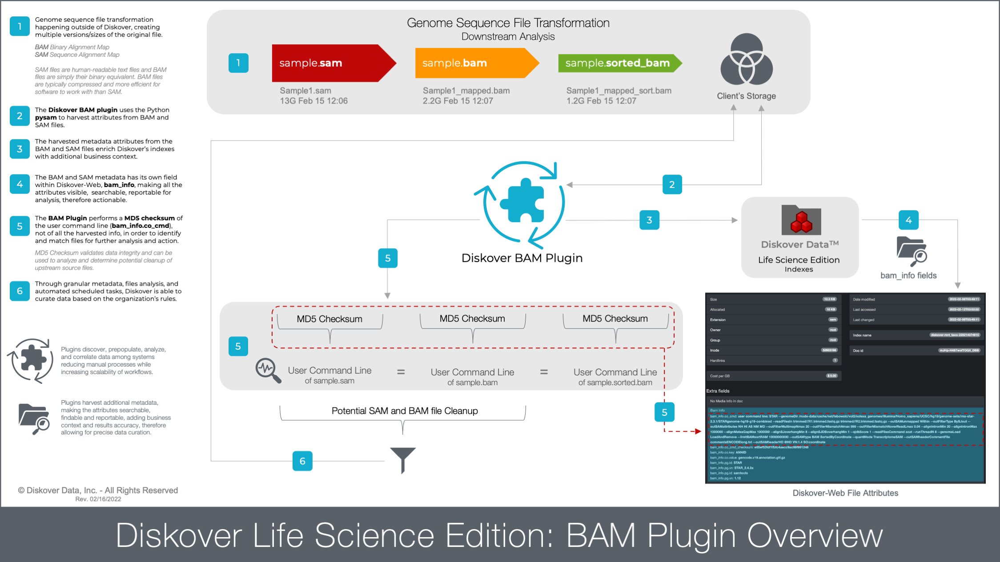
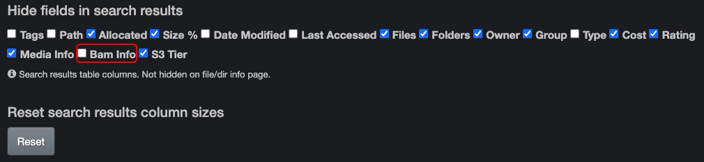
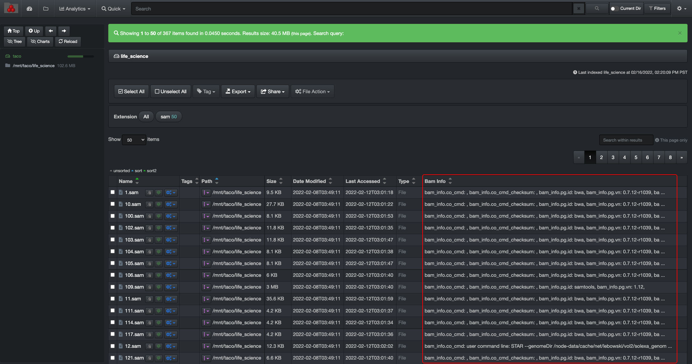

___
## BAM harvest Plugin
___

The first feature on the menu for the Life Science Edition is the BAM Plugin, allowing for the curation of genome sequence file transformation.

The BAM harvest plugin is designed to provide BAM and SAM metadata attributes about a file without granting the Diskover user any read/write file system access for data integrity measures. The BAM plugin enables additional metadata for the SAM and BAM file formats to be harvested at time of index, and those extra fields are therefore searchable within Diskover.

The additional metadata being searchable means that it is also reportable for analysis, therefore actionable, allowing for potential upstream file management, manually or via automated scheduled tasks. If a file at the source doesn’t include any BAM attributes, it goes without saying that no details will be harvested and/or be available within Diskover.

The BAM plugin regroups all the BAM file attributes under the **bam_info** field.

[Watch this video for a demonstration of the plugin](https://vimeo.com/678914314)

___
### BAM Plugin Overview Diagram



_[Click here for a full screen view of the BAM Plugin Overview Diagram.](images/diagram_diskover_life_science_plugins_overview_with_border.png)_

___
### Hide/Unhide BAM Info Column in Search Results Pane

When using the file search page, you have access to a column with all the **bam_info** attributes. If you cannot see that column, it means that it is hidden. To unhide that column, go to **gear icon** > **Settings** > **Hide fields in search results** > unclick the box in front of  **bam_info**.



The  **bam_info** column will then be available within the search results pane. If the column is visible but there are no attributes for a file, this means that there was no media metadata associated with the source file to begin with.



___
### View Detailed BAM Attributes

Below is an example of the location where you can see detailed media attributes. You can access this page by clicking on a file in the search results pane or wherever you see the magnifying glass icon:


___
### Search on BAM Attributes

In addition to the [manual file searches and syntax explained in the Diskover User Guide](https://docs.diskoverdata.com/diskover_user_guide/#manual-search-syntax), the BAM plugin allows end-users to search on specific BAM attributes.

#### Important Notes for Searching on BAM Attributes

- The BAM attributes can be used in a manual search query. The structure is as follow and the **< >** are not meant to by typed, they are only for visual and isolating where to input the variables:
```
bam_info.<key>:<value>
```

- As these fields can be complex to search, it is highly recommended to use the [* wild card](https://docs.diskoverdata.com/diskover_user_guide/#wild-card_1) for ease of searching and to expand your results.

- The fields described below are meant to be copied/typed in the search bar of the Diskover user interface.

- At the moment, searching on the BAM attributes is case sensitive, i.e. if the metadata harvested uses some or all capital letters, you will need to search with the same capital letters, for example:
  - The attributes field portion of the query needs to be typed lower case **bam_info.\<key>:**
  - As for the **\<value>** if the metadata shows **bam_info.pg.id: STAR**
    - If you launch a query with **bam_info.pg.id: star**, that file would not be found.
    - If you launch a query with **bam_info.pg.id: Star**, that file would not be found.
    - If you launch a query with **bam_info.pg.id: STAR**, that file would be found.

The searchable bam_info fields are:


```
bam_info.co_cmd:
```
>Example: `bam_info.co_cmd:*GenomeDir*`

```
bam_info.co_cmd_checksum:
```
>Example: `bam_info.co_cmd_checksum:e65ef53fdf1fbfc4aecc9ac99f991248` could be used to find other files with the same checksum value, although Diskover has automated tools to detect and find duplicate files.

```
bam_info.co.key:
```
>Example: `bam_info.co.key:*ANNID*`

```
bam_info.co.value:
```
>Example: `bam_info.co.value:*gencode.v19*`

```
bam_info.pg.id:
```
>Example: `bam_info.pg.id:*STAR*` or `bam_info.pg.id:*samtools*`
>

```
bam_info.pg.vn:
```
>Example: `bam_info.pg.vn:*2.4*`
