## CineViewer Player

#### [🍿 Watch Demo Video | CineViewer Player Plugin](https://vimeo.com/765285042)

CineViewer is a video playback and management system designed for video and broadcast professionals. It is designed to securely view high-resolution media from a remote browser, without giving users access to the source files. The player can be launched in one click from the AJA Diskover Media Edition user interface, allowing for seamless validation of media assets, therefore increasing productivity, while safeguarding your production network.

The following sections will guide you through the features and functions of CineViewer, helping you utilize this tool effectively for your video and broadcast needs.

[Click here to learn more about the CineViewer Player developed and sold exclusively by CineSys.io](https://cinesys.io/portfolio/cineviewer-player/)

### Login Credentials

The first time you launch the CineViewer, you might be prompted to enter the login credentials you received from your system administrator:

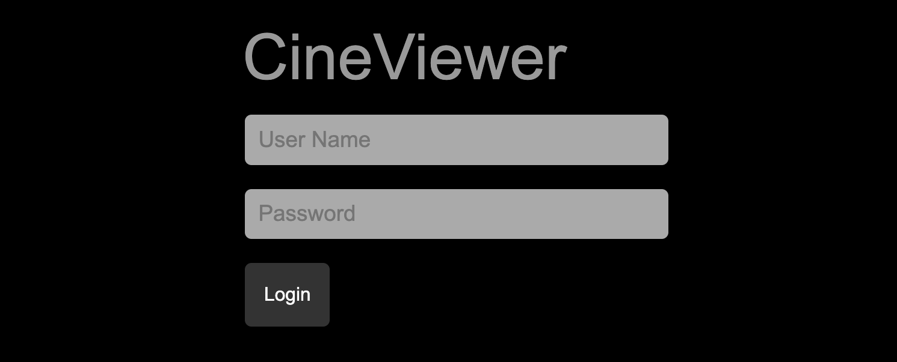

### How to Launch the CineViewer Player

You can access the CineViewer by 🅰 selecting a file in the results pane and 🅱 clicking **File Action** → **open in CineViewer**:

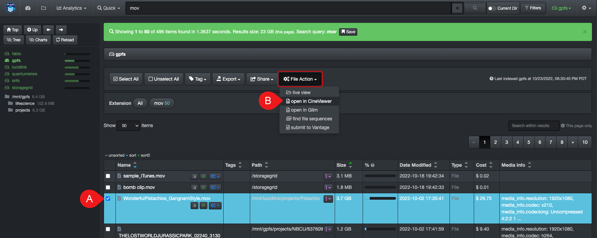

You can also click the **File Action/gear icon → open in CineViewer** located in the results pane to preview a media file:

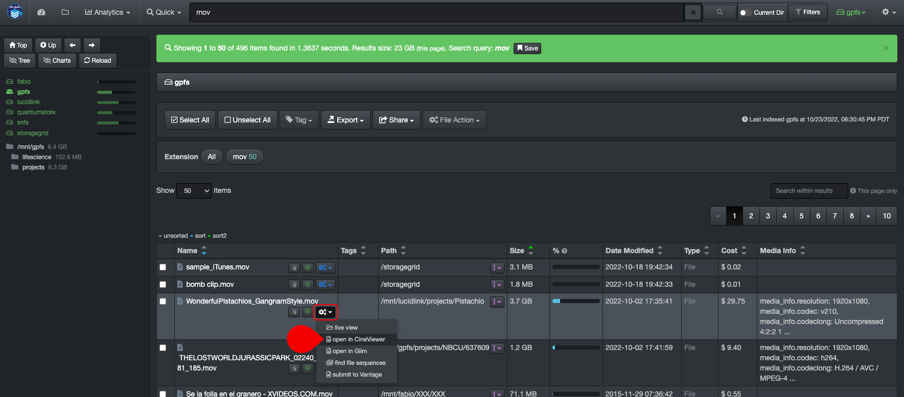

Either method will launch the CineViewer Player where you'll be able to validate/preview media files.

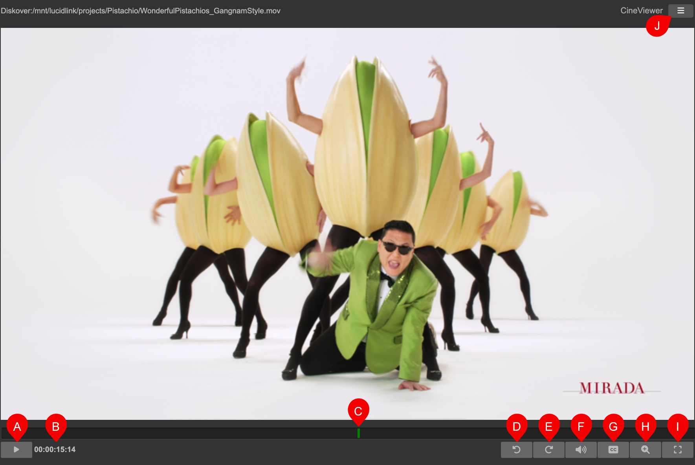

| REFERENCE | DESCRIPTION |
| :---: | --- |
| A | Play/pause, start/stop playback, can also be activated with the **space key**. |
| B | Timecode, can be clicked to open the timecode editor, you can change the timecode numbers and hit **Enter** or **Goto** to go to that frame.  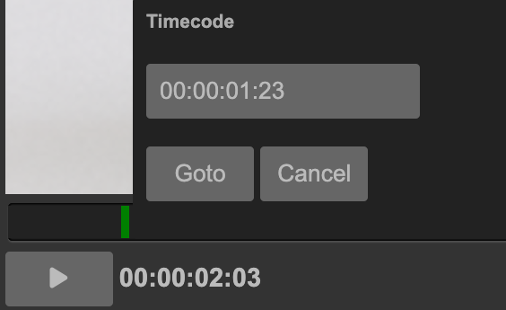 |
| C | Frame slider, click and drag to navigate the timeline. |
| D | Jump forward by 15 seconds increment. |
| E | Jump backward by 15 seconds increment. |
| F | Audio panel toggle to open the audio controls, will show levels for up to 16 channels. Clicking on the **S** button will solo channels while muting others. Clicking on the **M** button will mute that channel. There is also a main **mute** and **volume** slider at the top of this audio panel. Alternatively, the keyboard can be used for main volume control via the **up** and **down** arrows.  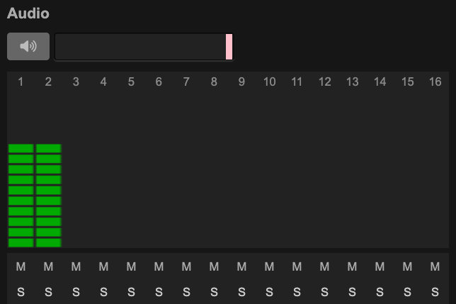 |
| G | Closed captions panel toggle to open the controls. CineViewer supports multiple closed caption languages from SRT files. CineViewer will look for a **.srt** with the same base name as well as in a **Subs** directory.  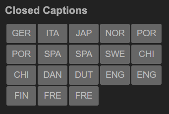 |
| H | Zoom panel toggle to open the zoom and pan controls, CineViewer supports zoom and pan on content for better inspection of frames. Zoom can also be controlled through the keyboard shortcuts as described in the next section.  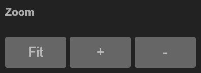 |
| I | Fullscreen mode, either press the same button or **ESC** to close fullscreen mode. |
| J | Menu to open extra interfaces for plugins and core features: 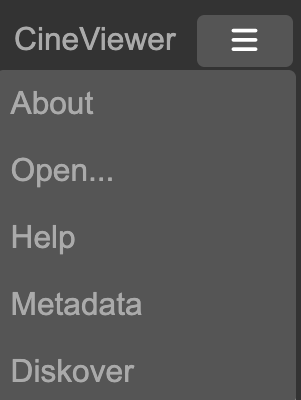<ul><li>**About** provides info about the currently installed version: 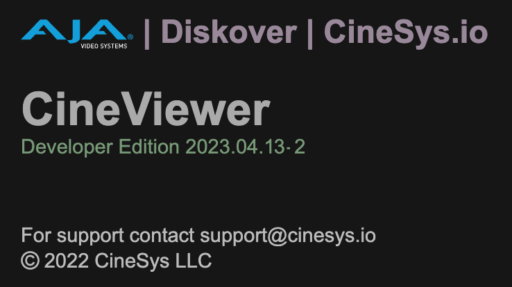</li><li>**Open** returns the system to the file browser mode: 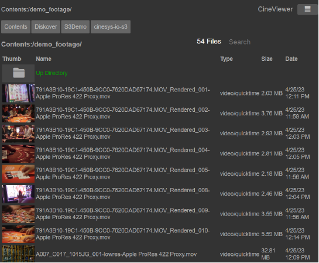</li><li>**Help** offers direct access to the latest documentation, keyboard shortcuts, and info about contacting support for the product: 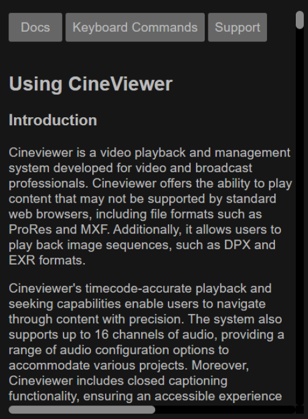</li><li>**Metadata** to see the attributes of the current media file: 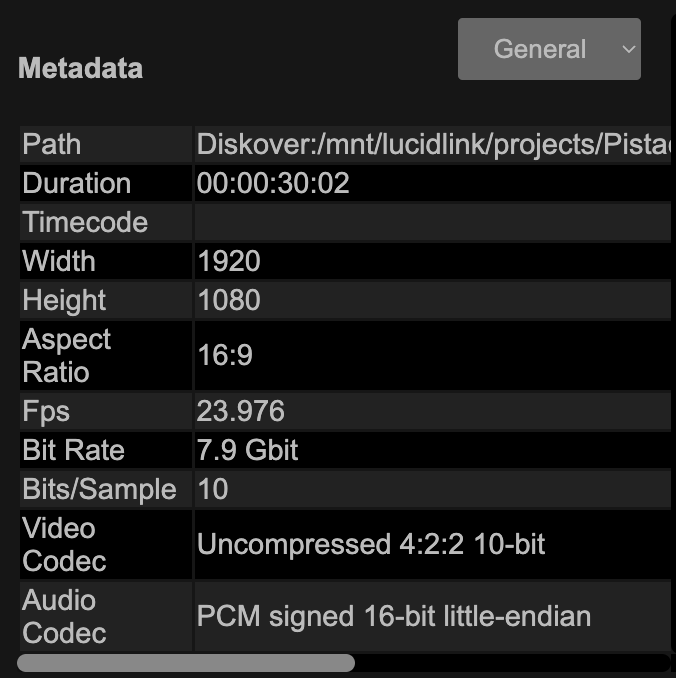</li><li>**Diskover** to do a quick search of Diskover without leaving the CineViewer application: 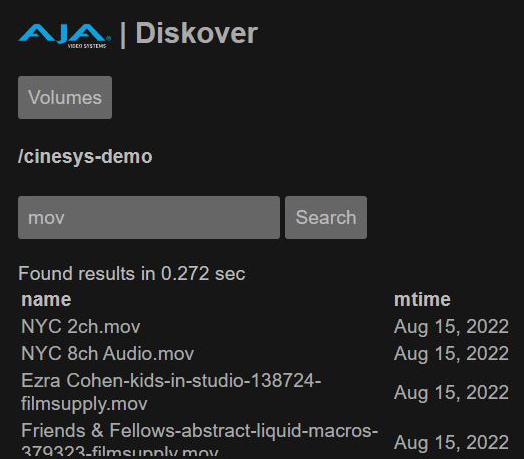 |

### Keyboard Shortcuts

The following keyboard shortcuts can be found in the **Help** menu of the CineViewer app.

| KEY | COMMAND |
| --- | --- |
| a | zoom fit |
| c | zoom center |
| 1 to 9 | zoom X |
| = | zoom in |
| - | zoom out |
| m | audio mute toggle |
| ↑ | audio volume up |
| ↓ | audio volume down |
| ← | previous frame |
| → | next frame |
| space bar | play/pause |
| p | play/pause |
  

### Conclusion

We hope you will find CineViewer to be easy to use and of great benefit at your facility. Please be sure to let us know what you think and also any ideas you may have to improve the product by [contacting the CineSys and Diskover team](mailto:support@cineviewer.io,support@diskoverdata.com).
