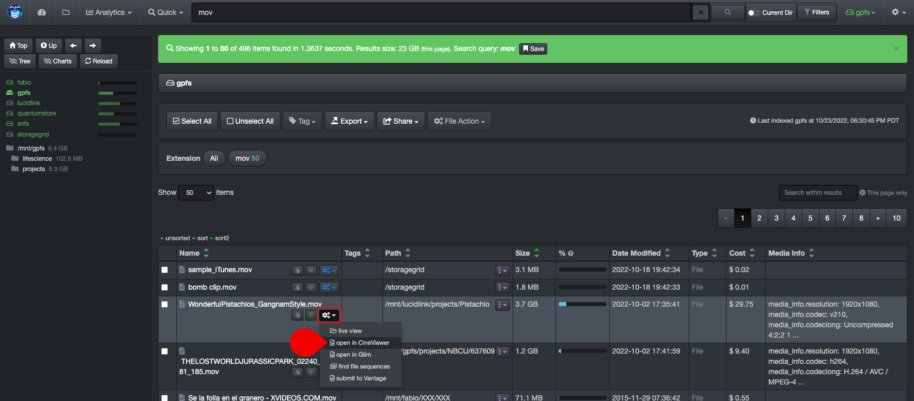

___
## CineViewer Player
___

The CineViewer Player is a seamless integration allowing end-users to view/confirm source files in one click from the Diskover web browser.

[Click here to learn more about the CineViewer Player developed by CineSys.io]([http://www.telestream.net/](https://cinesys.io/portfolio/cineviewer-player/))

___
### How to Launch the CineViewer Player

You can access the CineViewer by A) selecting a file in the results pane and B) clicking **File Action** > **open in CineViewer**:

You can also click the **File Action/gear icon > open in CineViewer** located in the results pane to preview a media file:

This will launch the CineViewer Player where you'll be able to validate/preview media files.

