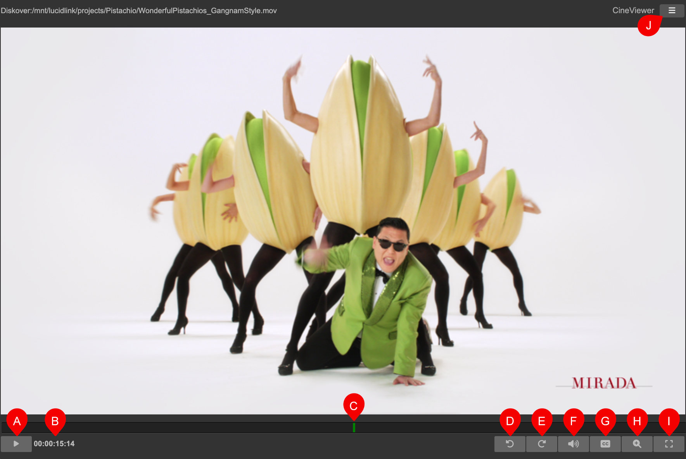
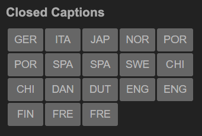
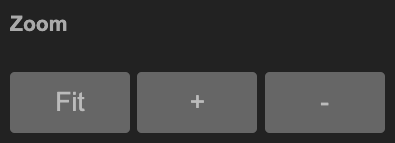
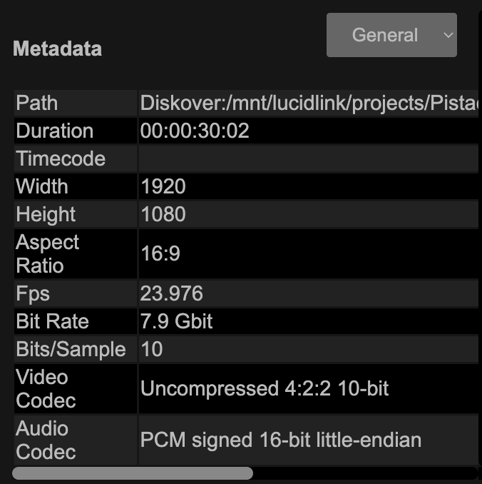

___
## CineViewer Player
___

#### [🍿 Watch Demo Video | CineViewer Player Plugin](https://vimeo.com/765285042)

The CineViewer Player is a seamless integration allowing end-users to securely view/validate media files in one click from the Diskover web browser, without ever accessing the source asset itself.

[Click here to learn more about the CineViewer Player developed and sold exclusively by CineSys.io](https://cinesys.io/portfolio/cineviewer-player/)

___
### Login Credientials

The first time you launch the CineViewer, you might be prompted to enter the login credentials you received from your system administrator:

___
### How to Launch the CineViewer Player

You can access the CineViewer by A) selecting a file in the results pane and B) clicking **File Action** > **open in CineViewer**:

You can also click the **File Action/gear icon > open in CineViewer** located in the results pane to preview a media file:

Either method will launch the CineViewer Player where you'll be able to validate/preview media files.

A) Play/pause, start/stop playback, can also be activated with the **space key**.

B) Timecode, can be clicked to open the timecode editor, you can change the timecode numbers and hit **Enter** or **Goto** to go to that frame.

C) Frame slider, click and drag to navigate the timeline.

D) Jump forward by 15 seconds increment.

E) Jump backward by 15 seconds increment.

F) Audio panel toggle to open the audio controls, will show levels for up to 16 channels. Clicking on the **S** button will solo channels while muting others. Clicking on the **M** button will mute that channel. There is also a main **mute** and **volume** slider at the top of this audio panel. Alternatively the keyboard can be used for main volume control via the **up** and **down** arrows.

G) Closed captions panel toggle to open the controls. Cineviewer supports multiple closed caption languages from SRT files. Cineviewer will look for a **.srt** with the same base name as well as in a **Subs** directory.

H) Zoom panel toggle to open the zoom and pan controls, Cineviewer supports zoom and pan on content for better inspection of frames. Zoom can also be controled through the keyboard shortcuts as described in the next section.

I) Fullscreen mode, either press the same button or **ESC** to close fullscreen mode.

J) Menu to open extra interfaces for plugins and core features:

> **About** provides info about the current installed version:
>
> 
>
> **Open** returns the system to the file browser mode:
>
> 
>
> **Help** offers direct access to the latest documentation, keyboard shortcuts, and info about contacting support for the product:
>
> 
> 
> **Metadata** to see the attributes of the current media file:
>
> 
>
> **Diskover** to do a quick search within Diskover without leaving the CineViewer app:
>
> 

___
### Keyboard Shortcuts

The following keyboard shortcuts can be found in the **Help** menu of the Cineviewer app.

| KEY | COMMAND |
| --- | --- |
| a | zoom fit |
| c | zoom center |
| 1 to 9 | zoom X |
| = | zoom in |
| - | zoom out |
| m | audio mute toggle |
| ↑ | audio volume up |
| ↓ | audio volume down |
| ← | previous frame |
| → | next frame |
| space bar | play/pause |
| p | play/pause |
  
___
### Conclusion

We hope you will find Cineviewer to be easy to use and of great benefit at your facility. Please be sure to let us know what you think and also any ideas you may have to improve the product by [contacting the CineSys and Diskover team](mailto:support@cineviewer.io,support@diskoverdata.com).
