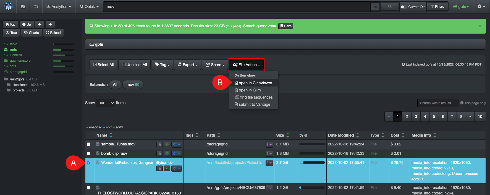

___
## CineViewer Player
___

#### [🍿 Watch Demo Video | CineViewer Player Plugin](https://vimeo.com/765285042)

The CineViewer Player is a seamless integration allowing end-users to securely view/validate media files in one click from the Diskover web browser, without ever accessing the source asset itself.

[Click here to learn more about the CineViewer Player developed and sold exclusively by CineSys.io](https://cinesys.io/portfolio/cineviewer-player/)

___
### License Key and Credientials

The first time you launch the CineViewer, you will need to request and install a license key.

1. Click on **Request License Key** and fill out the required fields. 

2. The license key will be emailed to the address you entered in the previous step. Click on **Enter License Key** and paste all the lines including **====BEGIN LICENSE KEY====** and **====END LICENSE KEY====** as shown in this example:

3. You will then be prompted to enter your login credentials:

___
### How to Launch the CineViewer Player

You can access the CineViewer by A) selecting a file in the results pane and B) clicking **File Action** > **open in CineViewer**:

You can also click the **File Action/gear icon > open in CineViewer** located in the results pane to preview a media file:

Either method will launch the CineViewer Player where you'll be able to validate/preview media files.

A) Go back 15 seconds.

B) Go forward 15 seconds.

C) Audio tracks.

D) Closed captions.

E) Zoom in, zoom out, fit screen.

F) Full-screen mode.

G) About CineViewer and go back to Diskover.
