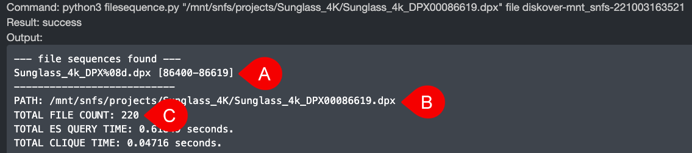

___
## Find File Sequences
___

Diskover allows you to easily find all files in a sequence via **File Action**.

### How to Launch Find File Sequences

A) You can launch from the inline File Action gears icon without having to select the file first.

B) You can launch from the File Action gears icon above the results pane but you'll have to select the line item first.

### How to Read File Sequence Results

The results will open in a new browser tab:

A) How to read the file sequence results:
  * DPX > constant digits at the beginning of the sequence
  * %08d > sequence contains 8 digits starting with zeros/padding
  * [86400-86619] > sequence detected, more brackets would show if broken sequences would be detected

B) Path of sequences.

C) Number of sequences found.
