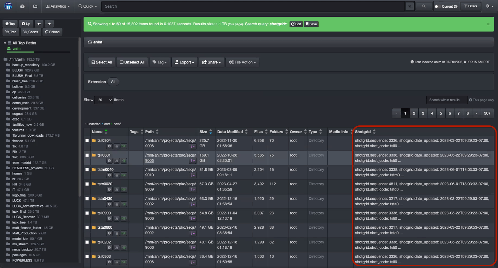
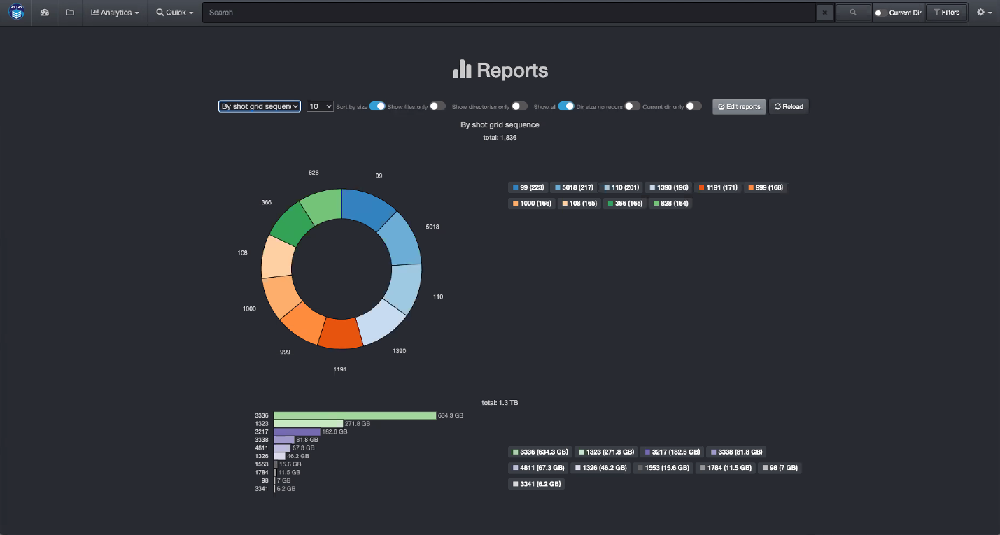

___
## Flow Production Tracking Plugin
___

   >**Important | Diskover Software Still Using ShotGrid**
   >Please note that Autodesk recently changed their product name "ShotGrid" to "Flow Production Tracking". Although our literature now refers to Flow Production Tracking, ShotGrid is still being used in Diskover's user interface and backend post-index harvesting until further notice.

The Autodesk Flow Production Tracking (formerly ShotGrid) Plugin is designed to enhance basic metadata with detailed production status information, aligning data management with production schedules. The Diskover Flow Production Tracking Plugin harvests additional attributes from the Autodesk ShotGrid platform for every **shot** directory located on storage. These attributes become properties of the **shot** directories and include status information such as **finaled**, **out-of-picture**, multiple project **tracking dates**, and many more, totaling over one hundred indexable fields.

These searchable business context attributes enable very precise data management decision-making via granular reporting, and can easily be engaged in workflows and file actions. A representative workflow might be to archive all **shots** directories **30 days** after their status has been updated to **finaled**.

For each shot directory within Diskover, the Flow Production Tracking attributes basically become a property of that directory. All fields/metadata harvested become searchable, reportable, and actionable within Diskover.

[Click here to learn more about the Autodesk Flow Production Tracking Platform.]([https://www.autodesk.com/products/shotgrid/overview?term=1-YEAR&tab=subscription&plc=SGSUB)

#### Flow Production Tracking Attributes in the Diskover User Interface

Search page showing a dedicated column with a summary of the Flow Production Tracking attributes.

Detailed Flow Production Tracking indexed fields can be found in the Diskover attributes window.

#### Flow Production Tracking Status Analytics Within Diskover

Business context metadata allows for granular and powerful analytics with information relevant to your business. Once the Flow Production Tracking attributes are indexed by Diskover, they can be used in various [reporting tools](https://docs.diskoverdata.com/diskover_user_guide/#analytics).

Below are examples of analytics using Diskover's [Reports](https://docs.diskoverdata.com/diskover_user_guide/#reports) feature.

##### Top Results by Status Code

Amount of data by **status code**:

##### Top Results by Sequence

Amount of data by **sequence**:

##### Top Results by Creator

Amount of data by **creator**:

#### How to Search for Flow Production Tracking Attributes in Diskover

##### Search Overview

   >**Important | Diskover Software Still Using ShotGrid**
   >Please note that Autodesk recently changed their product name "ShotGrid" to "Flow Production Tracking". Although our literature now refers to Flow Production Tracking, ShotGrid is still being used in Diskover's user interface and backend post-index harvesting until further notice.

The **Flow Production Tracking** (formerly **ShotGrid**) fields are part of the metadata harvested by Diskover. If a file at the source doesn’t have any of those attributes attached to it, it goes without saying that no details will be harvested and/or be available within Diskover.

In addition to the [manual search syntax explained in the Diskover User Guide](https://docs.diskoverdata.com/diskover_user_guide/#search_syntax), the AJA Diskover Media Edition allows end-users to search on multiple Flow Production Tracking attributes.

##### Search Syntax

- The following syntax needs to be respected **shotgrid.key:**__*value*__:
    * **shotgrid** is not a variable.
    * **key** is a variable like dates, sequence, creator, etc.
    * __*value*__ is a variable as per the examples below.

- Searching on **shotgrid** fields is case insensitive.

- Your search query needs to be typed or pasted in the Diskover search bar.

##### Search Examples

Diskover can harvest over 100 attributes from the Flow Production Tracking platform and they will all be listed over time. Here are a few examples:

| Search Query Examples | Search Results |
| --- | --- |
| **shotgrid.sequence:_3336_** | would find all files with **sequence** number __*3336*__ |
| **shotgrid.date_updated:**__*\*2023-03-22*\*__ | would find all files/directories with an **updated status date** of __*March 22, 2023*__ |
| **shotgrid.shot_code:**__*\*li0304*\*__ | would find all **shot code** files with full or partial number __*li0304*__ |

