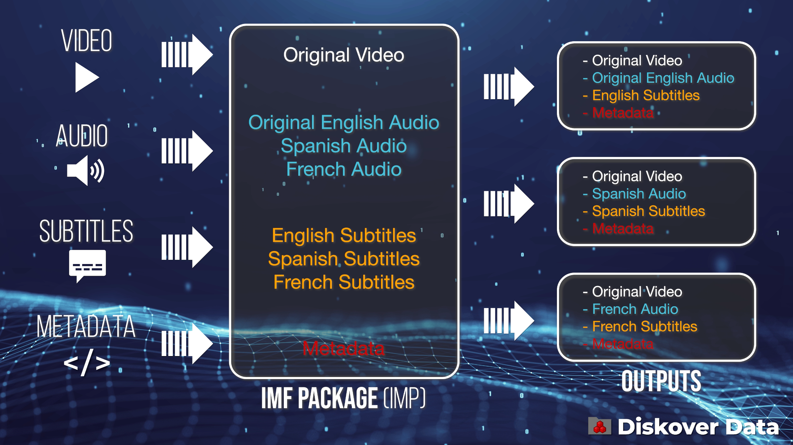
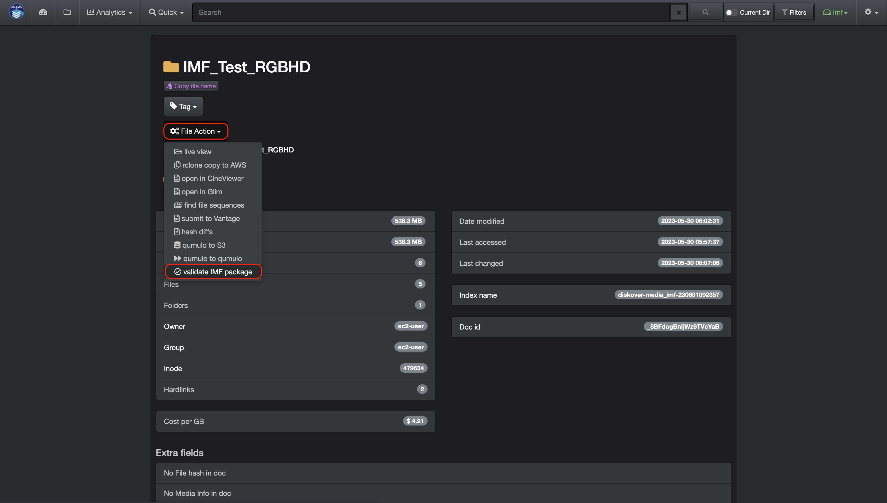

___
## IMF Package Validator
___

#### [🍿 Watch Demo Video | IMF Package Validator](https://vimeo.com/833500176?share=copy)

The IMF package validator plugin allows organizations to validate IMF packages before delivery from a remote platform, saving immense amounts of man-hours over the course of a business year.

Oxagile’s IMF Package Validator Plugin, exclusively designed for the AJA Diskover Media Edition, allows users to scan and validate IMF packages before delivery from any location, regardless of the location of the IMF package data.

IMF stands for Interoperable Master Format, which is a technical standard used in the Media and Entertainment industry for the exchange of digital content between different platforms and systems. The IMF format is used by content creators, distributors, and broadcasters to deliver high-quality video content to a variety of devices, including TVs, mobile devices, and web browsers.

Netflix, for example, requires all their content to be delivered in IMF format, which undergoes rigorous validation to ensure compliance with industry standards. The validation process involves extensive testing of the content's video, audio, and metadata to ensure that it meets the technical specifications and can be delivered to viewers in the highest quality possible.

Once the content has been validated, it is then encoded into various formats, including 4K and HDR, and made available for streaming on various platforms. The IMF validation process is a critical step in the content delivery pipeline.

The IMF Package Validator plugin is developed by [Oxagile](https://www.oxagile.com/), a major technological partner working with both Diskover Data and [AJA Video Systems](https://www.aja.com/). For more information or to purchase the IMF Package Validator plugin, please contact [Oxagile](mailto:IMF@Oxagile.com).

#### Functional Limitations

The following are the limitations of the current plugin version:

1.	Verification capabilities are limited with those of the latest version of Netflix Photon tool.
2.	Validation by schedule is not supported.
3.	Cloud storage is not supported.
4.	Archives are not supported.
5.	DCP packages are not supported.

___
### How to Launch the IMF Package Validator Plugin

First, locate the package(s) you want to validate by either [searching using the built-in tools](https://docs.diskoverdata.com/diskover_user_guide/#built-in-search-tools), [searching using manual queries](https://docs.diskoverdata.com/diskover_user_guide/#manual-queries-syntax-and-rules) or [drilling-down the file tree](https://docs.diskoverdata.com/diskover_user_guide/#basic-usage).

There are 3 ways to launch the **validate IMF package** file action:

1. If you want to validate a single package, use the file action button in line with that package in the results pane.

2. If you want to validate multiple packages at onece, use this global file action button located above the results pane.

3. You can first validate the attributes of a package by clicking this icon  in line with the package in the search page, then use the file action button located in the attributes page.

___
### Login Credentials

___
### How to Launch the CineViewer Player

