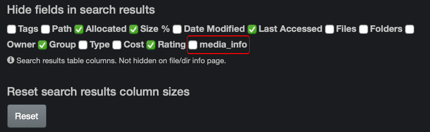
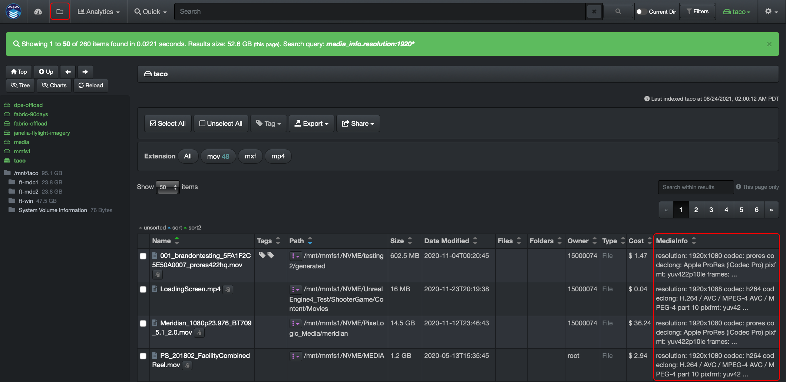
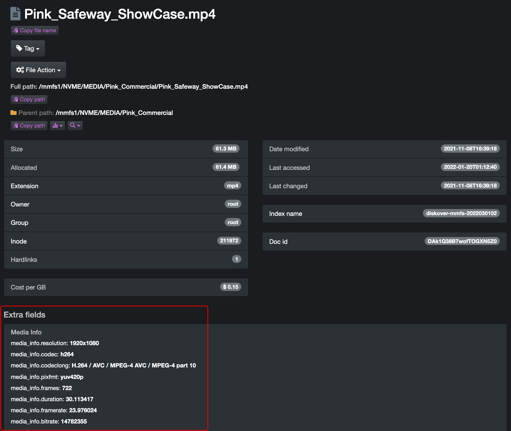

## Media Info Attributes

The media attributes are part of the metadata harvested exclusively by the AJA Diskover Media Edition. If a file at the source doesn’t include any of these attributes, it goes without saying that no details will be harvested and/or available.

Media attributes, like file resolution, codec, pixel format, etc., are harvested during indexing and are therefore available to enhance in-depth searches and deliver accurate results. In addition to the [manual search syntax explained in the Diskover User Guide](https://docs.diskoverdata.com/diskover_user_guide/#field-names), the AJA Diskover Media Edition allows end-users to search on media-specific attributes.

### Hide/Unhide Media Info Column in Search Results Pane

When using the file search page, you have access to a column with all the media attributes. If you cannot see that column, it means that it is hidden. To unhide that column, go to  ⛭  →  **Hide fields in search results**  → unclick the box in front of  **media_info**.

The  **media_info** column will then be available within the search results pane. If the column is visible but there are no attributes for a file, this means that there was no media metadata associated with the source file to begin with.

### View Detailed Media Attributes

Below is an example of the location where you can see detailed media attributes. You can access this page by clicking on a file in the search results pane or wherever you see the magnifying glass icon:

### Search Syntax

- Searching on **media_info** fields is case insensitive.
- The following syntax needs to be respected when searching on media info fields `media_info.key:value`:
    * `media_info` is not a variable.
    * `key` is a variable like resolution, codec, pixel format, etc.
    * `value` is a variable as per the examples below.

### Searchable Fields and Examples

Below is a list of the most used and indexed media info attributes.

✏️ As media fields’ info can be complex, unless you know exactly what you are looking for, we strongly recommend using the [* wildcard](https://docs.diskoverdata.com/diskover_user_guide/#wildcard) for ease of searching and to expand your results.

| ATTRIBUTE | SEARCH SYNTAX | 🔎 SEARCH EXAMPLE → POSSIBLE RESULT |
| --- | --- | --- |
| **File resolution** | `media_info.resolution:` | `media_info.resolution:3840x2160` → files with 3840x2160 resolution. `media_info.resolution:*1080*` → files with 1080 as part of the resolution, either width or height. |
| **Codec** | `media_info.codec:` | `media_info.codec:prores` → files `prores` [tokenized](#tokenize) in the codec field. `media_info.codec:*h264*` → files with `h264` [tokenized](#tokenize) or not |
| **Codec long** | `media_info.codeclong:` | `media_info.codeclong:*apple* `→ files with `apple` [tokenized](#tokenize) or not `media_info.codeclong:*quicktime*` → files with `quicktime` [tokenized](#tokenize) or not |
| **Codec tag** | `media_info.codectag:` | `media_info.codectag:*avc1*` → files with `avc1` [tokenized](#tokenize) or not |
| **Pixel format** | `media_info.pixfmt:` | `media_info.pixfmt:*yuv*` → files with `yuv` [tokenized](#tokenize) or not `media_info.pixfmt:*422*` → files with `422` [tokenized](#tokenize) or not |
| **Frames** | `media_info.frames:` | `media_info.frames:30` → files with an exact number of `30` frames `media_info.frames:29.*` → files with `29` frames and any number of decimals like `29.97` |
| **Duration** | `media_info.duration:` | `media_info.duration:*30.*` → files with a duration that includes exactly `30` seconds, with any number of hours, minutes and/or milliseconds, example `0:00:30.071708` ✏️  Note: Time format is H:MM:SS.MS |
| **Frame rate** | `media_info.framerate:` | `media_info.framerate:*23.*` → files with a standard framerate of `23.976` or `23.98` |
| **Bitrate** | `media_info.bitrate:` | `media_info.bitrate:*765*` → Bitrate is a difficult field to search, but not impossible! |
| **Error** | `media_info.error:` | See section below for more details |
| **Warning** | `media_info.warning:` | See section below for more details |

### Media Info Fields Containing Error or Warning

If the media fields at the source are corrupted and/or Diskover determines the file as "suspect", the media info fields will show either **error** or **warning** within Diskover. Below are search queries to either exclude or pinpoint files with those values:

| USE CASE | QUERY EXAMPLE |
| --- | --- |
| To search all files with valid media info fields while excluding files with **error** and **warning** | `media_info:* NOT (media_info.error:* OR media_info.warning:*)` |
| To search all files with media info fields containing **error** and **warning** | `media_info.error:* OR media_info.warning:*` |

### Search on Media Info Fields with Operators
Operators [**and, not, or**](https://docs.diskoverdata.com/diskover_user_guide/#operators) are explained in the [Diskover User Guide](https://docs.diskoverdata.com/diskover_user_guide/#operators). Here are a few query examples using media info fields with operators. Note that operators are not case sensitive, but they are being typed in capital letters below for visual purposes.

| OPERATOR | 🔎 SEARCH EXAMPLE | ✅ POSSIBLE RESULTS |
| --- | --- | --- |
| **AND** | `media_info.resolution:1920x1080 and media_info.codeclong:*quicktime*` | All files with resolution `1920x1080` AND `QuickTime` in codeclong |
| **NOT** | `*jurassic* NOT media_info.resolution:1920x1080 | All files/paths containing `jurassic`, [tokenized](#tokenize) or not, but NOT with a resolution of 1920x1080 |
| **OR** | `*jurassic* (media_info.pixfmt:*444* OR media_info.pixfmt:*422*)` | All files/paths containing `jurassic`, [tokenized](#tokenize) or not, with pixel format `444` OR `422` |
| **MIX'EM** | `(media_info.resolution:*1080* or media_info.resolution:*1920*) AND extension:mov NOT extension:mp4` | all files with `1080` or `1920` being part of the resolution, with file extension `.mov`, but would exclude file extension `.mp4` from the results |

