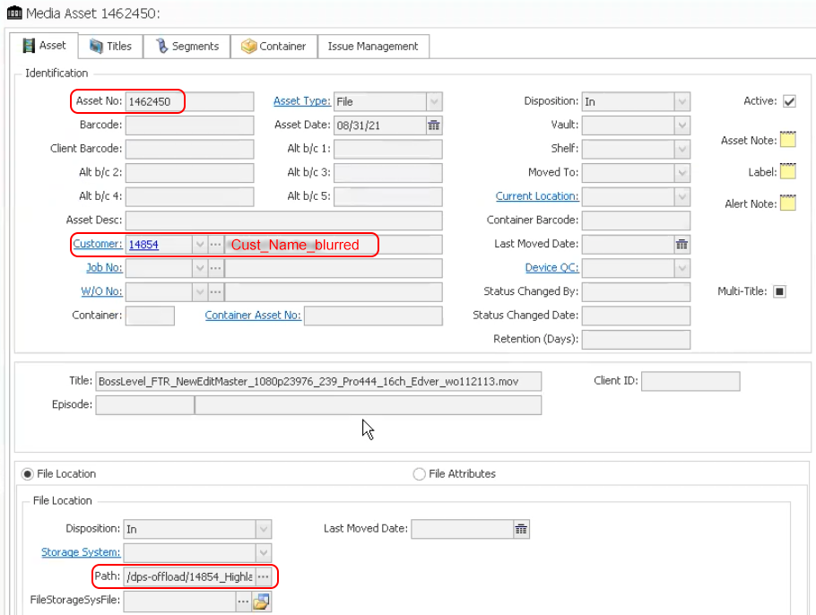
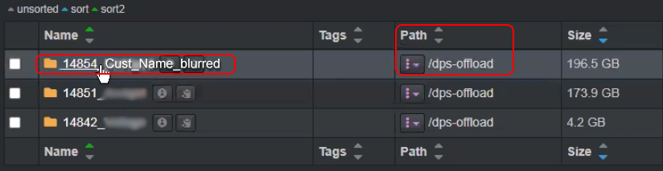
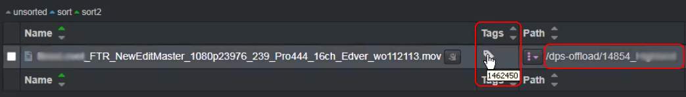

___
## Order Management
___
This chapter describes the features that are currently released enhancing file-based production workflows. Please stay tuned as many more features are in development and on the roadmap.

___
### Xytech MediaPulse Asset Creation

Post facilities often have customers’ assets that have been archived and lack findability, visibility, searchability, and therefore the opaque nature of these assets make them difficult to reuse or repurpose. Companies, with years of such archived assets, have often stored these on tape media or removable hard drives which are often stored in a physical vault.

Assets were often stored on such “offline” media due to costs, however with the advent of cloud and object storage, the economics are now making it viable to store such vaulted assets on more “online media”. Although, simply putting these assets onto online media does not necessarily make these assets findable in context or within the facility’s order management system.

The Xytech MediaPulse asset creation tool is designed to find and index newly restored online assets from LTO tapes, removable hard drives, etc., making them available, findable, and searchable within the Xytech MediaPulse order management system, as well as Diskover.

The plugin operates on the assumption that the assets restored to online media are placed into a folder with the following naming convention:  **CustomerID_CustomerName**

The path location is added to the asset within MediaPulse and the asset number is assigned to the file via a tag within the Diskover Index.

Here is an example of an asset rehydration as viewed in MediaPulse:

Here are the same values displayed within Diskover:

___
### Xytech MediaPulse Order Management

In development.
