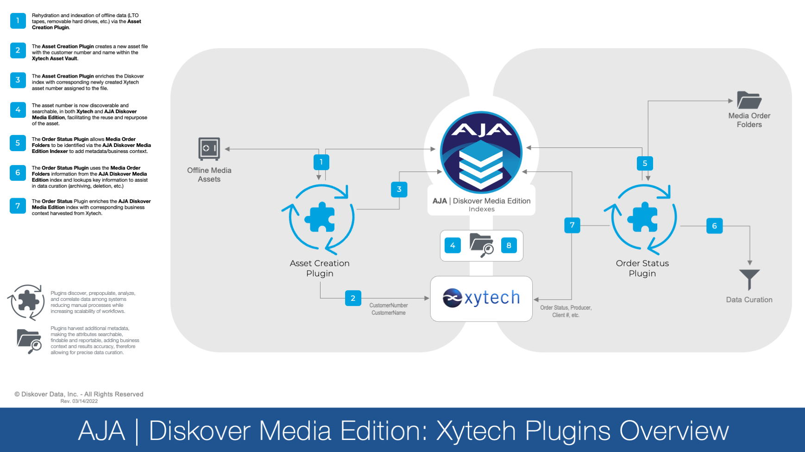
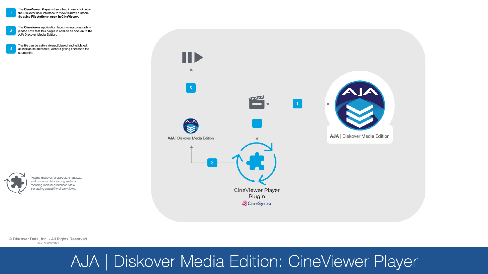

___
## Media Edition Plugins Overview
___

These diagrams illustrate the functionality of the current features of the Media Edition. More plugins and features will be added over time.

### Media Info Harvesting and File Sequences Plugins Diagram

_[Click here for a full-screen view of the MediaInfo and File Sequences Overview Diagram.](images/diagram_diskover_media_edition_plugins_overview_mediainfo_and_file_sequences.png)_

### Xytech MediaPulse Plugins Diagram

_[Click here for a full-screen view of the Xytech Plugins Overview Diagram.](images/diagram_diskover_media_edition_plugins_overview_xytech_20230223.png)_

### Telestream GLIM and Vantage Plugins Diagram

_[Click here for a full-screen view of the Telestream Plugins Overview Diagram.](images/diagram_diskover_media_edition_plugins_overview_telestream.png)_

### CineViewer Player Plugin Diagram

_[Click here for a full-screen view of the CineViewer Player Overview Diagram.](images/diagram_diskover_media_edition_plugins_overview_cineviewer_2022102801.png)_
