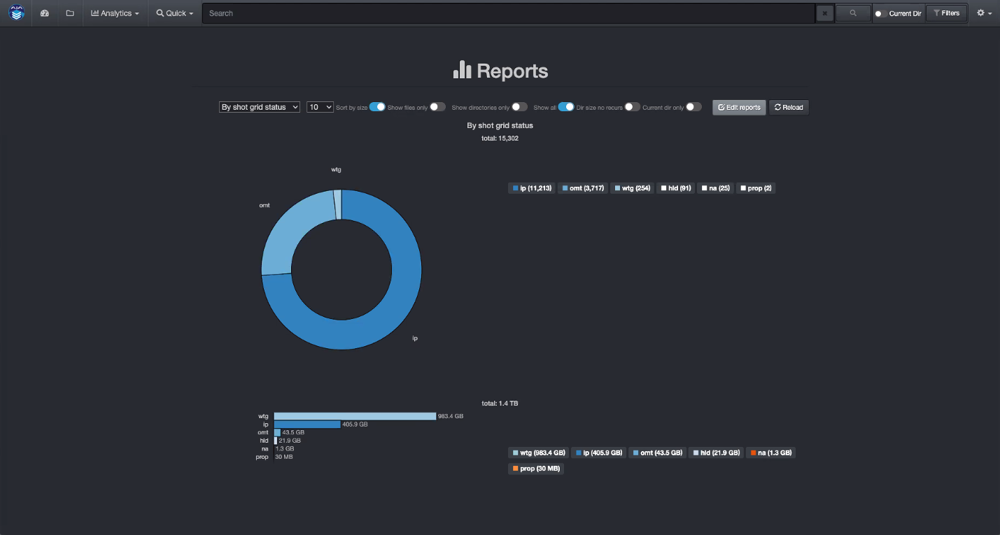
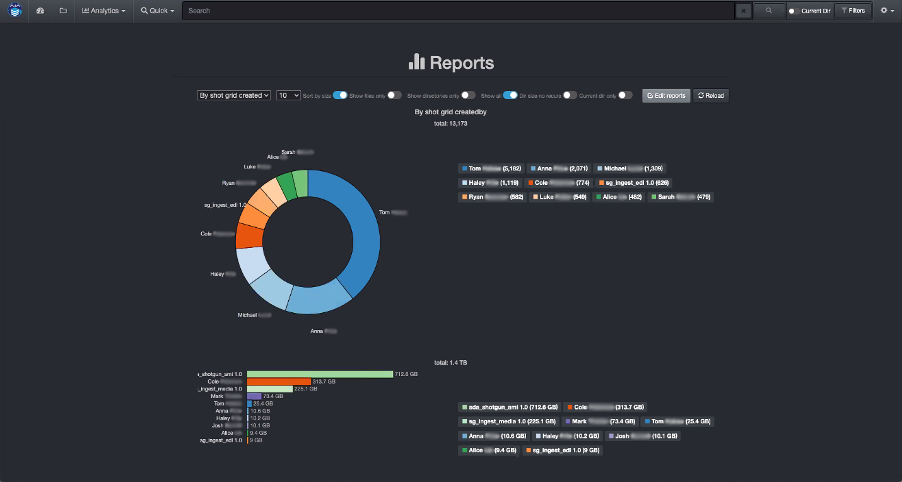

___
## ShotGrid Production Status Plugin
___
The Autodesk ShotGrid Plugin is designed to enhance basic metadata with detailed production status information, aligning data management with production schedules. The Diskover ShotGrid Plugin harvests additional attributes from the Autodesk ShotGrid platform for every **shot** directory located on storage. These attributes become properties of the **shot** directories and include status information such as **finaled**, **out of picture**, multiple project **tracking dates**, and many more totaling over one hundred indexable fields.

These searchable business context attributes enable very precise data management decision-making via granular reporting, and can easily be engaged in workflows and file actions. A representative workflow might be to archive all **shots** directories **30 days** after their status has been updated to **finaled**.

For each shot directory within Diskover, the ShotGrid attributes basically become a property of that directory. All ShotGrid fields harvested become searchable, reportable, and actionable within Diskover.

[Click here to learn more about the Autodesk ShotGrid Platform.](https://www.autodesk.com/products/shotgrid/overview?term=1-YEAR&tab=subscription&plc=SGSUB)

#### ShotGrid Attributes in the Diskover User Interface

Search page showing dedicated column with a summary of ShotGrid attributes.

Detailed ShotGrid indexed fields can be found in the Diskover attributes window.

#### ShotGrid Production Status Analytics Within Diskover

Business context metadata allows for granular and powerful analytics with information relevant to your business. Once the ShotGrid attributes are indexed by Diskover, they can be used in various [reporting tools](https://docs.diskoverdata.com/diskover_user_guide/#analytics).

Below are examples of analytics using Diskover's [Reports](https://docs.diskoverdata.com/diskover_user_guide/#reports) feature.

##### Top Results by Status Code

Amount of data by ShotGrid **status code**:

##### Top Results by Sequence

Amount of data by ShotGrid **sequence**:

##### Top Results by Creator

Amount of data by **creator**:

#### How to Search for ShotGrid Attributes in Diskover

##### Search Overview

The **shotgrid** fields are part of the metadata harvested by Diskover. If a file at the source doesn’t have any ShotGrid attributes attached to it, it goes without saying that no details will be harvested and/or be available within Diskover.

In addition to the [manual search syntax explained in the Diskover User Guide](https://docs.diskoverdata.com/diskover_user_guide/#search_syntax), the AJA Diskover Media Edition allows end-users to search on multiple ShotGrid attributes.

##### Search Syntax

- The following syntax needs to be respected **shotgrid.key:**__*value*__:
    * **shotgrid** is not a variable.
    * **key** is a variable like dates, sequence, creator, etc.
    * __*value*__ is a variable as per the examples below.

- Searching on **shotgrid** fields is case insensitive.

- Your search query needs to be typed or pasted in the Diskover search bar.

##### Search Examples

Diskover can harvest over 100 attributes from ShotGrid and they will all be listed over time. Here are a few examples:

| Search Query Examples | Search Results |
| --- | --- |
| **shotgrid.sequence:_3336_** | would find all files with **sequence** number __*3336*__ |
| **shotgrid.date_updated:**__*\*2023-03-22*\*__ | would find all files/directories with an **updated status date** of __*March 22, 2023*__ |
| **shotgrid.shot_code:**__*\*li0304*\*__ | would find all **shot code** files with full or partial number __*li0304*__ |

