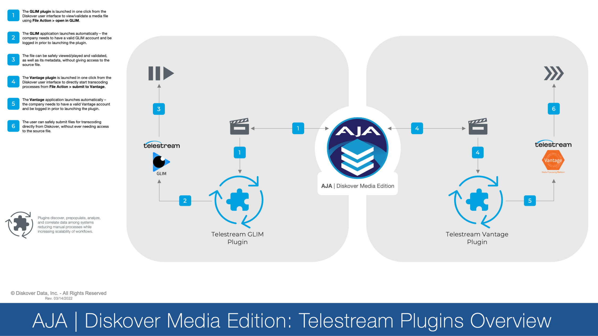
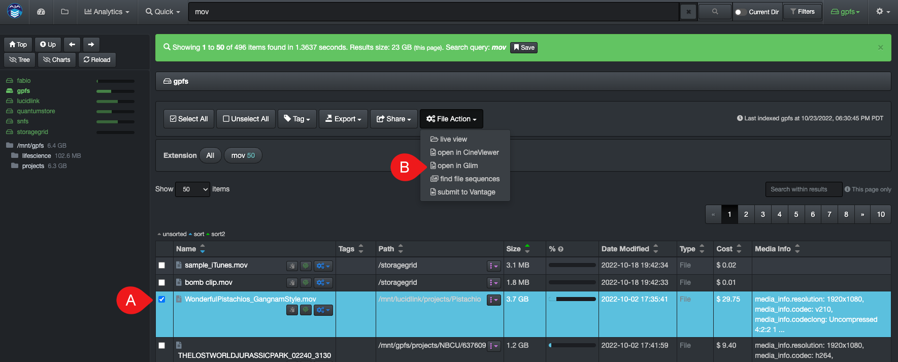
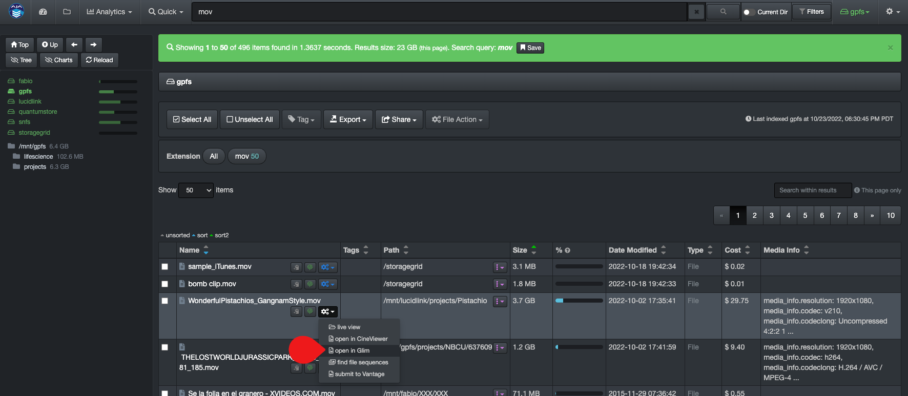
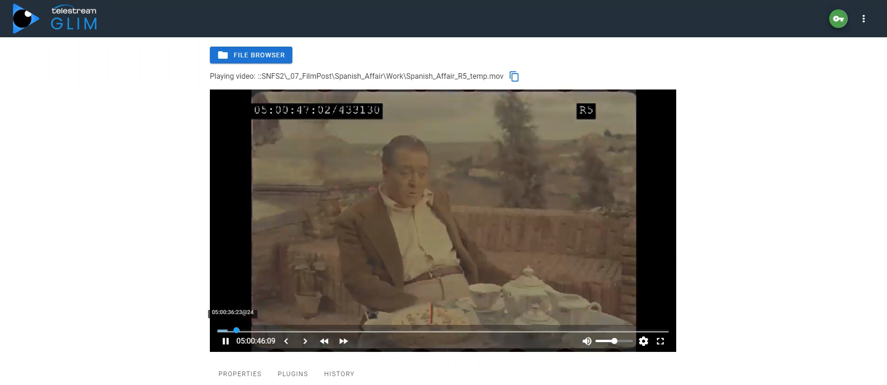

___
## Telestream GLIM and Vantage Workflow Enhancements
___

The GLIM and Vantage web tools allow end-users to view/confirm source files, as well as submit files for transcoding, directly from Diskover and without ever leaving your web browser.

_[Click here for a full screen view of the Storage Cost Configuration Overview diagram.](images/diagram_diskover_media_edition_plugins_overview_telestream_20220314.png)_

### Preview Media Files with GLIM

You can do an advanced search/validation of a media file and playback right from Diskover.

>🔆 &nbsp;Make sure you are logged in your Telestream account before using this feature.

You can access the **File Action > open in GLIM** by selecting a file and clicking the File Action button as shown below:

Or click the gear icon location on the line item that you want to preview with GLIM > select **open with Glim**

This will launch GLIM where you'll be able to validate/preview the file.

[Click here to learn more about the Telestream GLIM product](https://www.telestream.net/glim/overview.htm)

### Submit Proxies to Vantage Direclty from Diskover

The Diskover Telestream Vantage Plugin allows end-users to submit files for transcoding directly from the Diskover user interface. The major benefits:

- The plugin eliminates many steps from going back and forth between the two softwares.
- Vantage offers several transcoding options which can be confusing to non-technical users > the plugin allows for limiting the number of options to only the ones relevant to the end-users.
- Creating a Vantage account for an end-user is intensive as it requires complex and time consuming configurations > single end-user accounts for Vantage are not required with the plugin as all they need is access to Diskover.
- End-users with a Vantage account also means that they have access to your production network > the plugin keeps your network secure as the end-users only have access to read-only information via Diskover.
- Files are very easy to find within Diskover’s global index compared to Vantage where one needs to know where to look.
- The learning curve is quick and easy for new end-users.

