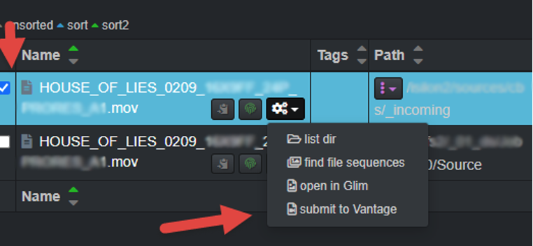
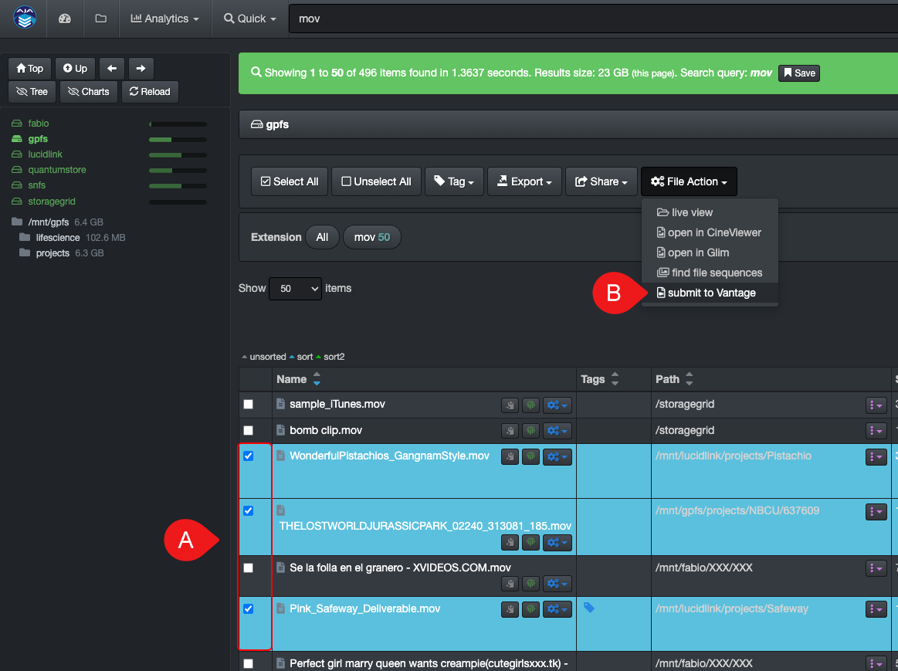
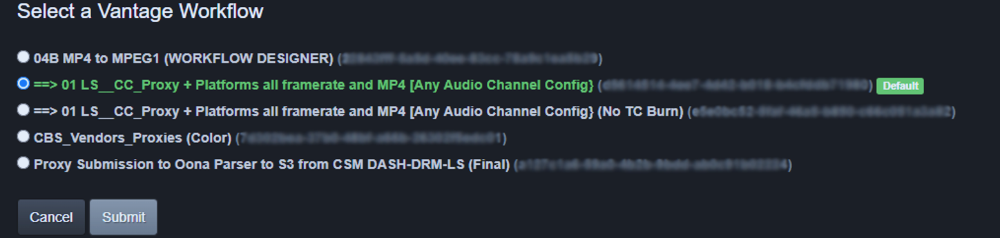
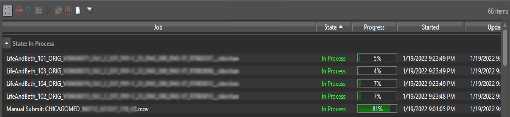
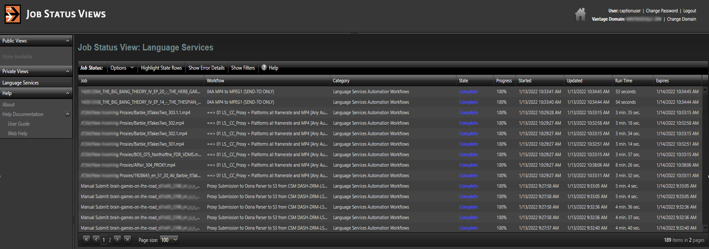

___
## Telestream GLIM and Vantage Workflow Automation
___

The GLIM and Vantage web tools allow end-users to view/confirm source files, as well as submit files for transcoding, directly from Diskover, without ever leaving your web browser.

[Click here to learn more about the Telestream products](http://www.telestream.net/)

___
### Preview/Validate Media Files with GLIM

You can do an advanced search/validation of a media file and playback right from Diskover.

>🔆 &nbsp;Make sure you are logged in your Telestream account before using this feature.

You can access the **File Action > open in GLIM** by selecting a file and clicking the File Action button as shown below:

Or click the gear icon location on the line item that you want to preview with GLIM > select **open with Glim**

This will launch GLIM where you'll be able to validate/preview the file.

[Click here to learn more about the Telestream GLIM product](https://www.telestream.net/glim/overview.htm)

___
### Submit Transcoding Jobs to Vantage Direclty from Diskover

The Diskover Telestream Vantage Plugin allows end-users to submit files for transcoding directly from the Diskover user interface. This process can be utilized by all end-users without needing access to the production tools and source files.

The major benefits:

- The plugin eliminates many steps from going back and forth between the two softwares.
- Vantage offers several transcoding options which can be confusing to non-technical users > the plugin allows for limiting the number of options to only the ones relevant to the end-users.
- Creating a Vantage account for an end-user is intensive as it requires complex and time consuming configurations > single end-user accounts for Vantage are not required with the plugin as all they need is access to Diskover.
- End-users with a Vantage account also means that they have access to your production network > the plugin keeps your network secure as the end-users only have access to read-only information via Diskover.
- Files are very easy to find within Diskover’s global index compared to Vantage where one needs to know where to look.
- The learning curve is quick and easy for new end-users.

#### Steps to Submit a File for Transcoding

1. [Search for the desired file(s) within Diskover](https://docs.diskoverdata.com/diskover_user_guide/#manual-search-syntax) as you would normaly do.
 
2. Select the file you wish to submit for transcoding by clicking the **File Action > submit to Vantage** icon (gears icon) in line with the file. If you wish to submit multiple files at a time, select the files by clicking the check box in front of the file, then select the **File Action > submit to Vantage** button.

3. A window will open with a series of submission options - after clicking the **Submit** button, you will get a message that the file has been submitted to Vantage successfully.

4. If you have access to the **jobs submission status** view in Vantage (webpage location to be supplied by your system administrator), you will see the progress status of your request(s).

[Click here to learn more about the Telestream Vantage product](http://www.telestream.net/vantage/overview.htm)
