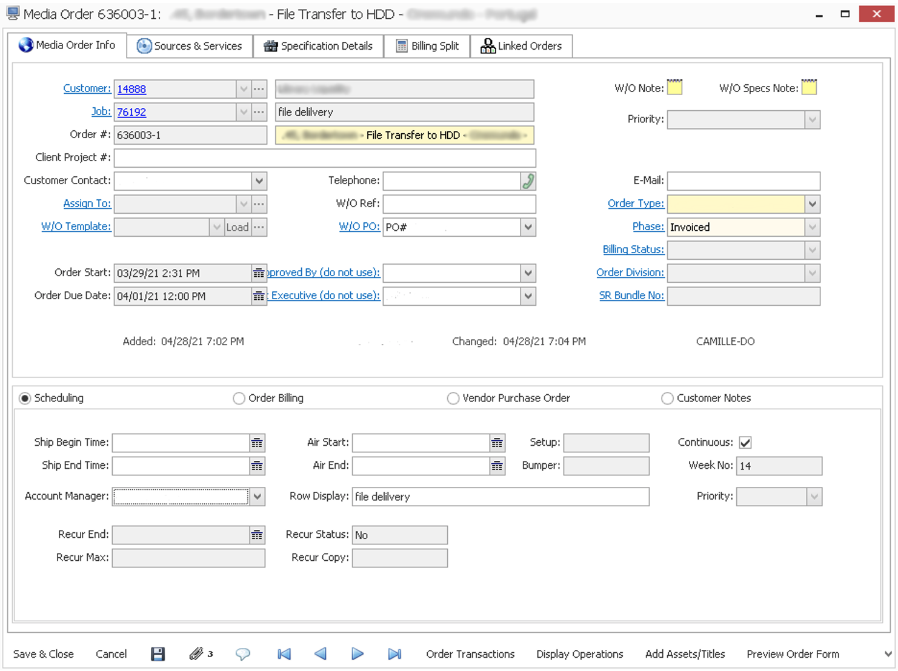

___
## Xytech Plugins
___
This chapter describes the features that are currently released enhancing file-based production workflows when using the Xytech Media Operations Platform. Extra metadata can be harvested to give addition business context allowing for efficient data flow management.

[Click here to learn more about the Xytech Media Operations Platform.](https://www.xytechsystems.com/)

___
### Xytech Asset Creation Plugin

#### [🍿 Watch Demo Video | Xytech Asset Creation Plugin](https://vimeo.com/660789118)

Post facilities often have customers’ assets that have been archived and lack findability, visibility, searchability, and therefore the opaque nature of these assets make them difficult to reuse or repurpose. Companies, with years of such archived assets, have often stored these on tape media or removable hard drives which are often stored in a physical vault.

Assets were often stored on such “offline” media due to costs, however with the advent of cloud and object storage, the economics are now making it viable to store such vaulted assets on more “online media”. Although, simply putting these assets onto online media does not necessarily make these assets findable in context or within the facility’s order management system.

The Xytech asset creation tool is designed to find and index newly restored online assets from LTO tapes, removable hard drives, etc., making them available, findable, and searchable within the Xytech order management system, as well as Diskover.

The plugin operates on the assumption that the assets restored to online media are placed into a folder with the following naming convention:  **CustomerID_CustomerName**

The path location is added to the asset within Xytech and the asset number is assigned to the file via a tag within the Diskover Index.

Here is an example of an asset rehydration as viewed in the Xytech application:

Here are the same values, customer ID and asset ID, displayed within Diskover:

___
### Xytech Order Status Plugin

#### [🍿 Watch Demo Video | Xytech Order Status Plugin](https://vimeo.com/768967081)

Facilities often manually correlate the order management system with the storage repositories. However, manual processes are subject to human errors and difficult to scale as the volume of media orders and data turnover increases rapidly and constantly.

Therefore, the lack of integration for file-based workflows between the order management system and the underlying storage repositories, makes data management decisions difficult as they are solely based on attributes of files or objects on storage. Additional business context is needed from the order management system to increase precision and accuracy of data management decisions.

An instance of key information might be the invoice date for a work order. A status change for a work order can be a key indicator for data management, for example, once a [Xytech](https://www.xytechsystems.com/) media order has been invoiced, then the data associated with that media order can be a candidate for archival.

The Xytech order status plugin is designed to automate the correlation of the order management system and the storage system, by harvesting key business context from Xytech and applying that context within the AJA Diskover Media Edition platform.

