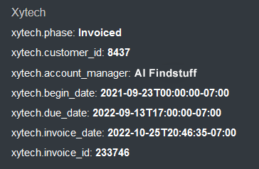
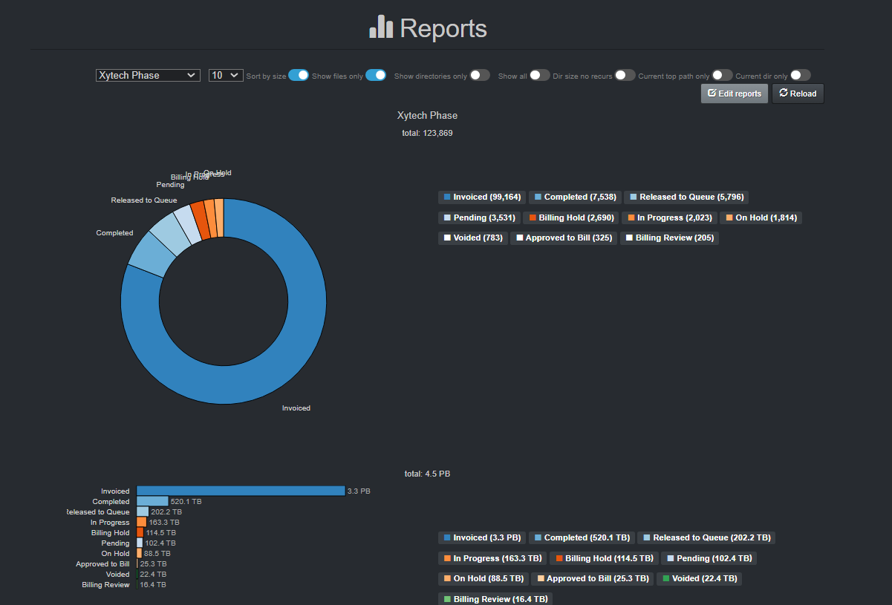

___
## Xytech Plugins
___
This chapter describes features enhancing file-based production workflows when using the Xytech Media Operations Platform. Extra metadata is harvested to give additional business context allowing for efficient data flow management, including searches, analytics, and data curation.

[Click here to learn more about the Xytech Media Operations Platform.](https://www.xytechsystems.com/)

___
### Xytech Asset Creation Plugin Overview

#### [🍿 Watch Demo Video | Xytech Asset Creation Plugin](https://vimeo.com/660789118)

Post facilities often have customers’ assets that have been archived and lack findability, visibility, searchability, and therefore the opaque nature of these assets makes them difficult to reuse or repurpose. Companies, with years of such archived assets, have often stored these on tape media or removable hard drives which are often stored in a physical vault.

Assets were often stored on such “offline” media due to costs, however, with the advent of cloud and object storage, the economics are now making it viable to store such vaulted assets on more “online media”. Although, simply putting these assets onto online media does not necessarily make these assets findable in context or within the facility’s order management system.

The Xytech asset creation tool is designed to find and index newly restored online assets from LTO tapes, removable hard drives, etc., making them available, findable, and searchable within the Xytech order management system, as well as Diskover.

The plugin operates on the assumption that the assets restored to online media are placed into a folder with the following naming convention:  **CustomerID_CustomerName**

The path location is added to the asset within Xytech and the asset number is assigned to the file via a tag within the Diskover Index.

#### Media Asset Interface Within Xytech Application

#### Xytech Media Asset Attributes Within Diskover

The following are examples of media asset attributes within Diskover, allowing correlation with the Xytech application, therefore, enabling that data to be searched, analyzed, as well as engaged in workflows.

#### How to Search for Xytech Media Assets in Diskover

##### Attributes Overview
The **asset id** is part of the metadata harvested by Diskover. If a file at the source doesn’t have an asset ID attached to it, it goes without saying that no details will be harvested and/or be available within Diskover.

In addition to the [manual search syntax explained in the Diskover User Guide](https://docs.diskoverdata.com/diskover_user_guide/#search_syntax), the AJA Diskover Media Edition allows end-users to search on Xytech asset ID numbers.

##### Search Syntax

- The following syntax needs to be respected **xytech.asset_id:**__*value*__:
    * **xytech.asset_id:** is not a variable.
    * __*value*__ is a variable as per the examples below.

- Searching on **xytech** fields is case insensitive.

- Your search query needs to be typed or pasted into the Diskover search bar.

| Search Query Examples | Search Results |
| --- | --- |
| **xytech.asset_id:**__*\**__ | would find all files/directories with any asset ID attached to them |
| **xytech.asset_id:**__*1495193*__ | would search for the specific asset ID number 1495193 |
| **xytech.asset_id:**__*123*__ | would search for partial digits 123 anywhere in the asset ID number |

___
### Xytech Order Status Plugin Overview

#### [🍿 Watch Demo Video | Xytech Order Status Plugin](https://vimeo.com/768967081)

The Xytech order status plugin is designed to automate the correlation of the order management system and the storage system, by harvesting key business context from Xytech and applying that context within the AJA Diskover Media Edition. In turn, this business context metadata can be used to curate data, automate workflows, monitor costs, create customized reports, etc.

Facilities often manually correlate the order management system with the storage repositories. However, manual processes are subject to human errors and difficult to scale as the volume of media orders and data turnover increases constantly.

Therefore, the lack of integration for file-based workflows between the order management system and the underlying storage repositories, makes data management decisions difficult as they are solely based on attributes of files or objects on storage. Additional business context is needed from the order management system to increase precision and accuracy of data management decisions.

An instance of key information might be the invoice date for a work order. A status change for a work order can be a key indicator for data management, for example, once a [Xytech media order](https://www.xytechsystems.com/) has been “invoiced”, then the data associated with that media order can be a candidate for archival.

#### Order Status User Interface Within Xytech Application

#### Xytech Media Asset Attributes Within Diskover

The following are examples of media asset attributes within Diskover, allowing correlation with the Xytech application, therefore, enabling that data to be searched, analyzed, as well as engaged in workflows.

#### Order Status Information Within Diskover

The plugin finds all of the Xytech Media Order folders on the storage volume(s) then pulls additional status and attributes/metadata and adds them as basically "properties" of that folder.

Examples of order status attributes harvested from Xytech during Diskover indexing, which can be used to search, analyze, and automate workflows:

&nbsp;&nbsp;&nbsp;

Example of Diskover customized Reports using order status attributes harvested from Xytech, giving business context to regular data. 

#### How to Search for Xytech Order Status in Diskover

##### General Information
The **order status** fields are part of the metadata harvested by Diskover. If a file at the source doesn’t have an asset ID attached to it, it goes without saying that no details will be harvested and/or be available within Diskover.

In addition to the [manual search syntax explained in the Diskover User Guide](https://docs.diskoverdata.com/diskover_user_guide/#search_syntax), the AJA Diskover Media Edition allows end-users to search on Xytech order status information.

##### Search Syntax

- The following syntax needs to be respected `xytech.key:value`:
    * **xytech** is not a variable.
    * **key** is a variable like phase, account manager, etc.
    * **value** is a variable as per the examples below.

- Searching on **xytech** fields is case insensitive.

- Your search query needs to be typed or pasted in the Diskover search bar.

| Search Query Examples | Search Results |
| --- | --- |
| `xytech.phase:invoiced` | would find all files/directories with an invoiced status |
| `xytech.account_manager:*Joe*` | would search for all files/directories with Joe as the account manager |
| `xytech.begin_date:*2022-07-19*` | would search for all files/directories with a order status beginning date of 19 July, 20202 |
| `xytech.due_date:*2022-07-19*` | would search for all files/directories with an order status due date of 19 July, 20202 |
| `xytech.invoice_id:19782` | would search for all files/directories with invoice number 19782 |
| `xytech.invoice_date:*2022-07-19*` | would search for all files/directories with an invoice date of 19 July, 20202 |

