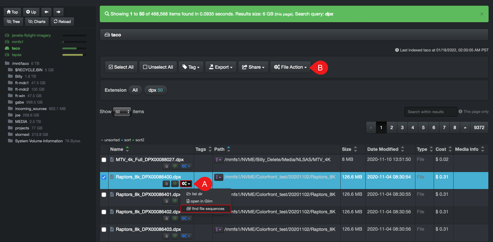
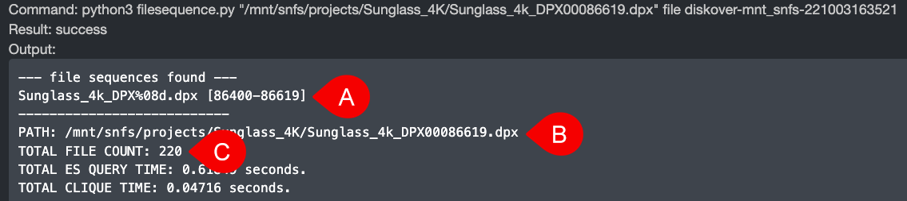

## Find File Sequences

Diskover lets you easily find all files in a sequence via [**File Action**](https://docs.diskoverdata.com/diskover_user_guide/#file-actions).

### How to Launch Find File Sequences

| REFERENCE | DESCRIPTION |
| :---: | --- |
| A | You can launch from the inline File Action gears icon without having to select the file first. |
| B | You can launch from the File Action gears icon above the results pane but you'll have to select the line item first. |

### How to Read File Sequence Results

The results will open in a new browser tab:

| REFERENCE | DESCRIPTION |
| :---: | --- |
| A | How to read the file sequence results:<ul><li>`DPX` → constant digits at the beginning of the sequence.</li><li>`%08d` → sequence contains 8 digits starting with zeros/padding.</li><li>`[86400-86619]` → sequence detected, more brackets would show if broken sequences would be detected. |
| B | Path where the file sequences can be found. |
| C | Number of sequences found. |
