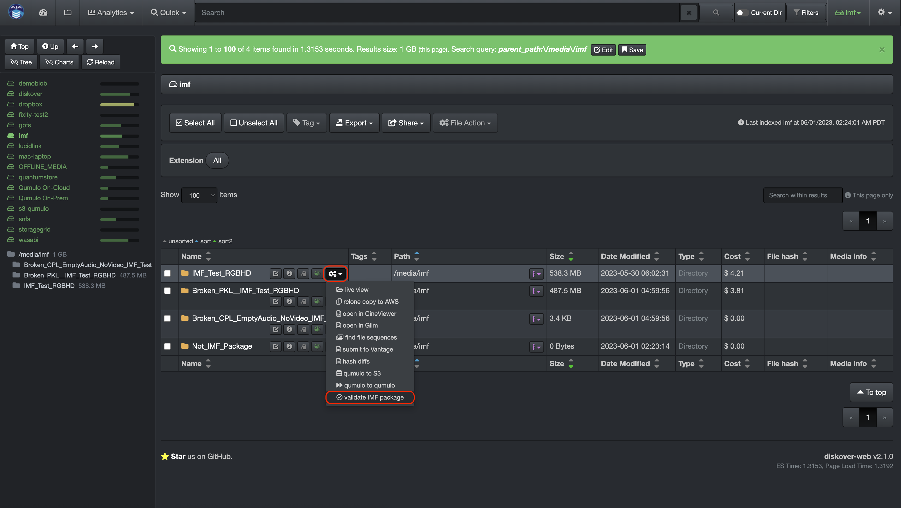
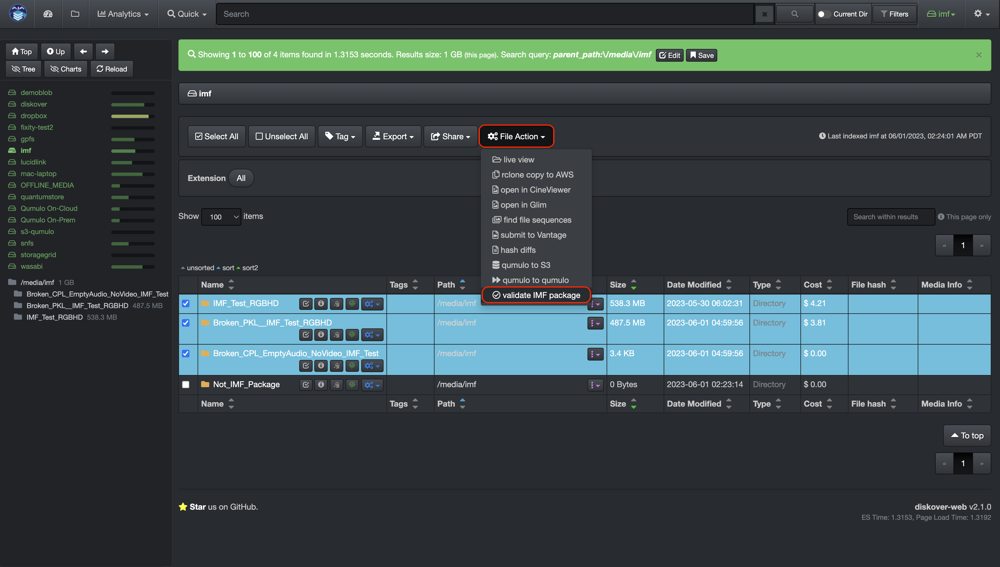
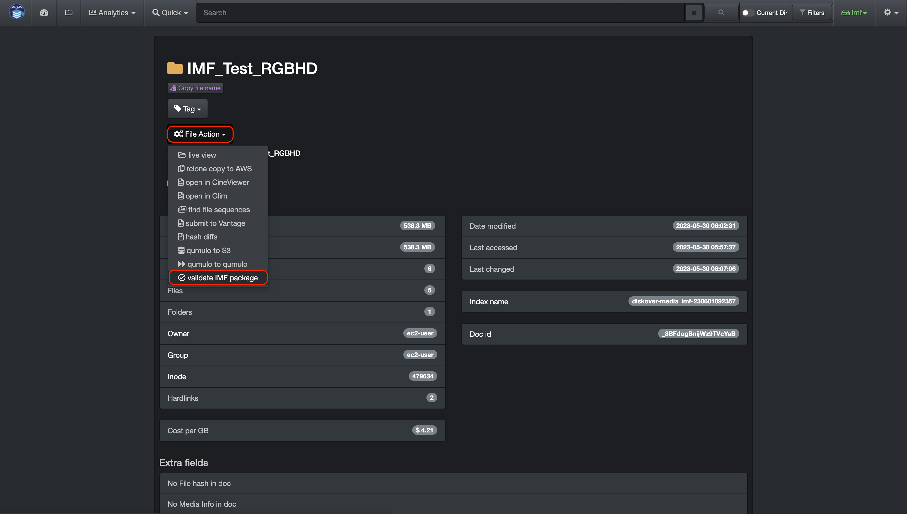
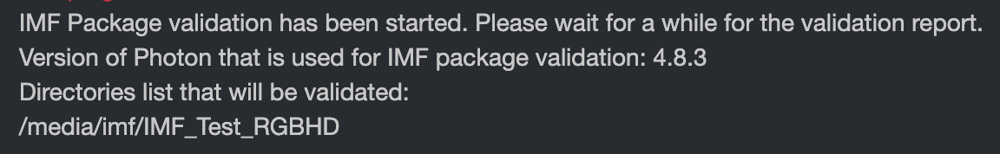
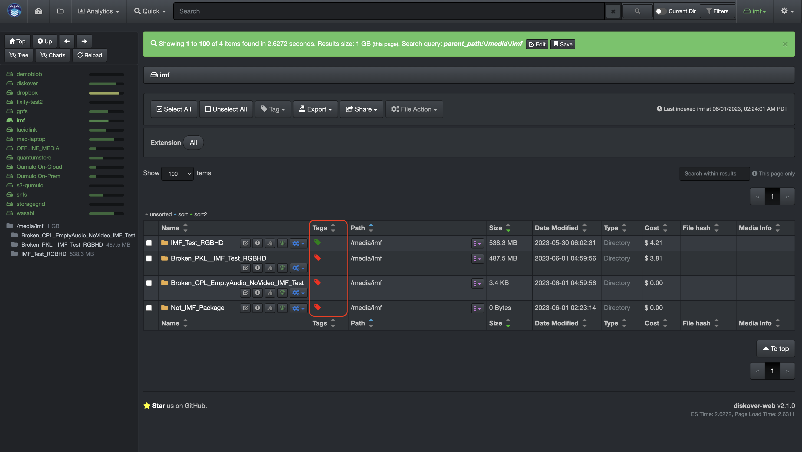
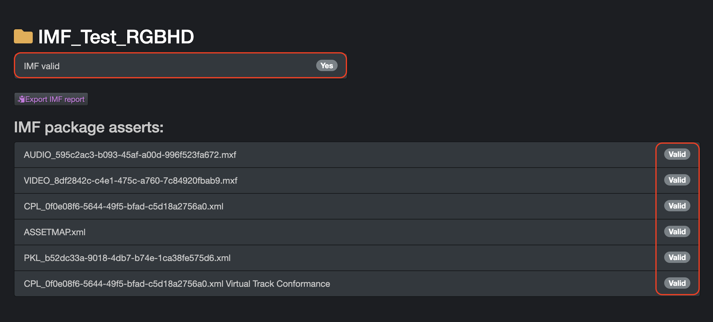
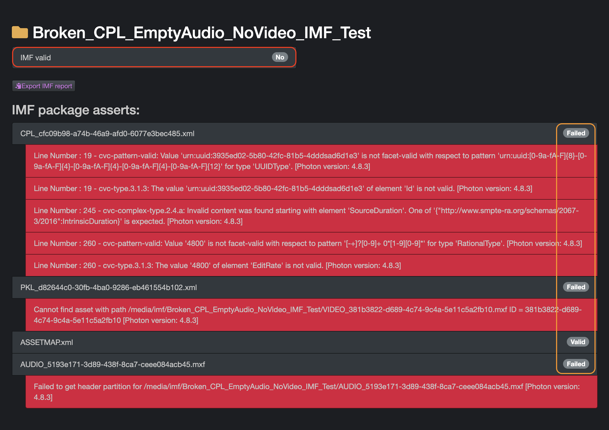
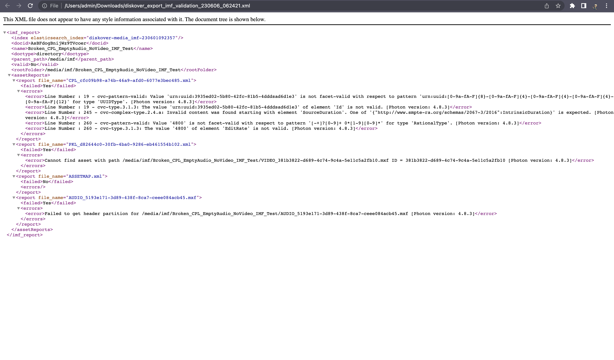

## IMF Package Validator

#### [🍿 Watch Demo Video | IMF Package Validator](https://vimeo.com/833500176?share=copy)

The IMF package validator plugin allows organizations to validate IMF packages before delivery from a remote platform, saving immense amounts of man-hours over the course of a business year.

Oxagile’s IMF Package Validator plugin allows users to scan and validate IMF packages before delivery from any location, regardless of the location of the IMF package data.

IMF stands for Interoperable Master Format, which is a technical standard used in the Media and Entertainment industry for the exchange of digital content between different platforms and systems. The IMF format is used by content creators, distributors, and broadcasters to deliver high-quality video content to a variety of devices, including TVs, mobile devices, and web browsers.

Netflix, for example, requires all their content to be delivered in IMF format, which undergoes rigorous validation to ensure compliance with industry standards. The validation process involves extensive testing of the content's video, audio, and metadata to ensure that it meets the technical specifications and can be delivered to viewers in the highest quality possible.

Once the content has been validated, it is then encoded into various formats, including 4K and HDR, and made available for streaming on various platforms. The IMF validation process is a critical step in the content delivery pipeline.

The IMF Package Validator plugin is developed by [Oxagile](https://www.oxagile.com/). For more information or to purchase the IMF Package Validator plugin, please contact [Oxagile](mailto:IMF@Oxagile.com).

#### Functional Limitations

The following are the limitations of the current plugin version:

1.	Verification capabilities are limited to those of the latest version of the Netflix Photon tool.
2.	Validation by schedule is not supported.
3.	Cloud storage is not supported.
4.	Archives are not supported.
5.	DCP packages are not supported.

### How to Launch the IMF Package Validator Plugin

First, locate the package(s) you want to validate by [searching using the built-in tools](https://docs.diskoverdata.com/diskover_user_guide/#built-in-search-tools), [searching using manual queries](https://docs.diskoverdata.com/diskover_user_guide/#manual-queries), or [drilling down the file tree](https://docs.diskoverdata.com/diskover_user_guide/#search-page).

There are 3 ways to launch the **validate IMF package** file action:

✏️ Note that this action is only available for directory items and will not work if you're trying to launch using a file.

If you want to **validate a single package**, use the file action button in line with that package in the results pane.

If you want to **validate multiple packages** at once, use this global file action button located above the results pane.

You can first **validate the attributes of a single package** by clicking this icon  in line with the package in the search page, then use the file action button located in the attributes page.

After launching the **validate IMF package** file action, a new tab will open displaying the packages being validated, as well as the version of the plugin. The process should take about 5 seconds per package. In this example, only one package is being validated:

### Validation Results Via Tags

Return to the search page and refresh the tab. The results of the validation are shown as tags.

**Green tag → imf valid** = validation successful for all items inside the package

**Red tag → imf not valid** = validation failed for some or all items inside the package

### Reports Following Validation

This new report icon  will be available for the validated directories in the results pane, as well as in the attributes window. 

#### Successful Validation

Here is an example of a successful validation report upon clicking the  icon.
- The report is displayed in a new tab.
- At the top you can see the global validation status for the package, as well as the status per file. 
- All items inside a package need to successfully pass validation for the package to be valid.

#### Failed Validation

Here is an example of a failed validation report upon clicking the  icon. 
- The report is displayed in a new tab.
- At the top you can see the global validation status for the package, as well as the status per file. 
- The error(s) encountered during the validation process are listed in red under each failed item.
- A package will be identified as not valid if one or more items inside that package failed the validation process.

#### Validation Report in XML Format

It is possible to export the validation report in XML format using the  button in the IMF reports window.

You can find the XML file in your **Downloads** folder. Here is an example when opening the file with a web browser:

#### Reports Using Tags

There are several ways to [report on tags](https://docs.diskoverdata.com/diskover_user_guide/#tags). To quickly report on successful (green tag) or failed (red tag) validation, please follow the instructions using [Quick Search](https://docs.diskoverdata.com/diskover_user_guide/#quick-search).
