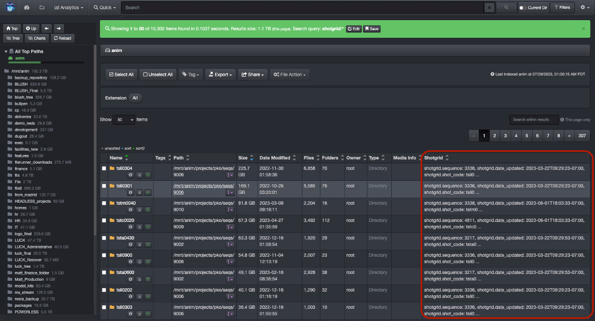
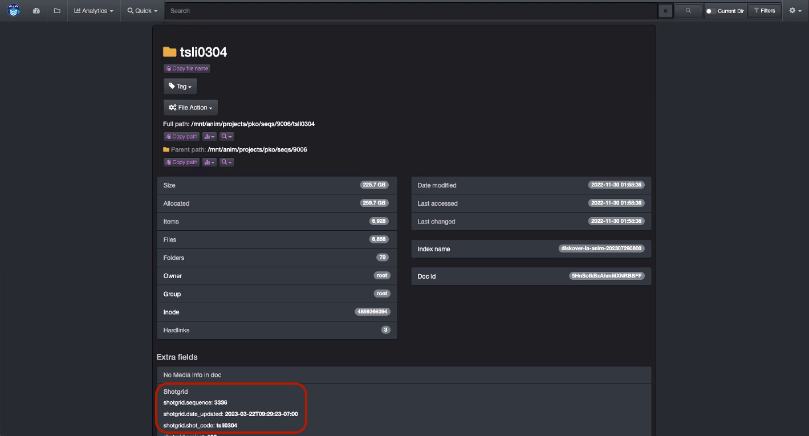
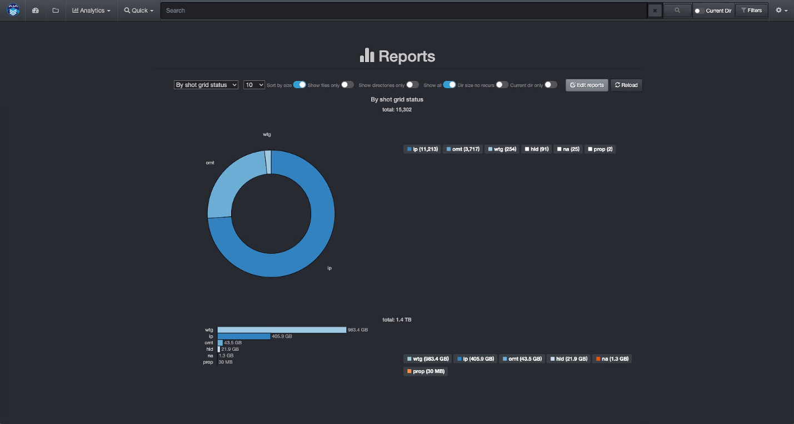
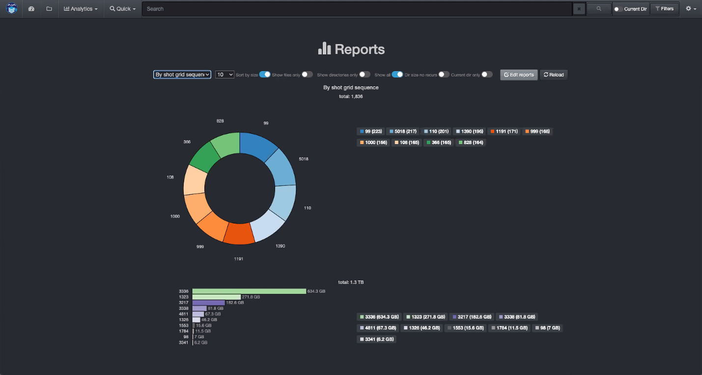
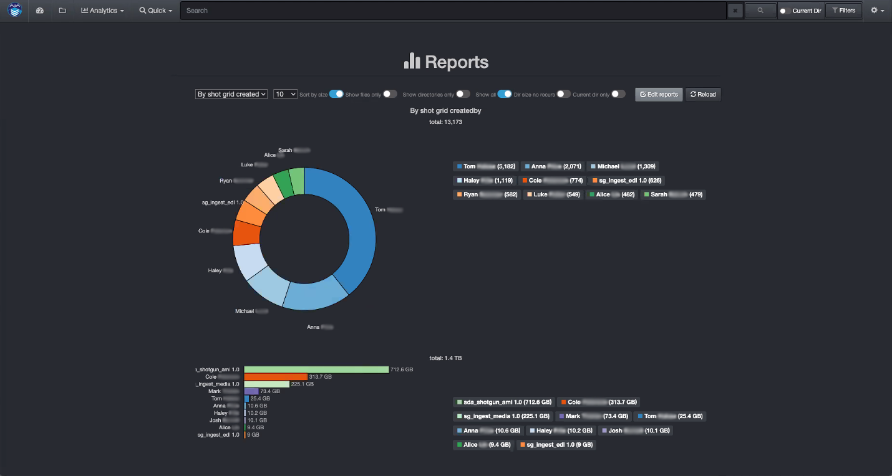

## Flow Production Tracking Plugin

The Flow Production Tracking (formerly ShotGrid) Plugin is designed to enhance basic metadata with detailed production status information, aligning data management with production schedules. The Diskover Flow Production Tracking Plugin harvests additional attributes from the Autodesk ShotGrid platform for every **shot** directory located on storage. These attributes become properties of the **shot** directories and include status information such as **finaled**, **out-of-picture**, multiple project **tracking dates**, and many more, totaling around one hundred indexable fields. Note that users can opt to only index the fields that are relevant to their business.

These searchable business context attributes enable very precise data management decision-making via granular reporting, and can easily be engaged in workflows and file actions. A representative workflow might be to archive all **shots** directories **30 days** after their status has been updated to **finaled**.

For each shot directory within Diskover, the Flow Production Tracking attributes basically become a property of that directory. All fields/metadata harvested become searchable, reportable, and actionable within Diskover.

[Click here to learn more about the Autodesk Flow Production Tracking Platform.]([https://www.autodesk.com/products/shotgrid/overview?term=1-YEAR&tab=subscription&plc=SGSUB)

### Flow Production Tracking Attributes in the Diskover User Interface

>**✏️ Important | Diskover Software Still Using ShotGrid**
>
>Please note that Autodesk recently changed its product name from **ShotGrid** to **Flow Production Tracking**." Although our literature now refers to Flow Production Tracking, ShotGrid will still be used in Diskover's user interface and backend post-index harvesting until further notice.

Search page showing a dedicated column with a summary of the Flow Production Tracking attributes.

Detailed Flow Production Tracking indexed fields can be found in the Diskover attributes window.

### Flow Production Tracking Status Analytics Within Diskover

Business context metadata allows for granular and powerful analytics with information relevant to your business. Once the Flow Production Tracking attributes are indexed by Diskover, they can be used in various [reporting tools](https://docs.diskoverdata.com/diskover_user_guide/#analytic).

Below are examples of analytics using Diskover's [Reports](https://docs.diskoverdata.com/diskover_user_guide/#reports) feature.

##### Top Results by Status Code

Amount of data by **status code**:

##### Top Results by Sequence

Amount of data by **sequence**:

##### Top Results by Creator

Amount of data by **creator**:

### How to Search for Flow Production Tracking Attributes

The **Flow Production Tracking** (formerly **ShotGrid**) fields are part of the metadata harvested by Diskover. If a file at the source doesn’t have any of those attributes attached to it, it goes without saying that no details will be harvested and/or be available within Diskover.

In addition to the [manual search syntax explained in the Diskover User Guide](https://docs.diskoverdata.com/diskover_user_guide/#manual-queries), users can search on multiple Flow Production Tracking attributes.

#### Search Syntax

   >**Important | Diskover Software Still Using ShotGrid**
   >
   >Please note that Autodesk recently changed its product name from **ShotGrid** to **Flow Production Tracking**." Although our literature now refers to Flow Production Tracking, ShotGrid will still be used in Diskover's user interface and backend post-index harvesting until further notice.

- The following syntax needs to be respected **shotgrid.key:**__*value*__:
    * **shotgrid** is not a variable.
    * **key** is a variable like dates, sequence, creator, etc.
    * __*value*__ is a variable as per the examples below.

- Searching on **shotgrid** fields is case insensitive.

- Your search query needs to be typed or pasted into the Diskover search bar.

- For [all information on manual search queries](https://docs.diskoverdata.com/diskover_user_guide/#manual-queries).

#### Searchable Fields and Examples

The Autodesk Flow Production Tracking platform has around one hundred indexable fields. Users can opt to index all or just the ones relevant to their business.

##### List of All Indexable and Searchable Fields

| 🔎 SEARCH SYNTAX | 🔎 SEARCH SYNTAX   | 🔎 SEARCH SYNTAX |
| --- | --- | --- |
| shotgrid.addressings_cc	| shotgrid.sg_cut_in	| shotgrid.smart_cut_summary_display	 |
| shotgrid.assets	| shotgrid.sg_cut_order	| shotgrid.smart_duration_summary_display	 |
| shotgrid.cached_display_name	| shotgrid.sg_cut_out	| shotgrid.smart_head_duration	 |
| shotgrid.code	| shotgrid.sg_dialogue	| shotgrid.smart_head_in	 |
| shotgrid.created_at	| shotgrid.sg_dialogue_change_	| shotgrid.smart_head_out	 |
| shotgrid.created_by	| shotgrid.sg_dialogue_notes	| shotgrid.smart_tail_duration	 |
| shotgrid.cut_duration	| shotgrid.sg_dialogue_type	| shotgrid.smart_tail_in	 |
| shotgrid.cut_in	| shotgrid.sg_dialoguelucks	| shotgrid.smart_tail_out	 |
| shotgrid.cut_out	| shotgrid.sg_head_in	| shotgrid.smart_working_duration	 |
| shotgrid.description	| shotgrid.sg_most_recent_cutitem	| shotgrid.step_0	 |
| shotgrid.filmstrip_image	| shotgrid.sg_published_files	| shotgrid.step_106	 |
| shotgrid.head_duration	| shotgrid.sg_sequence	| shotgrid.step_136	 |
| shotgrid.head_in	| shotgrid.sg_shot_dialogue	| shotgrid.step_178	 |
| shotgrid.head_out	| shotgrid.sg_shot_dialogue_status	| shotgrid.step_179	 |
| shotgrid.id	| shotgrid.sg_shot_type	| shotgrid.step_180	 |
| shotgrid.image	| shotgrid.sg_shots	| shotgrid.step_185	 |
| shotgrid.image_blur_hash	| shotgrid.sg_shots_1	| shotgrid.step_186	 |
| shotgrid.image_source_entity	| shotgrid.sg_status_list	| shotgrid.step_222	 |
| shotgrid.launches	| shotgrid.sg_sync_metadata	| shotgrid.step_255	 |
| shotgrid.notes	| shotgrid.sg_tail_out	| shotgrid.step_35	 |
| shotgrid.open_notes	| shotgrid.sg_tasks	| shotgrid.step_552	 |
| shotgrid.open_notes_count	| shotgrid.sg_transition_from	| shotgrid.step_6	 |
| shotgrid.parent_shots	| shotgrid.sg_transition_from_offset	| shotgrid.step_7	 |
| shotgrid.project	| shotgrid.sg_transition_to	| shotgrid.step_8	 |
| shotgrid.reel	| shotgrid.sg_transition_to_offset	| shotgrid.tags	 |
| shotgrid.sg_board_notes	| shotgrid.sg_vendor_groups	| shotgrid.tail_duration	 |
| shotgrid.sg_camera_notes	| shotgrid.sg_versions	| shotgrid.tail_in	 |
| shotgrid.sg_character_notes	| shotgrid.sg_versions_query	| shotgrid.tail_out	 |
| shotgrid.sg_characters	| shotgrid.sg_working_duration	| shotgrid.task_template	 |
| shotgrid.sg_color_keys	| shotgrid.shots	| shotgrid.tasks	 |
| shotgrid.sg_comments	| shotgrid.smart_cut_duration	| shotgrid.updated_at	 |
| shotgrid.sg_cut_duration	| shotgrid.smart_cut_in	| shotgrid.updated_by	 |
| shotgrid.sg_cut_duration_timecode	| shotgrid.smart_cut_out	|		 |

##### Search Examples  

| 🔎 QUERY EXAMPLES | ✅ POSSIBLE RESULTS |
| --- | --- |
| **shotgrid.sequence:_3336_** | All files/directories with **sequence** number __*3336*__ |
| **shotgrid.date_updated:**__*\*2023-03-22*\*__ | All files/directories with an **updated status date** of __*March 22, 2023*__ |
| **shotgrid.shot_code:**__*\*li0304*\*__ | All **shot code** files/directories with full or partial number __*li0304*__ |

