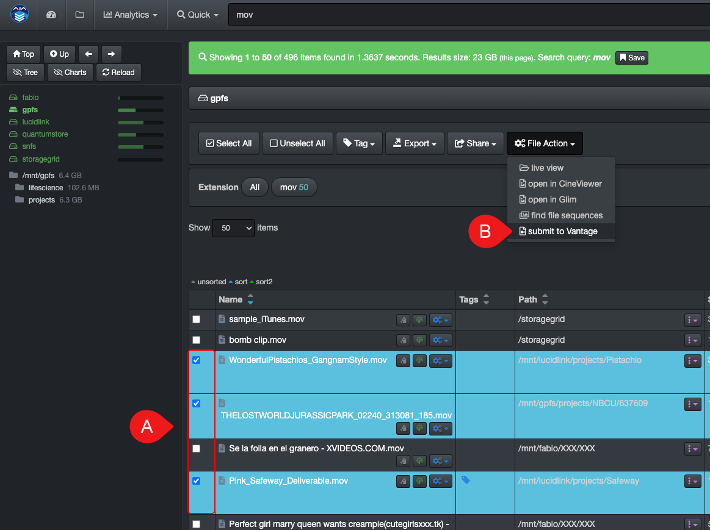
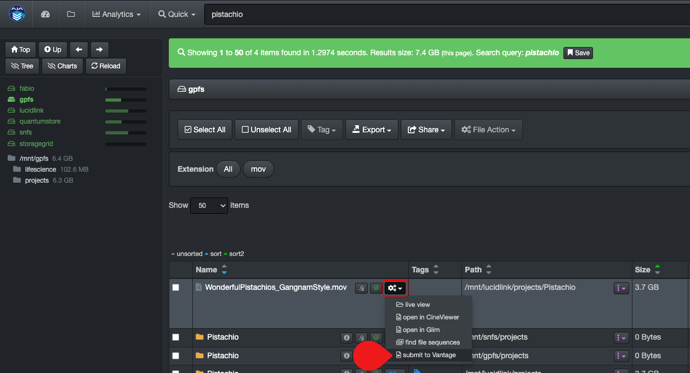
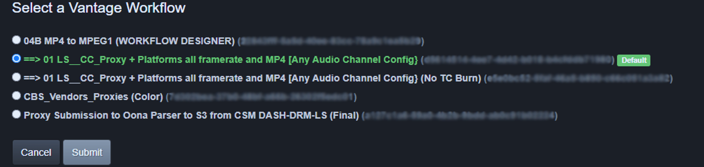
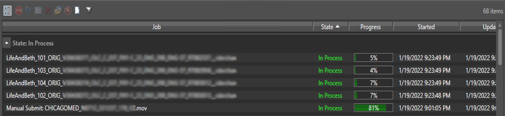
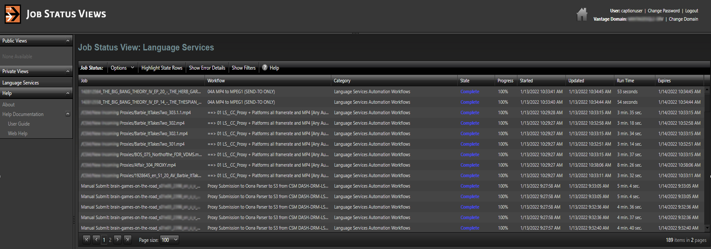

## Telestream GLIM and Vantage Plugins

The GLIM and Vantage web tools are seamless integrations allowing end-users to securely view/validate source files, as well as submit files for transcoding, directly from Diskover, in one click from the Diskover web browser and without ever accessing the source assets themselves.

[Click here to learn more about Telestream products.](http://www.telestream.net/)

### GLIM | Preview/Validate Media Files

#### [🍿 Watch Demo Video | Telestream GLIM](https://vimeo.com/665037937)

You can do an advanced search/validation of a media file and playback right from Diskover. 

✏️ Make sure you are logged in to your Telestream account before using this feature.

You can access the GLIM by 🅰 selecting a file in the results pane and 🅱 clicking **File Action → open in Glim**:

You can also click the **File Action/gear icon → open in Glim** located in the results pane to preview a media file:

Either method will launch GLIM where you'll be able to validate/preview media files.

[Click here to learn more about the Telestream GLIM product.](https://www.telestream.net/glim/overview.htm)

### Vantage | Submit Transcoding Jobs Directly from Diskover

#### [🍿 Watch Demo Video | Telestream Vantage](https://vimeo.com/669672933)

The Diskover Telestream Vantage Plugin allows end-users to submit files for transcoding directly from the Diskover user interface. This process can be utilized by all end-users without needing access to the production tools and source files.

The major benefits:

- The plugin eliminates many steps from going back and forth between the two software.
- Vantage offers several transcoding options which can be confusing to non-technical users > the plugin allows for limiting the number of options to only the ones relevant to the end users.
- Creating a Vantage account for an end-user is intensive as it requires complex and time-consuming configurations > single end-user accounts for Vantage are not required with the plugin as all they need is access to Diskover.
- End-users with a Vantage account also means that they have access to your production network > the plugin keeps your network secure as the end-users only have access to read-only information via Diskover.
- Files are very easy to find within Diskover’s global index compared to Vantage where one needs to know where to look.
- The learning curve is quick and easy for new end-users.

#### How to Submit a File for Transcoding

- 1 → Search for the desired file(s) within Diskover as you would normally do.
- 2 → You can launch transcoding jobs by first selecting a single file or multiple files in the results pane and then selecting **File Action → submit to Vantage**:

 
- 3 → You can also launch Vantage in the results pane for a single transcoding job by selecting **File Action → submit to Vantage**:

- 4 → A window will open with a series of submission options - after clicking the **Submit** button, you will get a message that the file has been submitted to Vantage successfully.

- 5 → If you have access to the **jobs submission status** view in Vantage (webpage location to be supplied by your system administrator), you will see the progress status of your request(s).

[Click here to learn more about the Telestream Vantage product.](http://www.telestream.net/vantage/overview.htm)
