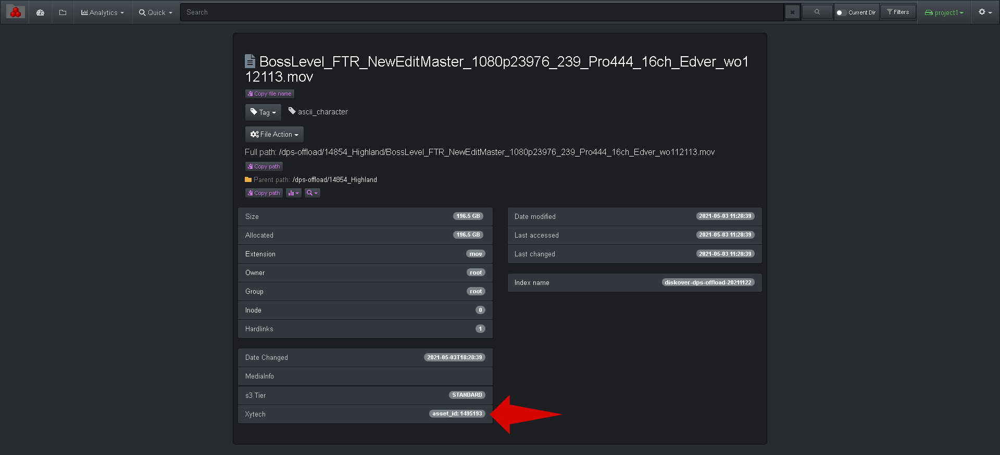
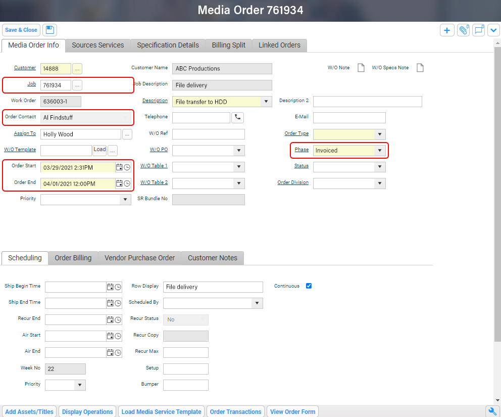

## Xytech Plugins

This chapter describes features enhancing file-based production workflows when using the [Xytech Media Operations Platform](https://www.xytechsystems.com/). Extra metadata is harvested to give additional business context allowing for efficient data flow management, including searches, analytics, and data curation.

[Click here to learn more about the Xytech Media Operations Platform.](https://www.xytechsystems.com/)

### Xytech Asset Creation Plugin Overview

#### [🍿 Watch Demo Video | Xytech Asset Creation Plugin](https://vimeo.com/660789118)

Post facilities often have customers’ assets that have been archived and lack findability, visibility, searchability, and therefore the opaque nature of these assets makes them difficult to reuse or repurpose. Companies, with years of such archived assets, have often stored these on tape media or removable hard drives which are often stored in a physical vault.

Assets were often stored on such “offline” media due to costs, however, with the advent of cloud and object storage, the economics are now making it viable to store such vaulted assets on more “online media”. Although, simply putting these assets onto online media does not necessarily make these assets findable in context or within the facility’s order management system.

The Xytech asset creation tool is designed to find and index newly restored online assets from LTO tapes, removable hard drives, etc., making them available, findable, and searchable within the Xytech order management system, as well as Diskover.

The plugin operates on the assumption that the assets restored to online media are placed into a folder with the following naming convention:  **CustomerID_CustomerName**

The path location is added to the asset within Xytech and the asset number is assigned to the file via a tag within the Diskover Index.

#### Media Asset Interface Within Xytech Application

#### Xytech Media Asset Attributes Within Diskover

The following are examples of media asset attributes within Diskover, allowing correlation with the Xytech application, therefore, enabling that data to be searched, analyzed, as well as engaged in workflows.

#### How to Search for Xytech Media Assets

##### Search Overview

The **asset id** is part of the metadata harvested by Diskover. If a file at the source doesn’t have an asset ID attached to it, it goes without saying that no details will be harvested and/or be available within Diskover.

In addition to the [manual search syntax explained in the Diskover User Guide](https://docs.diskoverdata.com/diskover_user_guide/#manual-queries), users can search on Xytech asset ID numbers.

##### Search Syntax

- The following syntax needs to be respected **xytech.asset_id:**__*value*__:
    * **xytech.asset_id:** is not a variable.
    * __*value*__ is a variable as per the examples below.

- Searching on **xytech** fields is case insensitive.

- Your search query needs to be typed or pasted into the Diskover search bar.

##### Search Examples

| 🔎 QUERY EXAMPLES | ✅ POSSIBLE RESULTS |
| --- | --- |
| **xytech.asset_id:**__*\**__ | All files/directories with __*any*__ asset ID attached to them |
| **xytech.asset_id:**__*1495193*__ | All files/directories with the specific asset ID number __*1495193*__ |
| **xytech.asset_id:**__*1234**__ | All files/directories with an asset ID number starting with __*1234*__ |

### Xytech Order Status Plugin Overview

#### [🍿 Watch Demo Video | Xytech Order Status Plugin](https://vimeo.com/768967081)

The Xytech order status plugin is designed to automate the correlation of the order management system and the storage system, by harvesting key business context from Xytech and applying that context within Diskover. In turn, this business context metadata can be used to curate data, automate workflows, monitor costs, create customized reports, etc.

Facilities often manually correlate the order management system with the storage repositories. However, manual processes are subject to human errors and difficult to scale as the volume of media orders and data turnover increases constantly.

Therefore, the lack of integration for file-based workflows between the order management system and the underlying storage repositories, makes data management decisions difficult as they are solely based on attributes of files or objects on storage. Additional business context is needed from the order management system to increase the precision and accuracy of data management decisions.

An instance of key information might be the invoice date for a work order. A status change for a work order can be a key indicator for data management, for example, once a [Xytech media order](https://www.xytechsystems.com/) has been “invoiced”, then the data associated with that media order can be a candidate for archival.

#### Order Status User Interface Within Xytech Application

#### Xytech Order Status Attributes Within Diskover

The plugin finds all of the Xytech Media Order folders on the storage volume(s), then pulls additional status and attributes/metadata and adds them as "properties" of that folder.

The following are examples of order status [attributes](https://docs.diskoverdata.com/diskover_user_guide/#field-names) within Diskover, allowing correlation with the Xytech application, therefore, enabling that data to be searched, analyzed, as well as engaged in workflows. Please note that the fields harvested from Xytech are configurable.

A Xytech column can be added in the Diskover search page, giving a summary of the [attributes](https://docs.diskoverdata.com/diskover_user_guide/#attributesmetadata).

#### Order Status Analytics Within Diskover

Business context metadata allows for granular and powerful analytics with information relevant to your business. Once the Xytech attributes are indexed by Diskover, they can be used in various [reporting tools](https://docs.diskoverdata.com/diskover_user_guide/#analytic).

Below are examples of analytics using Diskover's [Reports](https://docs.diskoverdata.com/diskover_user_guide/#reports) feature.

##### Top Results by Manager

##### Top Results by Order Status

#### How to Search for Xytech Order Status

##### Search Overview

The **order status** fields are part of the metadata harvested by Diskover. If a file at the source doesn’t have an asset ID attached to it, it goes without saying that no details will be harvested and/or be available within Diskover.

In addition to the [manual search syntax explained in the Diskover User Guide](https://docs.diskoverdata.com/diskover_user_guide/#manual-queries), users can search on multiple Xytech order status attributes.

##### Search Syntax

- The following syntax needs to be respected **xytech.key:**__*value*__:
    * **xytech** is not a variable.
    * **key** is a variable like phase, account manager, etc.
    * __*value*__ is a variable as per the examples below.

- Searching on **xytech** fields is case insensitive.

- Your search query needs to be typed or pasted in the Diskover search bar.

##### Search Examples

| 🔎 QUERY EXAMPLES | ✅ POSSIBLE RESULTS |
| --- | --- |
| **xytech.phase:**__*Invoiced*__ | would find all files/directories with an __*Invoiced*__ status, note that case sensitivity needs to be respected for the __*value*__ and needs to start with a capital letter |
| **xytech.customer_id:**__*9999*__ | would find all files/directories with customer ID __*9999*__ |
| **xytech.account_manager:**__*\*Smith*\*__ | would find all files/directories with __*Smith*__ being part of the account manager's name, note that case sensitivity needs to be respected for the __*value*__ and needs to start with a capital letter unless all lower cases were used in the Xytech application |
| **xytech.begin_date:**__*\*2022-10-02*\*__ | would find all files/directories with an order status beginning date of __*October 2, 2022*__ |
| **xytech.due_date:**__*\*2023-04-19*\*__ | would find all files/directories with an order status due date of __*April 10, 2023*__ |
| **xytech.invoice_date:**__*\*2023-05*\*__ | would search for all files/directories with an invoice date in the month of __*May 2023*__ |
| **xytech.invoice_id:**__*233890*__ | would find all files/directories with invoice number __*233890*__ |

