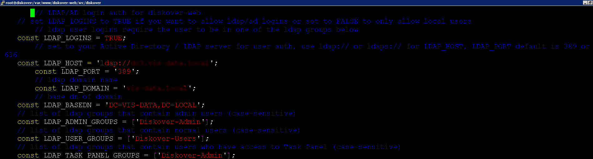

___
## User Roles and Authentication

&nbsp;&nbsp;&nbsp;

___

This chapter discusses setting up authenticated user access to Diskover-Web.

___
### Local User Configuration

Diskover-Web currently has two local users: 1) admin, and 2) data user. To change the login details for the two sets of users:
```
vim /var/www/diskover-web/src/diskover/Constants.php
```


___
### LDAP / Active Directory Authentication

Diskover-Web supports authenticating users from Active Directory over Lightweight Directory Access Protocol. LDAP integration can be used to authenticate users against a Microsoft Domain Controller (DC).

The following information is required to configure LDAP authentication:

**LDAP HOST** - The URL to use to contact the DC, example: ldap://dc.diskoverdata.com

**LDAP PORT** - Example: 389

**LDAP BASE DOMAIN** - The LDAP name space to use for queries, example: DC=diskoverdata, DC=com

At least three AD groups should be established for Diskover:
1. Admin group
2. User group  
3. Task panel group  

🔴 &nbsp;To configure AD / LDAP login authentication:
```
vim /var/www/diskover-web/src/diskover/Constants.php
```



___
### Restricting Visibility and Access

&nbsp;&nbsp;


Visibility can be limited by users/groups to specific indexes or branches within a given index. 

🔴 &nbsp;To limit index visibility by users/groups:
```
vim /var/www/diskover-web/src/diskover/Constants.php
```

```
// group/user index mappings
// controls what indices and paths groups/users are allowed to view
// enable index mappings, set to TRUE or FALSE
const INDEX_MAPPINGS_ENABLED = FALSE;
// index_patterns key is a list of index names user/group is allowed access to view
// index_patterns_exclude key is a list of index names user/group is not allowed to view
// index pattern wildcards * and ? are allowed, example diskover-* or diskover-indexname-*
// to not exclude any indices/dirs, use empty list [] for index_patterns_exclude and excluded_dirs
// excluded dirs use absolute path, example /top_path/dir_name
// group/user names and excluded dirs are case-sensitive
const INDEX_MAPPINGS = [
    CONSTANTS::ADMIN_USER => [
        ['index_patterns' => ['diskover-*'], 'index_patterns_exclude' => [], 'excluded_dirs' => []]
    ],
    CONSTANTS::USER => [
        ['index_patterns' => ['diskover-*'], 'index_patterns_exclude' => [], 'excluded_dirs' => []]
    ],
    'diskover-admins' => [
        ['index_patterns' => ['diskover-*'], 'index_patterns_exclude' => [], 'excluded_dirs' => []]
    ],
    'diskover-users' => [
        ['index_patterns' => ['diskover-*'], 'index_patterns_exclude' => [], 'excluded_dirs' => []]
    ],
    'diskover-powerusers' => [
        ['index_patterns' => ['diskover-*'], 'index_patterns_exclude' => [], 'excluded_dirs' => []]
    ]
];
```

Visibility can also be limited by AD/LDAP group permission and unix permissions filtering.

> _Note:_ To use unix permissions filtering, you will need to enable and use the [unixperms plugin](https://docs.diskoverdata.com/diskover_configuration_and_administration_guide/#unix-permissions-plugin) when indexing, for both file and directory.

🔴 &nbsp;To limit index visibility by AD/ldap group membership and unix permissions:
```
vim /var/www/diskover-web/src/diskover/Constants.php
```

```
// AD/ldap group permission filtering
// controls if directories in the index get fitered based on AD/ldap groups membership
// local users admin and diskover always see all directories in the index
// enable ldap filtering, set to TRUE or FALSE
const LDAP_FILTERING_ENABLED = TRUE;
// AD/ldap groups that are excluded from filtering
// if a user is a member of one of these groups, they will see all folders
// group names are case-sensitive
const LDAP_GROUPS_EXCLUDED = ['diskover-admins', 'diskover-powerusers'];
// use unix_perms index field (if exists) as well as group membership to determine filtering
// if unix permissions is readable by other, they will be visible to the user, regardless of ldap group membership
// example a directory with unix_perms = 777 or 770 or 755 will be visible to all
// example a directory with unix_perms = 770 or 751 will not be visible to all
const UNIXPERMS_FILTERING_ENABLED = TRUE;
```

___
### Restricting Diskover-Web API Access

&nbsp;&nbsp;

#### Enable HTTP Basic Authentication

You can turn on HTTP Basic Auth for the Diskover-web api. This will make it required to use a username and password to access the API.

🔴 &nbsp;Enable API auth and set a username and password:
```
vim /var/www/diskover-web/src/diskover/Constants.php
```

```
// HTTP Basic Auth for REST API
    // api authentication, set to TRUE to enable or FALSE to disable
    const API_AUTH_ENABLED = TRUE;
    // api username and password
    const API_USER = 'diskoverapi';
    const API_PASS = 'apisecret';
```

> _Note:_ When changing API Auth settings, remember to update diskoverd task worker daemon config to use the new auth settings.

#### Restricting API Access By Host/IP

To limit API access to certain hosts or networks, you can add an additional location block with allow/deny rules to your Diskover-Web NGINX config  **/etc/nginx/conf.d/diskover-web.conf**.
```
vi /etc/nginx/conf.d/diskover-web.conf
```

The NGINX location block below needs to go above the other location block that starts with:
```
location ~ \.php(/|$) {
```

🔴 &nbsp;Change **1.2.3.4** to the IP address you want to allow access to the API. You can add additional lines if you want to allow more hosts/networks to access the API. The **deny all** line needs to come after all **allow** lines:
```
location ~ /api\.php(/|$) {
    allow 1.2.3.4;
    deny all;
    fastcgi_split_path_info ^(.+\.php)(/.+)$;
    set $path_info $fastcgi_path_info;
    fastcgi_param PATH_INFO $path_info;
    try_files $fastcgi_script_name =404;
    fastcgi_pass unix:/var/run/php-fpm/php-fpm.sock;
    #fastcgi_pass 127.0.0.1:9000;
    include fastcgi_params;
    fastcgi_param SCRIPT_FILENAME $document_root$fastcgi_script_name;
    include fastcgi_params;
    fastcgi_read_timeout 900;
    fastcgi_buffers 16 16k;
    fastcgi_buffer_size 32k;
}
```

🔴 &nbsp;Restart NGINX:
```
systemctl restart nginx
```

🔴 &nbsp;Then verify you can access API with **curl** or web browser on an allowed host:
```
curl http://<diskover-web-host>:<port>/api.php
```

🔴 &nbsp;You should see this:
```
{
    "status": true,
    "message": {
        "version": "diskover REST API v2.0-b.3",
        "message": "endpoint not found"
    }
}
```

Others will now be blocked with a **403 forbidden http** error page.
