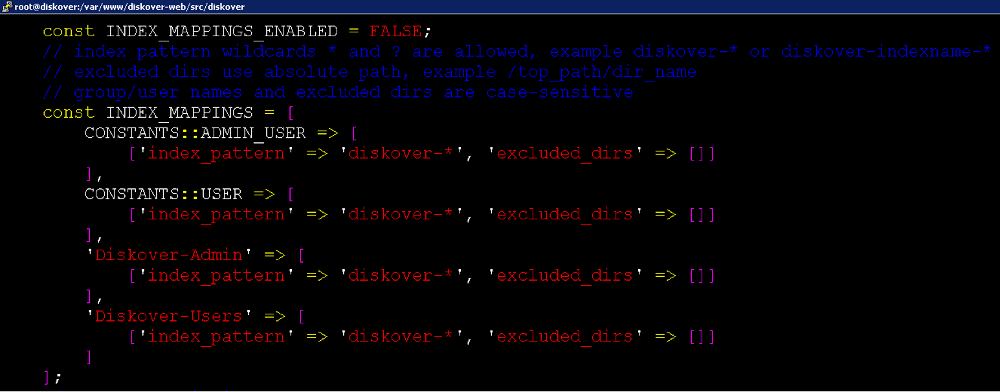

___
## User Roles and Authentication
___

This chapter discusses setting up authenticated user access to Diskover-Web.

___
### Local User Configuration

Diskover-Web currently has two local users: 1) admin, and 2) data user. To change the login details for the two sets of users:
```
vim /var/www/diskover-web/src/Diskover/Constants.php
```


___
### LDAP / Active Directory Authentication

Diskover-Web supports authenticating users from Active Directory over Lightweight Directory Access Protocol. LDAP integration can be used to authenticate users against a Microsoft Domain Controller (DC).

The following information is required to configure LDAP authentication:

**LDAP HOST** - The URL to use to contact the DC, example: ldap://dc.diskoverdata.com

**LDAP PORT** - Example: 389

**LDAP BASE DOMAIN** - The LDAP name space to use for queries, example: DC=diskoverdata, DC=com

At least three AD groups should be established for Diskover:
1. Admin group
2. User group  
3. Task panel group  

🔴 &nbsp;To configure AD / LDAP login authentication:
```
vim /var/www/diskover-web/src/Diskover/Constants.php
```


___
### Restricting Visibility and Access

Visibility can be limited by groups to specific indexes or branches within a given index. 

🔴 &nbsp;To limit index visibility:
```
vim /var/www/diskover-web/src/Diskover/Constants.php
```



___
### Restricting Diskover-Web API Access

#### Restricting API Access on Linux

To limit API access to certain hosts or networks, you can add an additional location block with allow/deny rules to your Diskover-Web NGINX config  **/etc/nginx/conf.d/diskover-web.conf**.
```
vi /etc/nginx/conf.d/diskover-web.conf
```

The NGINX location block below needs to go above the other location block that starts with:
```
location ~ \.php(/|$) {
```

🔴 &nbsp;Change **1.2.3.4** to the IP address you want to allow access to the API. You can add additional lines if you want to allow more hosts/networks to access the API. The **deny all** line needs to come after all **allow** lines:
```
location ~ /api\.php(/|$) {
    allow 1.2.3.4;
    deny all;
    fastcgi_split_path_info ^(.+\.php)(/.+)$;
    set $path_info $fastcgi_path_info;
    fastcgi_param PATH_INFO $path_info;
    try_files $fastcgi_script_name =404;
    fastcgi_pass unix:/var/run/php-fpm/php-fpm.sock;
    #fastcgi_pass 127.0.0.1:9000;
    include fastcgi_params;
    fastcgi_param SCRIPT_FILENAME $document_root$fastcgi_script_name;
    include fastcgi_params;
    fastcgi_read_timeout 900;
    fastcgi_buffers 16 16k;
    fastcgi_buffer_size 32k;
}
```

🔴 &nbsp;Restart NGINX:
```
systemctl restart nginx
```

🔴 &nbsp;Then verify you can access API with **curl** or web browser on an allowed host:
```
curl http://<diskover-web-host>:<port>/api.php
```

🔴 &nbsp;You should see this:
```
{
    "status": true,
    "message": {
        "version": "diskover REST API v2.0-b.3",
        "message": "endpoint not found"
    }
}
```

Others will now be blocked with a **403 forbidden http** error page.
