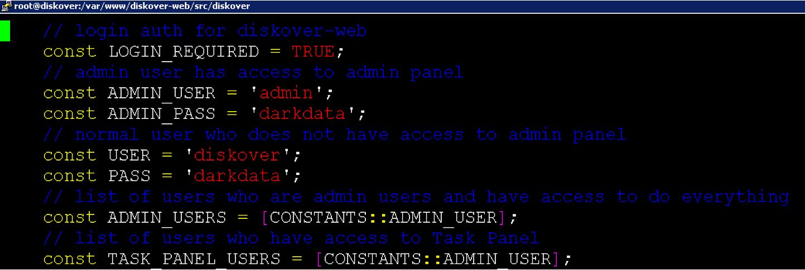

___
## User Roles and Authentication
___

This chapter discusses setting up authenticated user access to Diskover-Web.

___
### Local User Configuration

Diskover-Web currently has two local users: 1) admin, and 2) data user. To change the login details for the two sets of users:
```
vim /var/www/diskover-web/src/diskover/Constants.php
```



>_Note:_ The passwords stored in the web config file (Constants.php) are only used as the default initial passwords when first logging in to Diskover-Web. On first login, you will be asked to change the password, and the password will be stored and encrypted in `sqlite db`, and the default password in web config will no longer be used.

___
### LDAP/Active Directory Authentication

&nbsp;&nbsp;&nbsp;&nbsp;&nbsp;&nbsp;&nbsp;&nbsp;

Diskover-Web supports authenticating users from Active Directory over Lightweight Directory Access Protocol (LDAP). LDAP integration can be used to authenticate users against a Microsoft Domain Controller (DC).

🔴 &nbsp;To configure AD / LDAP login authentication:
```
vim /var/www/diskover-web/src/diskover/Constants.php
```


🔴 &nbsp;The following information is required to configure LDAP authentication:

| FIELD | DESCRIPTION |
| --- | --- |
| **LDAP_LOGINS** | Set to **TRUE** to enable and use ldap logins |
| **LDAP_HOST** | The full **LDAP URI**, ex: `ldap://dc.domain.com:389` or `ldaps://dc.domain.com:636` for SSL encryption <br> _Note:_ You can also provide multiple LDAP-URIs separated by a space as one string. |
| **LDAP_PORT** | Ex: 389 or 636 |
| **LDAP_DOMAIN** | The LDAP domain name, ex: `domain.com` |
| **LDAP_BASEDN** | The LDAP base dn of domain, ex: `dc=DOMAIN,dc=COM` |

🔴 &nbsp;At least three AD groups should be established for Diskover and set in web config. Note that at login, the **ad/ldap user** will be checked if they are in one of the **ad/ldap groups** below. If they are not in any of these groups, they will be denied access to log in.

| GROUP | DESCRIPTION |
| --- | --- |
| **LDAP_ADMIN_GROUPS** | To add **admin group** |
| **LDAP_USER_GROUPS** | To add **user group** | 
| **LDAP_TASK_PANEL_GROUPS** | To add **task panel group** |

___
### Okta Authentication

&nbsp;&nbsp;&nbsp;

Diskover-Web supports authenticating/authorizing users using Okta Identity.

>_Note:_ This section does not cover adding an application to the Okta admin page. You will need to first add an Oauth application (Web app) to your Okta admin page for Diskover-Web

🔴 &nbsp;To configure Okta logins:

```
vim /var/www/diskover-web/src/diskover/Constants.php
```

🔴 &nbsp;The following information is required to configure Okta authentication/authorization:

| FIELD | DESCRIPTION |
| --- | --- |
| **OAUTH2_LOGINS** | Set to **TRUE** to enable and use Okta Oauth2 login <br> _Note:_ When using Oauth2 login, local and ldap login is not used |
| **OAUTH2_CLIENT_ID** | Your Okta Oauth2 application client id |
| **OAUTH2_CLIENT_SECRET** | Your Okta Oauth2 application client secret |
| **OAUTH2_REDIRECT_URI** | Your Okta Oauth2 login redirect URI, ex: `https://diskover.domain.com/login.php?callback`<br> _Note:_ `login.php` page handles the redirect URI when using `callback` parameter |
| **OAUTH2_LOGOUT_REDIRECT_URI** | Your Okta Oauth2 post logout redirect URI, ex: `https://diskover.domain.com/` |
| **OAUTH2_AUTH_ENDPOINT** | Your Okta Oauth2 API Authorization Server Issuer URI authorization endpoint, ex: `https://diskover.domain.com/oauth2/default/v1/authorize` |
| **OAUTH2_TOKEN_ENDPOINT** | Your Okta Oauth2 API Authorization Server Issuer URI token endpoint, ex: `https://diskover.domain.com/oauth2/default/v1/token` |
| **OAUTH2_LOGOUT_ENDPOINT** | Your Okta Oauth2 API Authorization Server Issuer URI logout endpoint, ex: `https://diskover.domain.com/oauth2/default/v1/logout` |
| **OAUTH2_API_TYPE** | Oauth2 API Type, types are **Okta** or **Azure** (Graph API), set this to **Okta** |
| **OAUTH2_API_URL_BASE** | Your Okta Oauth2 API URL for getting user/group info, ex: `https://diskover.domain.com/api/v1/` |
| **OAUTH2_API_TOKEN** | Your Okta Oauth2 API Token |

🔴 &nbsp;At least two Okta Oauth2 groups should be established for Diskover and set in web config. Note that at login, the Okta Oauth2 user will be checked if they are in one of the following Okta Oauth2 groups.

| GROUP | DESCRIPTION |
| --- | --- |
| **OAUTH2_ADMIN_GROUPS** | To add **admin group** |
| **OAUTH2_TASK_PANEL_GROUPS** | To add **task panel group** |

___
### Azure AD Oauth2 OIDC SSO Authentication

&nbsp;&nbsp;&nbsp;

Diskover-Web supports authenticating/authorizing users using Azure Active Directory OIDC SSO.

🔴 &nbsp;Set up an App Registration in Azure with the following API Permissions:


🔴 &nbsp;To configure Oauth2 logins:

```
vim /var/www/diskover-web/src/diskover/Constants.php
```

🔴 &nbsp;The following information is required to configure Azure Oauth2 OIDC SSO authentication/authorization:

| FIELD | DESCRIPTION |
| --- | --- |
| **OAUTH2_LOGINS** | Set to **TRUE** to enable and use Azure oauth2 login<br> _Note:_ When using Oauth2 login, local and ldap login is not used |
| **OAUTH2_CLIENT_ID** | Your Azure Oauth2 application client ID |
| **OAUTH2_CLIENT_SECRET** | Your Azure Oauth2 application client secret |
| **OAUTH2_REDIRECT_URI** | Your Azure Oauth2 login redirect URI, ex: `https://diskover.domain.com/login.php?callback`<br> _Note:_ login.php page handles the redirect URI when using `callback` parameter |
| **OAUTH2_LOGOUT_REDIRECT_URI** | Your Azure Oauth2 post logout redirect URI, ex: `https://diskover.domain.com/` |
| **OAUTH2_AUTH_ENDPOINT** | Your Azure Oauth2 API Authorization Server Issuer URI authorization endpoint, ex: `https://diskover.domain.com/oauth2/default/v1/authorize` |
| **OAUTH2_TOKEN_ENDPOINT** | Your Azure Oauth2 API Authorization Server Issuer URI token endpoint, ex: `https://diskover.domain.com/oauth2/default/v1/token` |
| **OAUTH2_LOGOUT_ENDPOINT** | Your Azure Oauth2 API Authorization Server Issuer URI logout endpoint, ex: `https://diskover.domain.com/oauth2/default/v1/logout` |
| **OAUTH2_API_TYPE** | Oauth2 API Type, types are **Okta** or **Azure** (Graph API), set this to **Azure** |
| **OAUTH2_API_URL_BASE** | Your Azure Oauth2 API URL for getting user/group info, ex: `https://diskover.domain.com/api/v1/` |

🔴 &nbsp;At least two Azure Oauth2 groups should be established for Diskover and set in web config. Note that at login, the Azure Oauth2 user will be checked if they are in one of these above Azure Oauth2 groups.

| GROUP | DESCRIPTION |
| --- | --- |
| **OAUTH2_ADMIN_GROUPS** | To add **admin group** |
| **OAUTH2_TASK_PANEL_GROUPS** | To add **task panel group** |

___
### Restricting Visibility and Access

&nbsp;&nbsp;&nbsp;

Diskover-Web uses multiple levels to limit Elasticsearch index and directory visibility and access:

1) Index mappings can be configured and set to control what indices groups and users are allowed to see. Excluded dirs and ES search query can also be added to index mappings for more granular control.

2) AD/LDAP and Oauth2 group directory permissions.

3) Unix directory permissions.

🔴 &nbsp;Visibility can be limited by users/groups to specific indexes or branches within a given index. To limit index visibility by users/groups:

```
vim /var/www/diskover-web/src/diskover/Constants.php
```

```
// group/user index mappings
// controls what indices and paths groups/users are allowed to view
// enable index mappings, set to TRUE or FALSE
const INDEX_MAPPINGS_ENABLED = FALSE;
// index_patterns key is a list of index names user/group is allowed access to view
// index_patterns_exclude key is a list of index names user/group is not allowed to view
// index pattern wildcards * and ? are allowed, example diskover-* or diskover-indexname-*
// to not exclude any indices/dirs, use empty list [] for index_patterns_exclude, excluded_dirs, and excluded_query
// excluded_dirs use absolute paths and are recursive, example /top_path/dir_name
// excluded_query uses ES query string including regular expression syntax
// group/user names, excluded_dirs, and excluded_query are case-sensitive
// group/user name wildcards * and ? are allowed

const INDEX_MAPPINGS = [
    CONSTANTS::ADMIN_USER => [
      [
            'index_patterns' => [
                'diskover-*'
           ], 
           'index_patterns_exclude' => [], 
           'excluded_dirs' => [], 
           // allow access to projectA directory only in /mnt/stor1/projects
           'excluded_query' => ['((parent_path:\/mnt\/stor1\/projects AND name:/project[^A]/) OR parent_path:/\/mnt\/stor1\/projects\/project[^A]*/)']
       ]
   ],
   CONSTANTS::USER => [
       ['index_patterns' => ['diskover-*'], 'index_patterns_exclude' => [], 'excluded_dirs' => [], 'excluded_query' => []]
   ],
   'diskover-admins' => [
       ['index_patterns' => ['diskover-*'], 'index_patterns_exclude' => [], 'excluded_dirs' => [], 'excluded_query' => []]
   ],
   'diskover-users' => [
       ['index_patterns' => ['diskover-*'], 'index_patterns_exclude' => [], 'excluded_dirs' => [], 'excluded_query' => []]
   ],
   'diskover-powerusers' => [
       ['index_patterns' => ['diskover-*'], 'index_patterns_exclude' => [], 'excluded_dirs' => [], 'excluded_query' => []]
   ]
];
```

🔴 &nbsp;Visibility can also be limited by AD/LDAP and Oauth2 group permissions. To limit index visibility by AD/LDAP or Oauth2 group membership:

```
vim /var/www/diskover-web/src/diskover/Constants.php
```

```
// AD/ldap group permission filtering
// controls if files/directories get fitered based on AD/ldap groups membership of the user logged in
// local users admin and diskover always see all directories in the index
// aws s3 indices are not filtered
// enable ldap filtering, set to TRUE or FALSE
const LDAP_FILTERING_ENABLED = TRUE;
// AD/ldap groups that are excluded from filtering
// if a user is a member of one of these groups, they will see all files/directories
// group names are case-sensitive
const LDAP_GROUPS_EXCLUDED = ['diskover-admins', 'diskover-powerusers'];

// Oauth2 SSO group permission filtering
// controls if files/directories get fitered based on Oauth2 SSO groups membership of the user logged in
// local users admin and diskover always see all directories in the index
// aws s3 indices are not filtered
// Diskover Pro license required
// enable Oauth2 filtering, set to TRUE or FALSE
const OAUTH2_FILTERING_ENABLED = FALSE;

// Oauth2 SSO groups that are excluded from filtering
// if a user is a member of one of these groups, they will see all files/directories
// group names are case-sensitive
const OAUTH2_GROUPS_EXCLUDED = ['diskover-admins', 'diskover-powerusers'];

// lower case group names when filtering
const GROUPNAME_FILTERING_LOWERCASE = FALSE;
```

🔴 &nbsp;To limit index visibility by Unix file permissions:

> _Note:_ To use Unix permissions filtering, you will need to enable and use the [Unix Permissions plugin](https://docs.diskoverdata.com/diskover_configuration_and_administration_guide/#unix-permissions-plugin) when indexing, for both file and directory.

```
vim /var/www/diskover-web/src/diskover/Constants.php
```

```
// use UNIXPERMS_FILTERING_STRING as well as group membership to determine filtering
const UNIXPERMS_FILTERING_ENABLED = TRUE;

// unix perms filtering ES search string
// could also use other fields besides unix_perms such as owner, group, etc
//const UNIXPERMS_FILTERING_STRING = 'owner:root AND group:root AND unix_perms:755'
const UNIXPERMS_FILTERING_STRING = 'unix_perms:/..[57]/';
```

___
### Restricting Diskover-Web API Access

&nbsp;&nbsp;&nbsp;

#### Enable HTTP Basic Authentication

You can turn on HTTP Basic Auth for the Diskover-Web API. This will make it required to use a username and password to access the API.

🔴 &nbsp;Enable API auth and set a **username** and **password**:

```
vim /var/www/diskover-web/src/diskover/Constants.php
```

```
// HTTP Basic Auth for REST API
// api authentication, set to TRUE to enable or FALSE to disable
const API_AUTH_ENABLED = TRUE;
// api username and password
const API_USER = 'diskoverapi';
const API_PASS = 'apisecret';
```

🔴 &nbsp;The API password `API_PASS` in web config is only used as a default password and this password needs to be changed. To login to Diskover-Web as admin, go to the **Settings** page and scroll to the **API Password** section and click **change password**. Set a new password and the password will be securely stored in `sqlite db`.

> _Note:_ When changing API Auth settings, remember to update [diskoverd](https://docs.diskoverdata.com/diskover_installation_guide/#setting-up-diskover-task-worker-daemon) task worker daemon config to use the new auth settings.

#### Restricting API Access By LDAP/AD login

You can use LDAP/AD logins using `HTTP Basic Auth` for the Diskover-Web API.

🔴 &nbsp;Enable API LDAP auth:

```
vim /var/www/diskover-web/src/diskover/Constants.php
```

```
// LDAP/AD Auth for REST API
// api ldap/ad authentication, set to TRUE to enable or FALSE to disable
const API_AUTH_LDAP_ENABLED = TRUE;
```

> _Note:_ When enabling API LDAP auth, config index/ldap filter settings are used, see [Restricting Visibility and Access](https://docs.diskoverdata.com/diskover_configuration_and_administration_guide/#restricting-visibility-and-access).

#### Restricting API Access By Host/IP

🔴 &nbsp;To limit API access to certain hosts or networks, you can add an additional location block with allow/deny rules to your Diskover-Web NGINX config **/etc/nginx/conf.d/diskover-web.conf**.

```
vi /etc/nginx/conf.d/diskover-web.conf
```

The NGINX location block below needs to go above the other location block that starts with:

```
location ~ \.php(/|$) {
```

🔴 &nbsp;Change **1.2.3.4** to the IP address you want to allow access to the API. You can add additional lines if you want to allow more hosts/networks to access the API. The **deny all** line needs to come after all **allow** lines:

```
location ~ /api\.php(/|$) {
    allow 1.2.3.4;
    deny all;
    fastcgi_split_path_info ^(.+\.php)(/.+)$;
    set $path_info $fastcgi_path_info;
    fastcgi_param PATH_INFO $path_info;
    try_files $fastcgi_script_name =404;
    fastcgi_pass unix:/var/run/php-fpm/php-fpm.sock;
    #fastcgi_pass 127.0.0.1:9000;
    include fastcgi_params;
    fastcgi_param SCRIPT_FILENAME $document_root$fastcgi_script_name;
    include fastcgi_params;
    fastcgi_read_timeout 900;
    fastcgi_buffers 16 16k;
    fastcgi_buffer_size 32k;
}
```

🔴 &nbsp;Restart NGINX:

```
systemctl restart nginx
```

🔴 &nbsp;Then verify you can access API with **curl** or web browser on an allowed host:

```
curl http://<diskover-web-host>:<port>/api.php
```

🔴 &nbsp;You should see this:

```
{
    "status": true,
    "message": {
        "version": "diskover REST API v2.0-b.3",
        "message": "endpoint not found"
    }
}
```

Others will now be blocked with a **403 forbidden http** error page.
