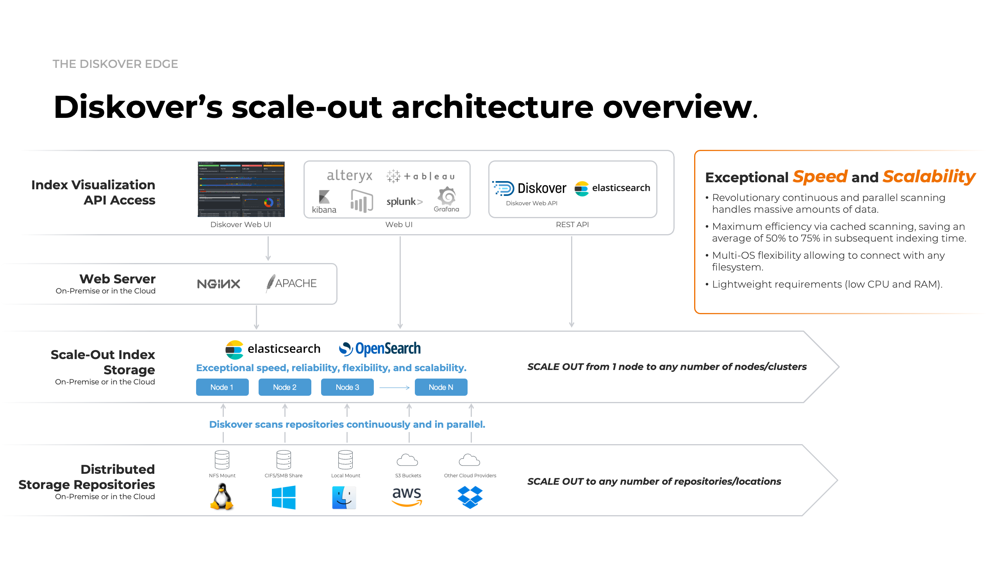

## Terminology

While the terms in this section may have different meanings in other contexts, they are defined here specifically for the Diskover end-user environment.

### Data Curation

Data curation is the practice of managing data collected from various sources as a valuable asset to unlock its potential and organization. Managing data effectively requires having a data strategy and reliable methods to access, integrate, cleanse, govern, store, and prepare data for analytics. The value of the data is maintained over time and remains available for reuse and preservation.

### Volume

A storage repository indexed by Diskover, for example, Windows Share/drive, Linux mount/NFS Export, cloud storage/S3 bucket, Dell PowerScale, a laptop, a USB drive, etc.

Examples of other names for volume that might be used in your organization are storage volume, storage mount, mount point, top-level path, top-level storage directory, etc.

Learn → [how to select a volume](#select_volume).

### Index/Indexes/Indices

An index is an inventory of all the metadata, aka attributes, about a file on a volume; it allows the metadata to be searched quickly via the index instead of the operating system's "find command". Note that both **indexes** and **indices** have the same meaning and are the plural of index, although indices are usually preferred in a technical context.

- You can have multiple [inventories/indices](#indices) of a storage volume from different points in time times.
- Indices contain [base metadata](#base_metadata) like directory name, file name, file size, file extension, creation date, modify date, owner, etc.
- Diskover can also populate the indices with [additional metadata](#extra_metadata), adding business context.

Learn → [how to use indices](#indices).

### Directory/Folder

There are very subtle differences between a directory and a folder, but in the context of this guide, they are interchangeable and have the same meaning: a container to store/organize other directories/folders and files.

Learn → [how to select a directory](#select_directory).

### Path

A path is the full location or name of a directory or file, for example:

`/mnt/lucidlink/projects/Pistachio/WonderfulPistachios_GangnamStyle.mov`

### Recursive and Non-Recursive

**Non-Recursive**: Will search or apply an action exclusively to the selected [path](#path) without going into any subfolders or files.

**Recursive**: Will search or apply an action to the selected [path](#path), as well as all the sub-directories and files inside that path.

### Hard Links

A hard link is like a shortcut that acts just like the original file. It connects a name to a file on your computer, so even if the file is renamed, the hard link will still point to the same content. Unlike a regular shortcut, which might break if the file is moved or renamed, a hard link keeps working no matter what.

Think of hard links like copies of a file, but without using extra disk space. Unlike symbolic or soft links, which are just pointers to the original file, hard links are directly tied to the file itself, so they keep working even if the file is renamed.

| Feature                           | Soft Links                                   | Hard Links                                  |
|-----------------------------------|----------------------------------------------|---------------------------------------------|
| **Can span file systems**         | Yes                                          | No                                          |
| **Can link between directories**  | Yes                                          | No                                          |
| **Inode number**                  | Different from the original file             | Same as the original file                  |
| **File permissions**              | Different from the original file             | Same as the original file                  |
| **Permissions update**            | No, permissions are not updated              | Yes, permissions are updated if the source file's permissions change |
| **Contents**                      | Points to the path, not the contents         | Contains the actual contents of the original file |
| **File system boundaries**        | Can cross file system boundaries             | Cannot cross file system boundaries        |
| **Disk space usage**              | Does not consume additional space            | No additional space until all links are deleted |
| **Link type**                     | A pointer to the original file               | A reference to the actual data of the file |
| **Required for files**            | Yes                                          | Yes, must have at least one hard link      |
| **Can link directories**          | Yes                                          | No                                          |

✏️  Hard links are used a lot in the media and entertainment industry so that digital assets can be referenced in different shot folders without using additional space._

### Elasticsearch

[Diskover’s unique architecture](https://diskoverdata.com/platform/backend/) is designed to handle the most demanding data environments with ease. Built for scalability, flexibility, and unmatched speed, it seamlessly integrates with your existing systems to deliver real-time insights and powerful data management capabilities.

