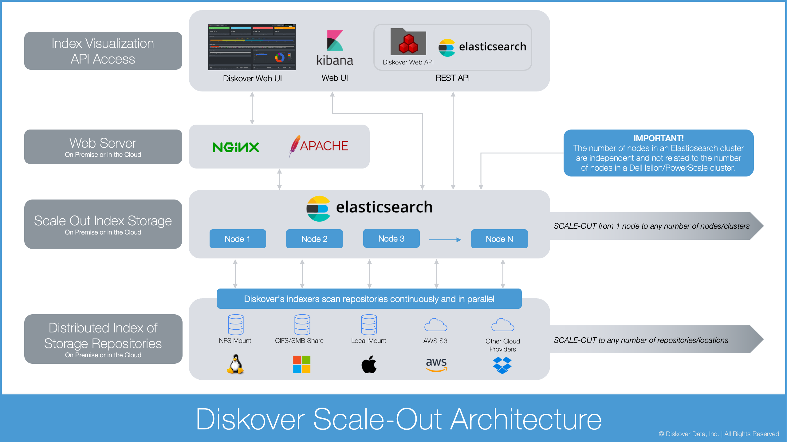

___
## Terminology
___

Although the terms described in this section may have slightly different interpretations in other contexts, they are defined here within the Diskover end-user environment.

### Data Curation

Data curation is the practice of managing data collected from various sources as a valuable asset to unlock its potential and organization. Managing data effectively requires having a data strategy and reliable methods to access, integrate, cleanse, govern, store, and prepare data for analytics. The value of the data is maintained over time and remains available for reuse and preservation.

___
### Volume

A storage location that you want to index, for example: Windows Share/drive, Linux mount/NFS Export, cloud storage/S3 bucket, etc.

Examples of other names for volume that might be used in your organization: storage volume, storage mount, mount point, top level path, top level storage directory.

Read more about [how to select a volume](#select_volume).

___
### Index/Indices

An index is an inventory of all the files on a volume; it allows the data to be searched quickly via the index instead of the operating system "find commands". Both  **indexes**  and  **indices**  have the same meaning, and are the plural of index, although indices is usually preferred in a technical context.

- You can have multiple inventories/indices of a storage volume at different times.
- Indices typically contain directory name, file name, file size, creation date, modify date, owner, etc.
- Diskover’s software populates the indices with additional metadata and makes these attributes searchable, pushing the searches, reporting, and workflows to a higher level of business and schedule awareness. For example:
	- Adds business context (job status, client #, project manager, etc.)
	- Adds media info attributes for media files (resolution, codec, framerate, etc.)

Read more about [how to use indices](#indices).

___
### Directory/Folder

There are very subtle differences between a directory and a folder, but in the context of this guide, they are interchangeable and have the same meaning: a container to store/organize other directories/folders and files.

Read more about [how to select a directory](#select_directory).

___
### Recursive and Non-Recursive

**Non-Recursive**: Will search or apply action exclusively to the path/directory you are pointing to.

**Recursive**: Will search or apply action to the path/directory, as well as all sub-directories and files, inside that path.

___
### Elasticsearch

Diskover uses Elasticsearch in the backend for its speed and reliability. Below is an overview of the Diskover architecture.

> 🔆 &nbsp;You can search across several indices with: &nbsp;&nbsp;&nbsp;&nbsp;

> 🔆 &nbsp;You can search across several clusters with: &nbsp;&nbsp;&nbsp;

_[Click here for a full screen view of the Diskover Architecture Overview diagram.](images/diagram_diskover_architecture_overview.png)_

In order to better understand the terminology used by Elasticsearch and throughout the Diskover documentation, please refer to this diagram.

_[Click here for a full screen view of the Elasticsearch Architecture diagram.](images/diagram_diskover_elasticsearch_architecture.png)_
