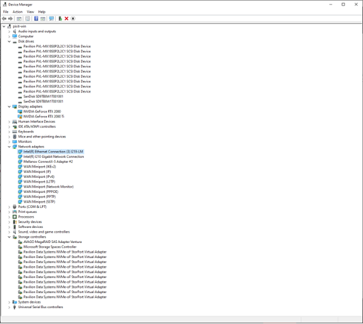
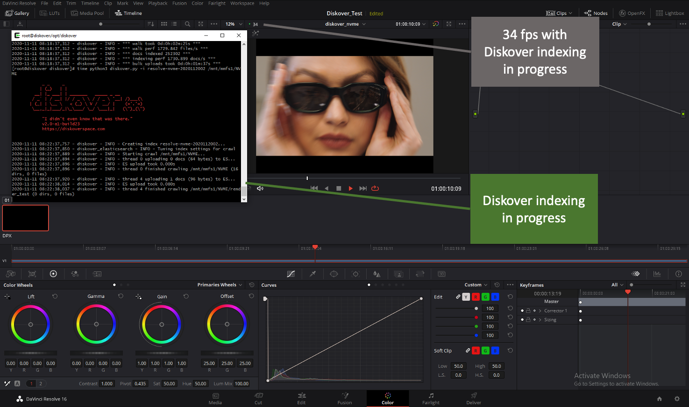

___
## Overview  
___

Media production environments often require insights into the various projects in flight on their infrastructure. When the environment consists of many projects “in flight” or coming and going, the need for data visibility becomes imperative to running an efficient file-based production line. An accurate index of the data associated with projects is required, however the indexing process alone should not reduce the efficiency of the production line by negatively impacting the performance of creative applications used in the production process.  

The objective of this paper is to measure the performance impact, if any, to production application performance while the diskover indexing process is actively indexing file system storage. Any file system management technology should not impact performance for actual production applications. The testing in this document focused on Media & Entertainment creative applications.

___
## Test Environment Tools
___

The following two applications we used to test and monitor any performance impacts of the Diskover indexing threads:

- **DaVinci Resolve** – which is a color correction and non-linear video editing application for macOS, Windows, and Linux.

[https://Diskover.blackmagicdesign.com/products/davinciresolve/](https://www.blackmagicdesign.com/products/davinciresolve/)

- **SGI _frametest_** – The  _frametest_  application is commonly used to generate streaming workload for SD/HD/2K/4K formats of video streams. Each frame is stored in a separate file. However, the You can tool can also be used to simulate the reading and writing video streams by streaming applications. The  _frametest_  tool generates the performance statistics for the reading and writing operation, therefore it is very useful for performance analysis for streaming applications.

[https://techpubs.jurassic.nl/manuals/hdwr/admin/CXFSx_AG/sgi_html/ch12.html#Z1197578849lhj](https://techpubs.jurassic.nl/manuals/hdwr/admin/CXFSx_AG/sgi_html/ch12.html#Z1197578849lhj)

The  _frametest_  application is commonly used by Autodesk System Engineers to profile performance characteristics.

[https://infernoflameflintflaresmoke.blogspot.com/2015/09/frametest.html](https://infernoflameflintflaresmoke.blogspot.com/2015/09/frametest.html)

### DaVinci Resolve Test Methodology and Results

The testing involved setting up Resolve to playback 4K resolution frames and the frame rate playback was measured from within the Resolve application.

#### DaVinci Resolve Test Environment

DaVinci Resolve Studio 16 Version 16.2.7.010:

### Media Playback Details

A media sequence of uncompressed 4K dpx frames was used for the playback clip during testing of performance impacts of the Diskover file system indexer(s):

### Setting Up Playback Frame Rate within Resolve

To setup the environment, the playback framerate was incremental increase until the point where Resolve would drop frames during playback. Once the number where frames dropped was determined, the playback frame rate used for testing purposes was set at that point minus 1 fps, to a point where no frames were being dropped (FPS where playback dropped frames – 1 fps), but playback speed was right on the edge.

The screenshot below shows a playback frame rate of 18 fps (frames per second) for the testing done on the Nearline SAS storage:

#### Windows System Details

Resolve Application was Installed on Windows 10 Pro.

Here are the Windows system details:

#### Network I/O Details

#### Storage Environment Details

The storage infrastructure consisted of IBM SpectrumScale file system with three tiers of storage, NVME, SAS, and Nearline SAS:

___
## Test 1: Resolve Playback on NVME Based Storage
___

Based on the methodology described earlier of determining the maximum consistent playback thru the resolve application, it was determined that the underlying NVME storage infrastructure could sustain 34 frames per second with the uncompressed 4K media clip.

The screenshot below details the Resolve timeline settings used for the NVME performance testing:

The playback of the media clip (without the Diskover indexer running) showed the playback rate of 34 fps with no dropped frames.

>_Note:_ When resolve starts to drop frames the green dot turns to a red dot.

With media clip playback in progress, the Diskover indexing process of the NVME storage was then initiated.

### Results: Resolve Playback on NVME Based Storage

Based on the test results, the Diskover indexer process resulted in no performance degradation to playback when using the Resolve application for playback on NVME based storage.

___
## Test 2: Resolve Playback on Nearline SAS Based Storage
___

Based on the methodology described earlier of determining the maximum consistent playback thru the resolve application, it was determined that the underlying Nearline SAS storage infrastructure could sustain 19 frames per second with the uncompressed 4K media clip.

The screenshot below details the Resolve timeline settings used for the Nearline performance testing:

The playback of the media clip (without the Diskover indexer running) showed the playback rate of 19 fps with no dropped frames:

With media clip playback in progress, the Diskover indexing process of the Nearline SAS storage was then initiated:

### Results: Resolve Playback on Nearline SAS Based Storage

Based on the test results, the Diskover indexer process resulted in no performance degradation to playback when using the Resolve application for playback on Nearline SAS based storage.

___

## SGI  _frametest_  Test Methodology and Results
___

The  _frametest_ application can be used to generate streaming workload for SD/HD/2K/4K formats of video streams, for testing purposes a 4K frame size was used to align with previous DaVinci Resolve testing. Each frame is stored in a separate file. The  _frametest_  tests simulate streaming applications and encompassed both reading and writing video streams for the purpose of measuring any performance degradation due to the Diskover indexing process. To measure any performance impact of Diskover indexing process, a comparison of total number of frames dropped (out of 10,000 frames) will be used. Any measurable performance load created by the Diskover indexing process will manifest in more frames dropped.

Should the reader desire to use  _frametest_, for additional performance testing. The  _frametest_  application can be downloaded here:

**Windows:**  [Diskover.dvsus.com/gold/san/frametest/win/frametest.zip](http://www.dvsus.com/gold/san/frametest/win/frametest.zip)

**Linux (32bit):**  [Diskover.dvsus.com/gold/san/frametest/lin/frametest](http://www.dvsus.com/gold/san/frametest/lin/frametest)

**Mac-Intel:** [Diskover.dvsus.com/gold/san/frametest/mac/frametest-intel](http://www.dvsus.com/gold/san/frametest/mac/frametest-intel)

**Mac-PowerPC:**  [Diskover.dvsus.com/gold/san/frametest/mac/frametest-powerpc](http://www.dvsus.com/gold/san/frametest/mac/frametest-powerpc)

_frametest_ can be run on many OS platforms, the syntax is the same and is executed / run from within a terminal session.

### Test Environment Details for  _frametest_

To conduct the Diskover performance impact testing, the  _frametest_  application was installed and all tests were run from a CentOS 7 Linux environment.

#### _frametest_ 4.22 for Linux

Copyright © 2004-2005 Silicon Graphics, Inc. All rights reserved.

Here are the details of the Linux environment used for  _frametest_:

#### CPU

#### Memory

#### IBM SpectrumScale File System Details - Overall Size

#### Consisting of 3 Tiers of Storage: NVME, SAS, and Nearline SAS

### _frametest_  Environment Setup

The following directories were created as the testbed for the series of tests to be executed:

Nearline SAS write test (without indexing)  
`/mmfs1/NLSAS/Paul/NLSAS_DISKOVER/`

Nearline SAS write test (with indexing)  
`/mmfs1/NLSAS/Paul/NLSAS_WI/`

Nearline SAS read test (without indexing)  
`/mmfs1/NLSAS/Paul/NLSAS_R/`

Nearline SAS read test (with indexing)  
`/mmfs1/NLSAS/Paul/NLSAS_RI/`

The  _frametest_  application is actually executed two times, 1) the first time is the write pass, and 2) the second time is the read pass. The write pass generates test frames in the test directory that the read pass will then use.

#### Setting Up Playback Frame Rate within  _frametest_

To setup the environment, the playback framerate was incremental increase until the point where some amount of frames would drop frames during playback. If no frames are dropped, the test might not be pushing the edge of underlying storage capabilities. For testing purposes, the frame rate should be set right on the edge of the capabilities so any additional workload imposed by indexing would be measurable. Through a series of trial and error, the frame rate edge for the Nearline SAS based storage infrastructure was determined to be:

>**Nearline SAS write test:** 64 frames per second
>
>**Nearline SAS read test:** 60 frames per second

#### Test Environment  _frametest_  Usage Options

The parameters used for the testing will simulate 4K DPX file sequence (-Diskover 4k), to align with the playback environment used for the Resolve testing.

**Additional  _frametest_  Options Used:**

>**-f rate** Limit speed to 'rate' frames per second (set at 64 fps for write tests and 60 fps for read tests)
>
>**-t num** Use multithreading I/O, with 'num' threads at one time (set at 4)
>
>**-n num** Number of frames to read or write (set at 10,000)

#### NLSAS 4K Write Test of 10,000 Frames @ 64 fps

No indexing.

`/DIST/frametest -Diskover 4k -n 10000 -t 4 -f 64 /mmfs1/NLSAS/Paul/NLSAS_DISKOVER/`

#### NLSAS 4K Write Test of 10,000 Frames @ 64 fps with Diskover Indexing in Progress

`/DIST/frametest -Diskover 4k -n 10000 -t 4 -f 64 /mmfs1/NLSAS/Paul/NLSAS_WI/time 
python3 Diskover.py -i Diskover-frametest-2020111008 /mnt/mmfs1/NLSAS`

#### NLSAS 4K Write Test Findings

During the 4K write tests, the Diskover indexing process dropped a total of 91 frames and the write test without indexing dropped a total of 85 frames. Therefore, the performance impact of the Diskover indexing during the 4K write tests resulted in 6 more frames dropped out of a total of 10,000 frames, or a %0.0006 performance impact (6/10000) of the Diskover indexing process.

NLSAS 4K read test of 10,000 frames @ 60 fps

`/DIST/frametest -r 4k -n 10000 -t 4 -f 60 /mmfs1/NLSAS/Paul/NLSAS_R/`

NLSAS 4K read test of 10,000 frames @ 60 fps with Diskover indexing in progress

`/DIST/frametest -r 4k -n 10000 -t 4 -f 60 /mmfs1/NLSAS/Paul/NLSAS_RI/
python3 Diskover.py -i Diskover-frametest-2020111009 /mnt/mmsf1/NLSAS`

#### NLSAS 4K Read Test Findings

During the 4K read tests, both the Diskover indexing process dropped a total of 49 frames and the read test without indexing dropped a total of 49 frames. Therefore, there was zero performance impact of the Diskover indexing process.

___
## Conclusion - Overall Findings
___

There were a total of 4 different test scenarios using 2 different application test environments:

1. DaVinci Resolve playback testing 4K @ 34 frames per second on NVME based storage.
1. DaVinci Resolve playback testing 4K @ 19 frames per second on  Nearline SAS based storage.
1. SGI  _frametest_  4K streaming write tests @ 64 frames per second on Nearline SAS based storage.
1. SGI  _frametest_  4K streaming read tests @ 60 frames per second on Nearline SAS based storage.

>3 out of the 4 tests showed zero performance degradation due to the Diskover indexing process. The fourth tests, SGI  _frametest_  4K streaming write tests showed a %0.0006 performance degradation due to the Diskover indexing process. Therefore, it is safe to assume the Diskover indexing process will not affect workflow for Media file-based workflows.
