___
## Overview
___

### What to Expect from this Guide

Zendesk is highly configurable, and offers hundreds of menus and sub-menus and settings galore.

**👍🏼 What this guide is:** This guide aims to help you in the daily navigation and use of the Zendesk platform.

**👎🏼 What this guide is not:** This guide is not intended to be an all-encompassing Zendesk guide and/or address all the exhaustive administrative options.

### Why Zendesk

Diskover has partnered with [Zendesk](https://diskoverdata.zendesk.com/) to enhance our customer support experience. This collaboration and AI-powered platform brings you:

- **Streamlined Support**: Access our knowledge base and submit tickets through a user-friendly interface.
- **Faster Resolution**: The rich information contained in ticket submission allows for quick routing and resolution.
- **Self-Service Options**: Find answers quickly with an extensive, searchable knowledge base.
- **Diskover Community**: Share, learn, and connect with other awesome Diskover users.

### Links

| USE | PURPOSE | LINK |
| --- | --- | --- |
| Public & Internal | Diskover Zendesk platform | [https://diskoverdata.zendesk.com/](https://diskoverdata.zendesk.com/) or [https://support.diskoverdata.com/](https://support.diskoverdata.com/) |
| Public | Technical Support and Troubleshooting Guide | [[https://support.diskoverdata.com/](https://docs.diskoverdata.com/tech_support_and_troubleshooting/)](https://docs.diskoverdata.com/tech_support_and_troubleshooting/) |
| Public | How to create a user account | [https://docs.diskoverdata.com/tech_support_and_troubleshooting/#create-a-zendesk-account](https://docs.diskoverdata.com/tech_support_and_troubleshooting/#create-a-zendesk-account) |
| Public | How to create a support ticket | [https://docs.diskoverdata.com/tech_support_and_troubleshooting/#create-a-support-ticket](https://docs.diskoverdata.com/tech_support_and_troubleshooting/#create-a-support-ticket) |
| Public | Diskover Community on Zendesk | [https://docs.diskoverdata.com/tech_support_and_troubleshooting/#diskover-community](https://docs.diskoverdata.com/tech_support_and_troubleshooting/#diskover-community) |
| Internal | This administrative guide | [https://docs.diskoverdata.com/zendesk_internal_user_guide](https://docs.diskoverdata.com/zendesk_internal_user_guide) |

### Login

You should have received an email in early July inviting you to complete your Zendesk account. <a class="email-link" href= "mailto:brandon.langley@diskoverdata.com,nathalie.sampson@diskoverdata.com?subject=I need help with my Zendesk login, it's my fault for not doing it in time üò´">Click here if you need assistance with your Zendesk login</a>.

### Roles and Access

Roles and access levels were applied depending on each team member and what is required for their work. <a class="email-link" href= "mailto:brandon.langley@diskoverdata.com,nathalie.sampson@diskoverdata.com?subject=Dude! Please increase my Zendesk access">Send us an email</a> if you feel you need additional access to do your work.

### Need Help with Zendesk?

Zendesk has support links throughout the application for help on the fly, but please <a class="email-link" href= "mailto:brandon.langley@diskoverdata.com,nathalie.sampson@diskoverdata.com?subject=I need help figuring out Zendesk">email us if you need support</a>.

___
## Zendesk Main Menu
___

### Overview

You can find a **four squares** icon next to your profile in the top right corner. Note that depending on your [role and access](#access), you may not see or have access to all the features described in this guide. That icon is where to click to access the admin **main menu**, it is your "home" button to navigate between the different sections.

üî∂&nbsp;When you select an option from that menu, it will open another menu on the left side. Only the necessary ones for the daily use of Zendesk are explained in the subsequent sections of this guide.

 üìï *Documented in this guide*

| MENU | PURPOSE | DESCRIPTION |
| --- | --- | --- |
| **Support** üìï | [Support Tickets](#tickets_management) | Workspace for tickets management |
| **Guide** üìï | [Knowledge Base](#knowledge_base) | Where to see, add, edit, and manage all help articles |
| **Gather** üìï | [Diskover Community Forum](#diskover_community) | Where users can post and request features |
| **Chat** | Live Chat and Messaging | Not currently in use |
| **Talk** | Voice | Not currently in use |
| **Explore** üìï | [Reporting and Analytics](#explore) | No custom report at the moment, standard reports only for now |
| **Sell** | Sales CRM | Not currently in use |
| **Workforce management** | Direct Access to Zendesk Website | Great for further help than what is covered in this guide |
| **Admin Center** üìï | [Account Settings](#admin_center) | Where to set up users, forms, fields used in forms, etc. |

___
## SUPPORT | Tickets Management
___

### How to Access Support Tickets

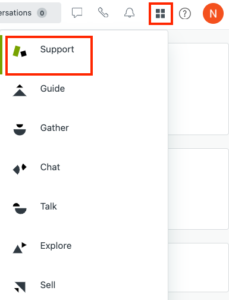

### Overview

This section is mainly used by our fabulous engineers, so you will undoubtedly find your way around it.

| OPTION | DESCRIPTION |
| :---: | --- |
| 1 | Tickets assigned to you |
| 2 | All open tickets for the whole team |
| 3 | To filter by status |
| 4 | To filter by channel > the method use to create the ticket (web, email, etc.) |
| 5 | See tickets a co-worker involved you with |
| 6 | You can follow tickets, posts, etc. in Zendesk, this lists the tickets you opted to follow |
| 7 | Another view to see all tickets by status, priority, agent assigned, etc. |
| 8 | Add, search, and [manage customers/contacts](#manage_users) who have created a support ticket or not: <ul><li>You can add contacts manually, or delete them but don't do that!</li><li>You can open their profile by clicking on their name to see more information as well as the tickets related to that contact</li><li>Note that every time you open a profile, a tab will open at the very top of your view and stay there until you close it using the **x** in that tab</li></ul> |
| 9 | Add, search, and [manage organizations](#manage_companies) (customers, partners, and most deals in motion): <ul><li>List of domains that were proactively created for ease of future ticket submission</li><li>When a customer/contact creates a new profile, Zendesk will recognize the domain and associate the new contact with the appropriate company whenever possible</li><li>You can add contacts manually, or delete them but don't do that!</li><li>You can open their profile by clicking on their name to see more information as well as the tickets related to that contact</li><li>Note that every time you open a profile, a tab will open at the very top of your view and stay there until you close it using the **x** in that tab</li></ul> |
| 10 | Statistics about support tickets, not configured yet |
| 11 | Link to the [Admin Center](#admin_center) where live most of the settings related to the Zendesk platform including the forms and fields for support tickets |

### Manual Support Ticket Creation

Especially during the transition between email support to Zendesk, you may have to create tickets manually. Wherever you are in the **Support** menu, you'll see the **+ Add** option at the left top corner. Note that more than just a ticket creation is possible:

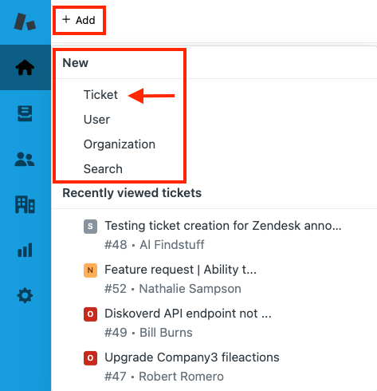

🔴 &nbsp;Fill out all the fields with as much information as possible. An **asterisk** denotes a required field. 

🔴 &nbsp;Before clicking on **Submit as New**, you can apply a different status than **New**, if applicable, using the arrow beside the button.

### Support Tickets Management

In addition to the main view above, the second option on the left is another productive way to view and manage the tickets.

| OPTION | DESCRIPTION |
| :---: | --- |
| 1 | See tickets filtered in different ways |
| 2 | Filters/views can be added, deleted, modified |
| 3 | Take action on a single or multiple tickets, at least one needs to be selected to view these options |
| 4 | Add filters |
| 5 | When no tickets are selected, you have more options like exporting as CSV, editing, or cloning the view |

### Manage Customer Profiles (User)

üî∂&nbsp;Depending on your Zendesk account access, you will be able to view, create, and/or modify user profiles.

🔴 &nbsp;You shouldn't have to do much of that, as users need to create an account before they can submit a ticket:

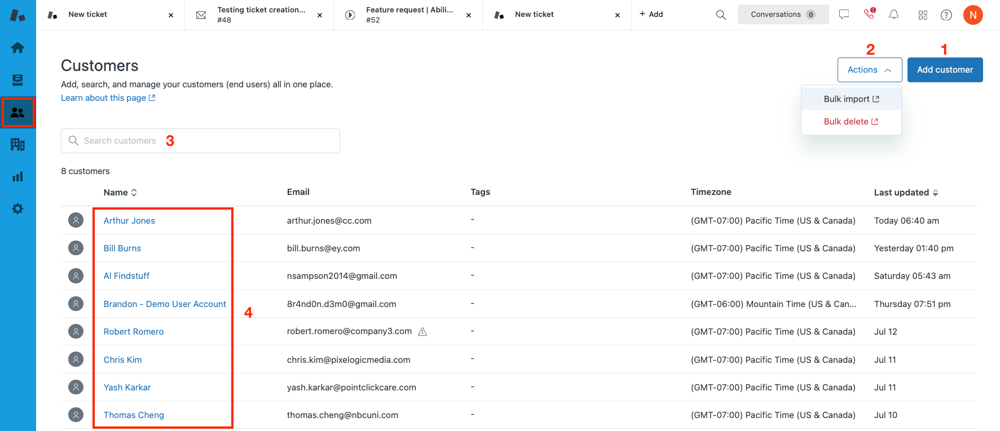

| OPTION | DESCRIPTION |
| :---: | --- |
| 1 | To manually add a customer |
| 2 | For bulk import and delete, but don't do the latter |
| 3 | To search for a contact |
| 4 | Click on a name to open and see all related information and tickets associated with that contact |

🔴 &nbsp;When you open a user profile:

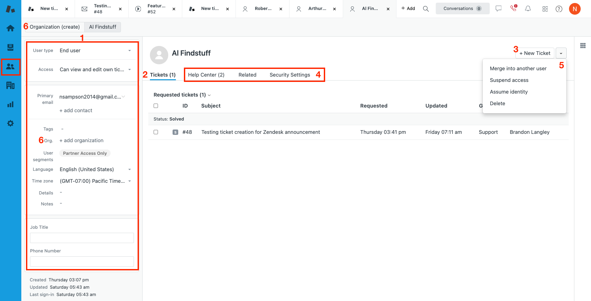

| OPTION | DESCRIPTION |
| :---: | --- |
| 1 | See and edit the profile information, make sure to fill out as many fields as possible |
| 2 | See tickets associated with that contact |
| 3 | Manually create a ticket for that contact |
| 4 | Navigate to different views |
| 5 | Take different actions on the profile |
| 6 | If no **organization**/domain exists for that contact in Zendesk, you can add it from there |

### Manage Organization Profile (Company)

üî∂&nbsp;Depending on your Zendesk account access, you will be able to view, create, and/or modify company profiles.

🔴 &nbsp;You shouldn't have to do much of that as most accounts have been pre-populated or are created automatically when a new user creates an account. But in case you do need to manually add a customer/domain:

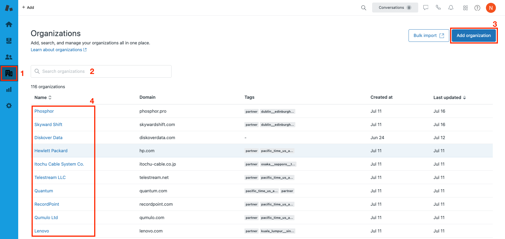

| OPTION | DESCRIPTION |
| :---: | --- |
| 1 | This is where you'll find the Organizations/companies profiles |
| 2 | Search for existing profiles before creating a new one |
| 3 | Start the manual profile creation here for a company/domain |
| 4 | Click on a name to open and see all related information and tickets associated with that company |

🔴 &nbsp;When you open a company profile:

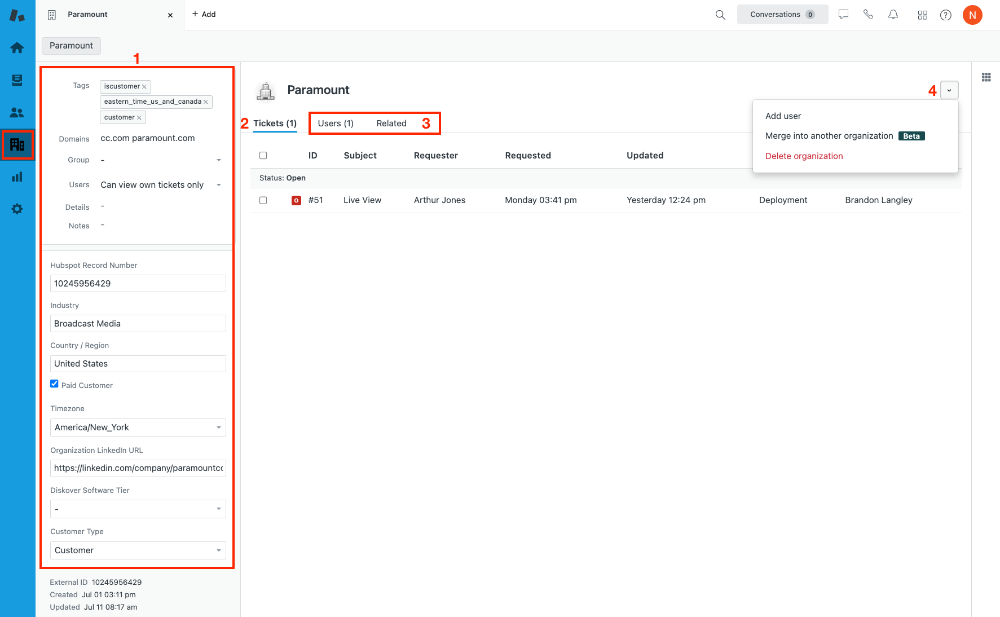

| OPTION | DESCRIPTION |
| :---: | --- |
| 1 | See and edit the profile information, make sure to fill out as many fields as possible |
| 2 | See tickets associated with that company, they can be from different users |
| 3 | Navigate to different views |
| 4 | Take different actions on the profile |

### Support Tickets Reporting

Support metrics will grow over time, but you can already refer to basic information. Hover the graphs to see more details, a little bit like Diskover!

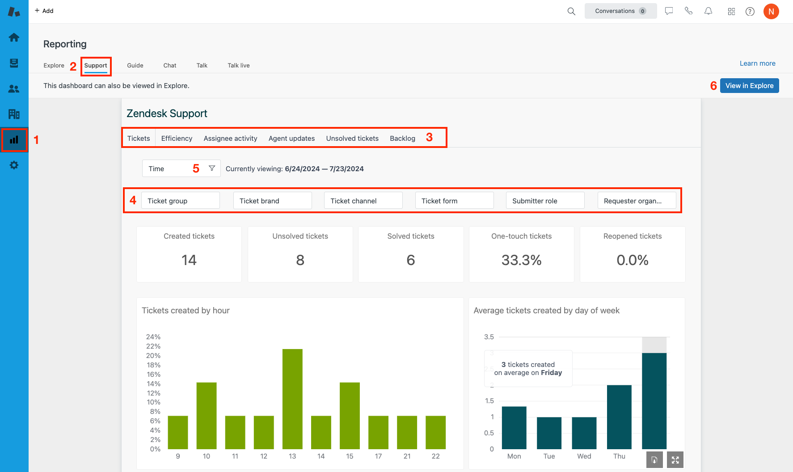

| OPTION | DESCRIPTION |
| :---: | --- |
| 1 | Select this menu to access **Reporting** or from the main menu select [**Explore**](#main_menu) |
| 2 | Select the **Support** tab |
| 3 | Navigate to different metrics |
| 4 | Apply different filters |
| 5 | Modify the **time** filter |
| 6 | To view the same thing but from the **Explore** menu |

___
## GUIDE | Knowledge Base Management
___

### How to Access the Knowledge Base
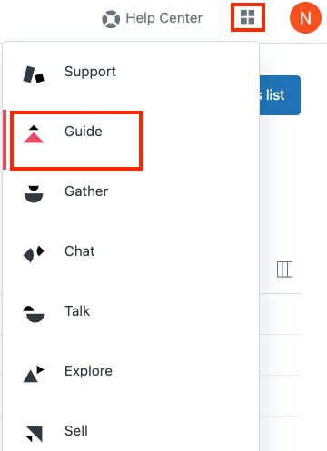

### Switch to/from User and Admin View

When you are working in most admin space, you can switch from **admin** to **user** view.

🔴 &nbsp;When you are in the user view and want to switch to admin, you will see this or something similar:

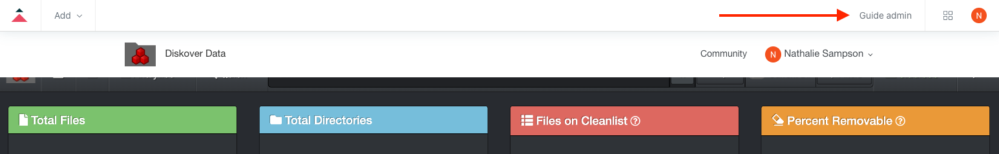

🔴 &nbsp;When you are in the admin view and want to preview what users will experience, you will see this or something similar:

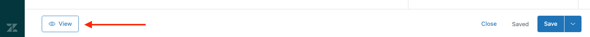

### Overview

What you will find under this menu:

- A log of the **discussions** and **feature requests** that stems from the [Diskover Community](#diskover_community) forum.
- All **help articles** used for troubleshooting, tips, etc. Note that "how to access what" may be confusing at first. This is the hierarchy/nomenclature used by Zendesk:

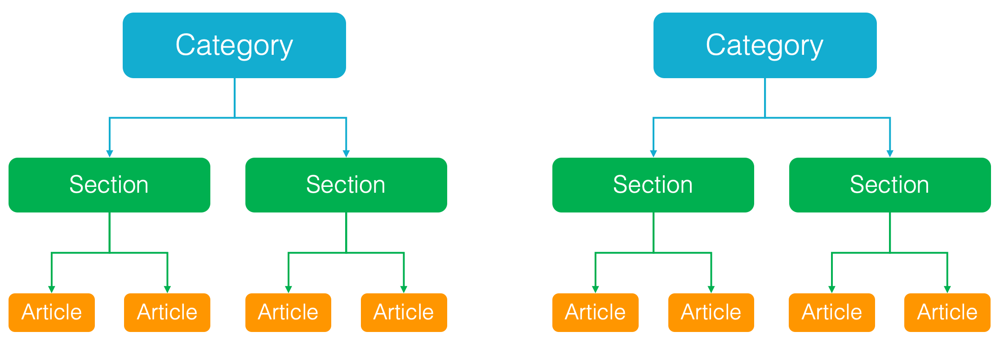

### Categories Management

🔴 &nbsp;Start with familiaring yourself with the construct of the Diskover **categories**, **sections**, and **articles**. This will help greatly when you [create an **article**](#create_article).

🔴 &nbsp;This menu allows you to view the **categories**. Click twice to see the **sections** inside a **category**.

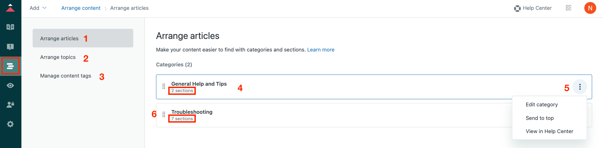

| OPTION | DESCRIPTION |
| :---: | --- |
| 1 | It says **Arrange articles** but what you see at first are **categories** |
| 2 | This is to view/moderate the posts and feature requests from the [**Diskover Community** Space](#diskover_community) |
| 3 | Using [tags](#tags_management) when creating articles makes it easier for users to search content |
| 4 | Double click on a **category** to see the **sections** contained in that category |
| 5 | Click on those 3 dots to edit the name of a **category** |
| 6 | Grab and move to change the order of **categories** |

### Sections Management

🔴 &nbsp;If you double-click on a **section**, it will open a view to the **article(s)** inside that **section**. 

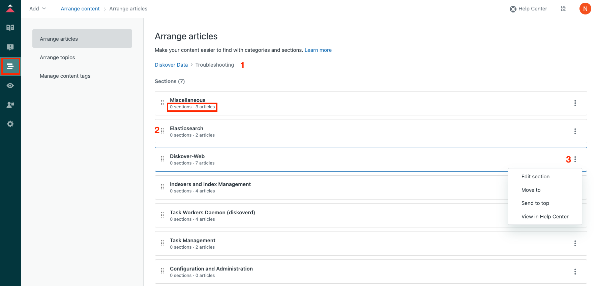

| OPTION | DESCRIPTION |
| :---: | --- |
| 1 | The **sections** you see on this page are all part of this **category** |
| 2 | Grab and move to change the order of **sections** |
| 3 | Click on those 3 dots to edit the name of a **section** |

### Articles Management

🔴 &nbsp;This menu allows you to view all **articles**, open, edit, and archive them.

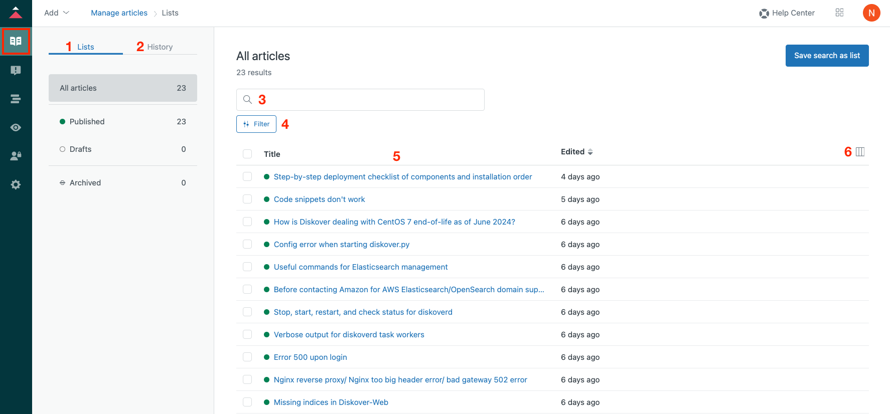

| OPTION | DESCRIPTION |
| :---: | --- |
| 1 | To see the list of all articles, drafts, or published |
| 2 | That view will show you all the last additions, edits, etc. and who did it when |
| 3 | Search articles using keywords |
| 4 | Apply filters to your search |
| 5 | Open any article just by clicking on one, follow [these instructions to edit an article](#edit_article) |
| 6 | Add columns to your current view (dates, author, etc.) for better browsing and filtering |

### Create a Category

🔴 &nbsp;From any sub-menu in the **Guide** menu, you will see this **Add** menu at the top left corner:

1. Click on the down arrow beside it.
2. Select **Category**.

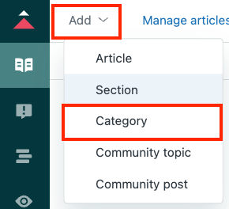

🔴 &nbsp;Fill out the new **Category** information:

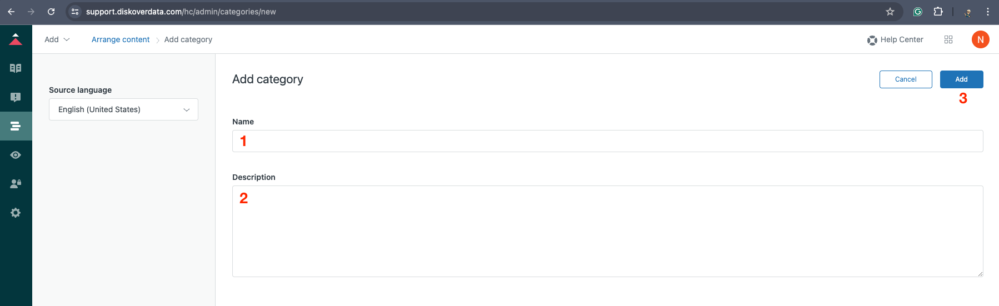

| OPTION | DESCRIPTION |
| :---: | --- |
| 1 | Enter the name of the new **Category** you want to create |
| 2 | Enter a **description** - optional |
| 3 | **Save** to add your new category |

### Create a Section

🔴 &nbsp;From any sub-menu in the **Guide** menu, you will see this **Add** menu at the top left corner:

1. Click on the down arrow beside it.
2. Select **Section**.

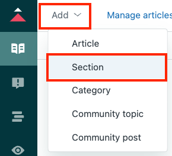

🔴 &nbsp;Fill out the new **Section** information:

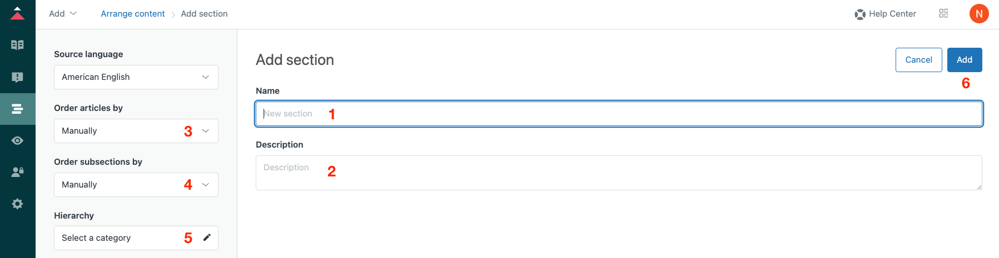

| OPTION | DESCRIPTION |
| :---: | --- |
| 1 | Enter the name of the new **Section** you want to create |
| 2 | Enter a **description** - optional |
| 3 | Select **Manually** |
| 4 | Select **Manually** |
| 5 | Select the **Category** in which you want that **Section** to live |
| 6 | **Save** to add your new category |

### Create an Article

🔴 &nbsp;From any sub-menu in the **Guide** menu, you will see this **Add** menu at the top left corner:

1. Click on the down arrow beside it.
2. Select **Article**.

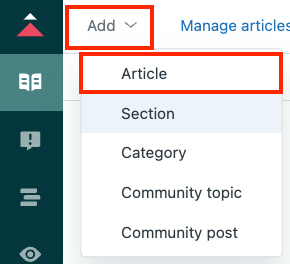

🔴 &nbsp;Fill out the new **Article** information - Here you see an example of a created article:

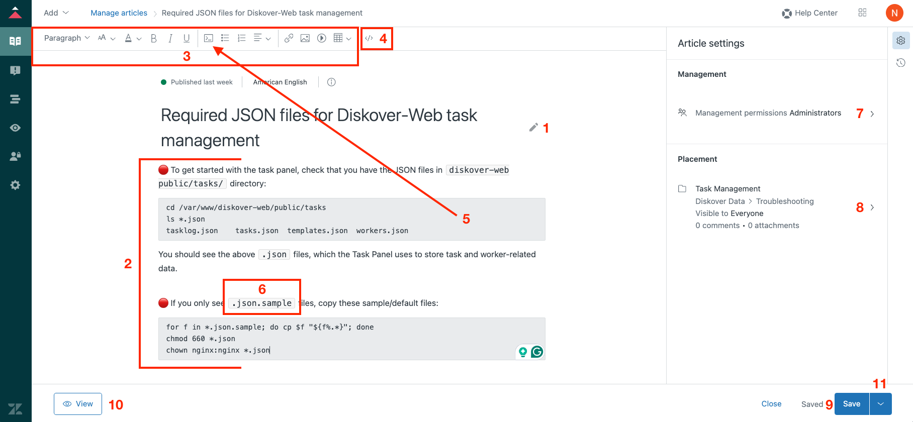

| OPTION | DESCRIPTION |
| :---: | --- |
| 1 | Click on the pencil to edit the **title** of the article and make sure it's very descriptive and easy to understand the purpose of the article |
| 2 | Plain text is easy to do but if you want to **write codes** see # 5 and 6 below.  üî∂ &nbsp;Zendesk doesn't understand Markdown formatting, but is HTML friendly |
| 3 | Text formatting tools: <ul><li>There are no formal guidelines to follow, for now anyway:</li><li>We recommend you look at other articles and follow the same/similar formatting.</li><li>Make sure that articles are nice and easy to read.</li><li>Share your formatting ideas with the team!</li></ul> |
| 4 | This will open the body of the text in **source code format**, which you may need to do sometimes, especially for code formatting. Zendesk sometimes wants to include too much or too little of the codes. This way you'll have perfect control, see # 5 and #6. |
| 5 | Unfortunately, Zendesk doesn't offer a copy icon for codes like we have in our GitHub docs, but users can click once in a code block which will select all the text automatically, then they can just copy the whole code content. <ul><li>You should be able to click the **code block** option in the formatting menu and that should create a code block.</li><li>If you can't get this to work the way you want, open the source code format as per #4 and use the following:  **``<pre><code id="codeSnippet">first line of code`` ``second line of code`` ``third line of code</code></pre>``**  Result: 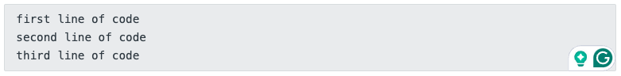</li></ul> |
| 6 | If you want to show only part of a sentence as codes: <ul><li>Open the source code format as per #4</li><li>Use the following:   This is an example of how to **``<code>insert code here</code>``** in a sentence.  Result: 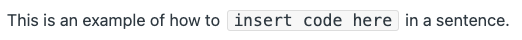</li></ul> |
| 7 | As of July 2024, there is only an **Administrators** category inside **Management Permissions** so there is nothing to edit here for now, but you can check it out anyway by clicking on the forward arrow |
| 8 | You can't create a new article without filling out this section, and it's always a good idea to review the information if you're editing an article, go to [**Article Placement**](#article_placement) for more information | 
| 9 | Save, save, save! <ul><li>This will save your modifications if you're editing an existing article</li><li>If you are creating a new article, this will save a draft only, see #11 if you are ready to publish</li></ul> | 
| 10 | Click the **View** button to see how your article will look for end users. When you are done and want to go back to the admin view click **Guide admin**: 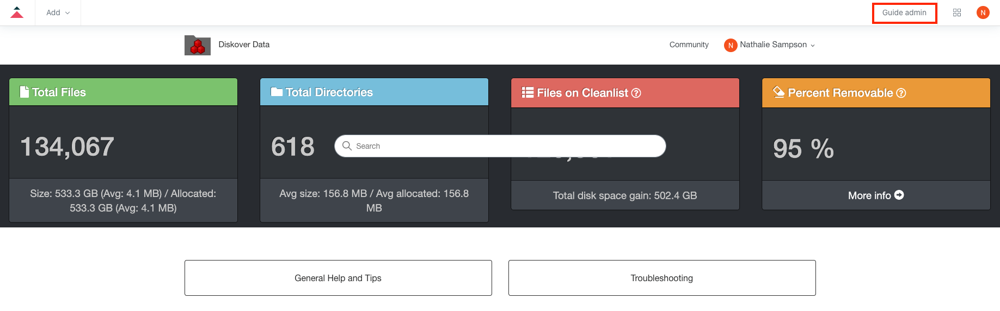 |
| 11 | Click the arrow and select **Publish** for the public to see your article - it's easy to see the status of an article:<ul><li>Green = Published</li><li>White = Draft</li></ul> 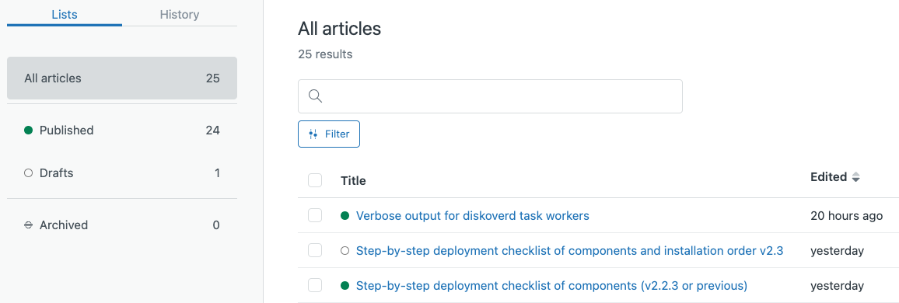

### Edit an Existing Article

🔴 &nbsp;Double-click on an [existing article](#article_management).

🔴 &nbsp;Follow these [instructions and formatting guideline](#article_formatting).

🔴 &nbsp;Follow these [article placement instructions](#article_placement)

### Article Placement

🔴 &nbsp;You can't create an article without filling out these parameters.

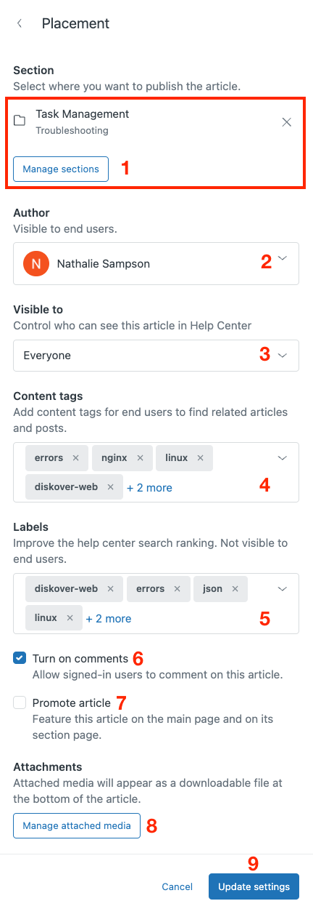

| OPTION | DESCRIPTION |
| :---: | --- |
| 1 | Select the most appropriate [**section**](#section_management), by default [**category**](#category_management) that your article will live in |
| 2 | Select or edit the article's author's name |
| 3 | Select who can see the article  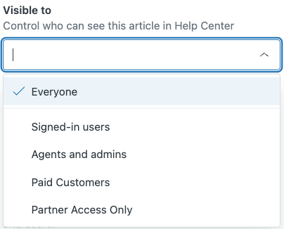 |
| 4 | Type or select appropriate [**tags**](#tags_management) to make the articles easier to find |
| 5 | Not really sure this is applicable yet, but easy enough to apply the same [**tags**](#tags_management) while you're there |
| 6 | Check the box if you are ok with users commenting on your article |
| 7 | You can promote an article so it's listed on the main page when users login, here's an example of a featured article: 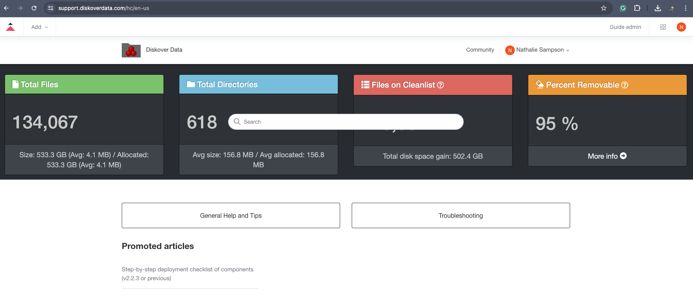 |
| 8 | You can attach a file to your article for users to download |
| 9 | Click **Update settings** to save your work |

### Tags Management

🔴 &nbsp;This space allows you to view, edit or create new tags.

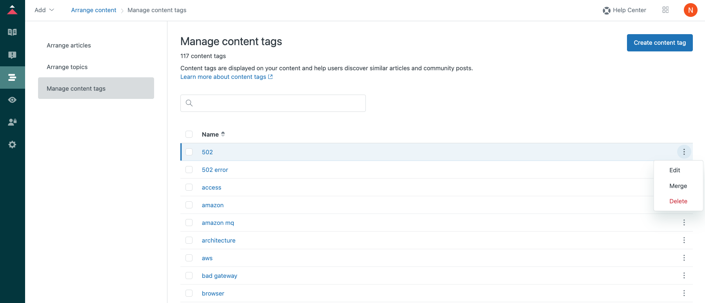

| OPTION | DESCRIPTION |
| :---: | --- |
| 1 | Click here to access the tags |
| 2 | Search tags | 
| 3 | <ul><li>Take action on tags.</li><li>You can click on a tag to edit the tag.</li><li>Once you open a tag click on **View tagged content** to see all articles using that tag.</li></ul> |
| 4 | Create a new tag - note that you can create tags directly when working in the [**article placement**](#article_placement) space |

### Community Content Management and Moderation

There's nothing to see here...yet!

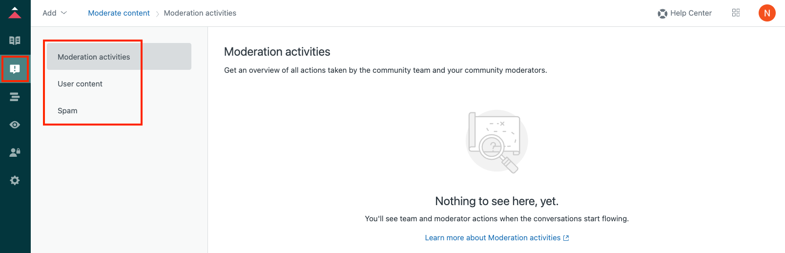

### Need Help Writing an Article?

<a class="email-link" href= "mailto:brandon.langley@diskoverdata.com,nathalie.sampson@diskoverdata.com?subject=Here's an article I'd like to add to Zendesk">Email us the content, we've got your back üôåüèΩ</a> 

___
## GATHER | Diskover Community 
___

### How to Access the Diskover Community

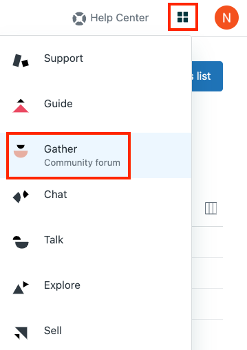

### Overview

🔴 &nbsp;Selecting **Gather** in the admin menu will send you to the **Diskover Community** user page.

üî∂ &nbsp;This section will be a bit of an experiment and we'll see over time if we need to moderate, add restrictions, etc.

🔴 &nbsp;Clicking on **Guide Admin** at the top will bring you to [**article management**](#article_management), from there you can navigate to the [**Community Content page**](#community_content).

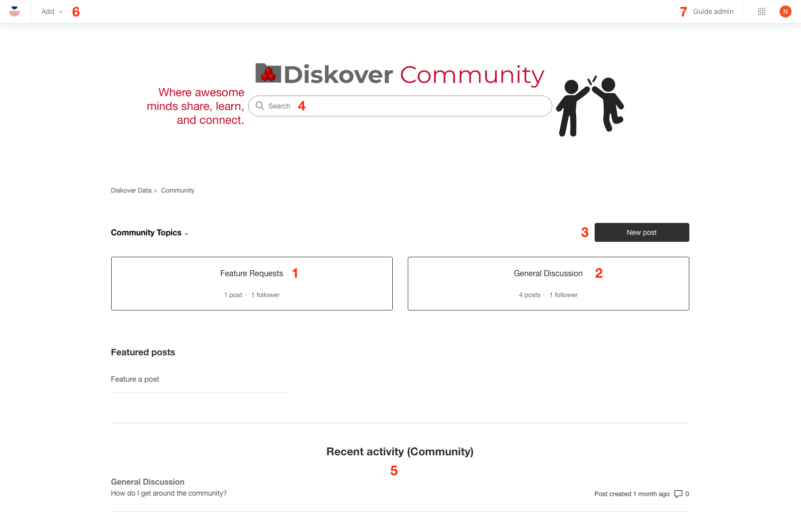

| OPTION | DESCRIPTION |
| :---: | --- |
| 1 | Users can view proposed **Feature Requests** posted by other users |
| 2 | Users can view general posts from other users under **General Discussion** |
| 3 | Users can click **New post** to create **general posts/topics** or **feature requests** |
| 4 | Users can search on existing posts or feature requests |
| 5 | List of the latest users' posts, for now only canned posts are available |
| 6 | For Diskover staff to add [**articles**](#create_article) for the support page OR create posts for this Community section |
| 7 | Will bring you back to the [**Knowledge Base**](#knowledge_base) |

___
## EXPLORE | Reporting and Analytics
___

### How to Get Here

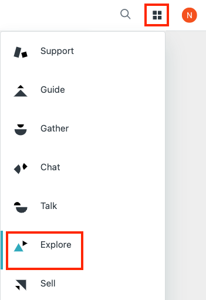

### Overview

There is not a whole lot going on here as of July 2024 and it's basically all canned reports. Stay tuned for customized reports and stats coming soon.

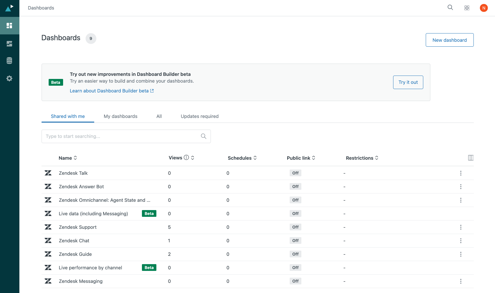

| OPTION | DESCRIPTION |
| :---: | --- |
| 1 | **Dashboards** note that creating a new dashboard is not super intuitive |
| 2 | We are basicallly using **Support** and **Guide** at the moment, so click on either to open stats, here's an example when clicking on **Zendesk Support**:  |
| 3 | You can use shared dashboards or create your own, again creating a new dashboard is not super intuitive |
| 4 | **Reports** those are all canned reports for now |
| 5 | **Datasets** nothing to see here for now |
| 6 | **Settings** nothing to see here for now |

___
## Site Theme Customization
___

### How to Access Themes

🔴 &nbsp;Select the "**eye**" menu on the left and then **Customize**:

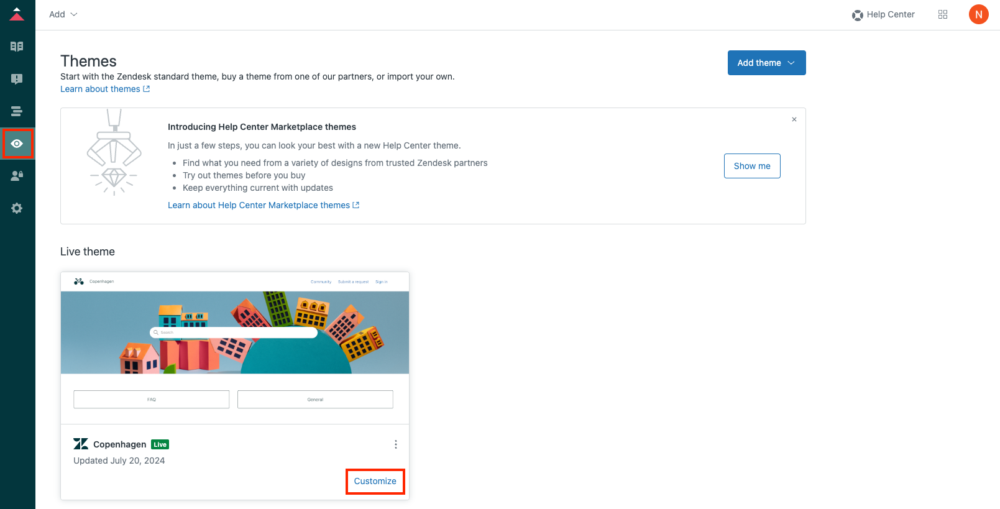

### Overview

**Themes** is where the logo, fonts, colors, etc. are determined. There is not a ton we can do with the current theme, but the goal was to take the fastest route to launching Zendesk.

üî∂ You don't want to risk doing it yourself but you'd like to request a change to the current look and feel? <a class="email-link" href= "mailto:brandon.langley@diskoverdata.com,nathalie.sampson@diskoverdata.com?subject=I'd like to change something to Zendesk theme/branding">Send us an email</a> detailing what you would like to change.

### Theme Management

| OPTION | DESCRIPTION |
| :---: | --- |
| 1 | Collapsible sections where you can adjust the look and feel |
| 2 | Go to different pages to view what users will experience 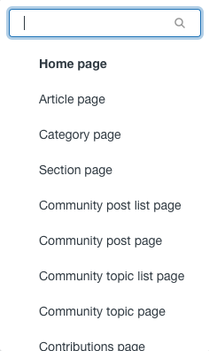 |
| 3 | Alternate between different user roles to experience the diffent views |
| 4 | Publish your changes |

___
## Admin Center
___

### How to Access Admin Center

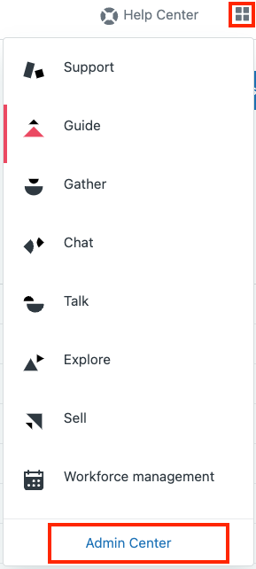

### Overview

üî∂ You don't have permission and/or you don't want to risk changing something? <a class="email-link" href= "mailto:brandon.langley@diskoverdata.com,nathalie.sampson@diskoverdata.com?subject=I'd like to change something in the Admin Center section">Send us an email</a> detailing what you would like to change.

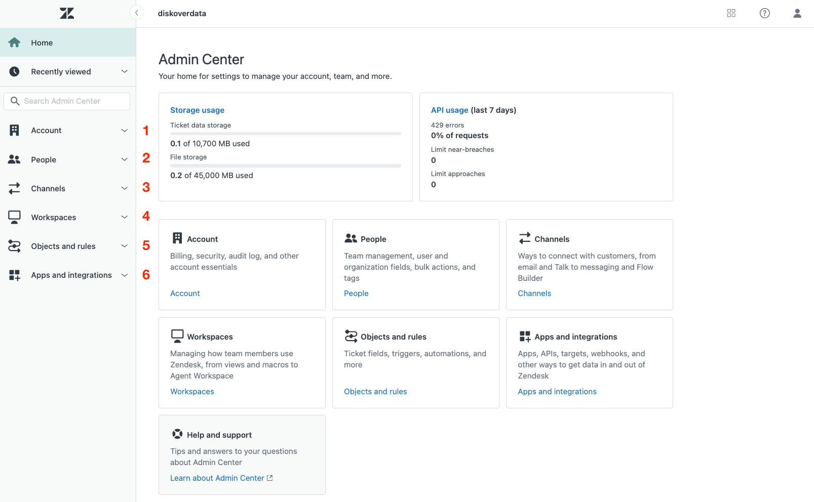

| OPTION | DESCRIPTION |
| :---: | --- |
| 1 | **Account** 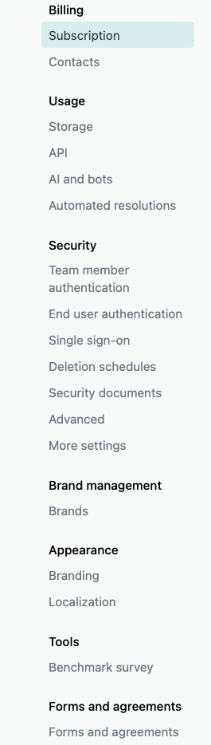 |
| 2 | **People** 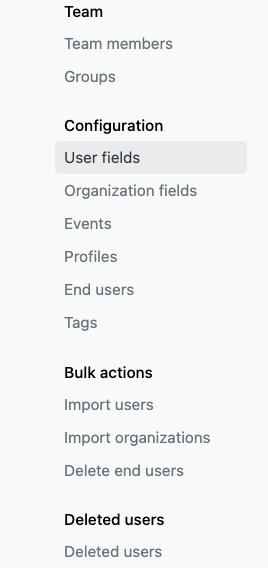 |
| 3 | **Channels** 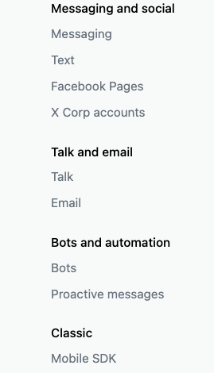 |
| 4 | **Workspaces** 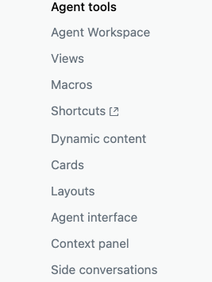 |
| 5 | **Objects and rules** is where forms and fields are created/edited but they also work with a conditions and whatnot so it's not straightforward 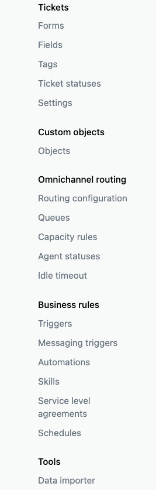 |
| 6 | **Apps and integrations** 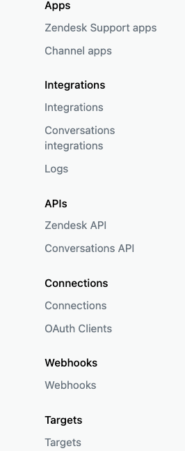 |

